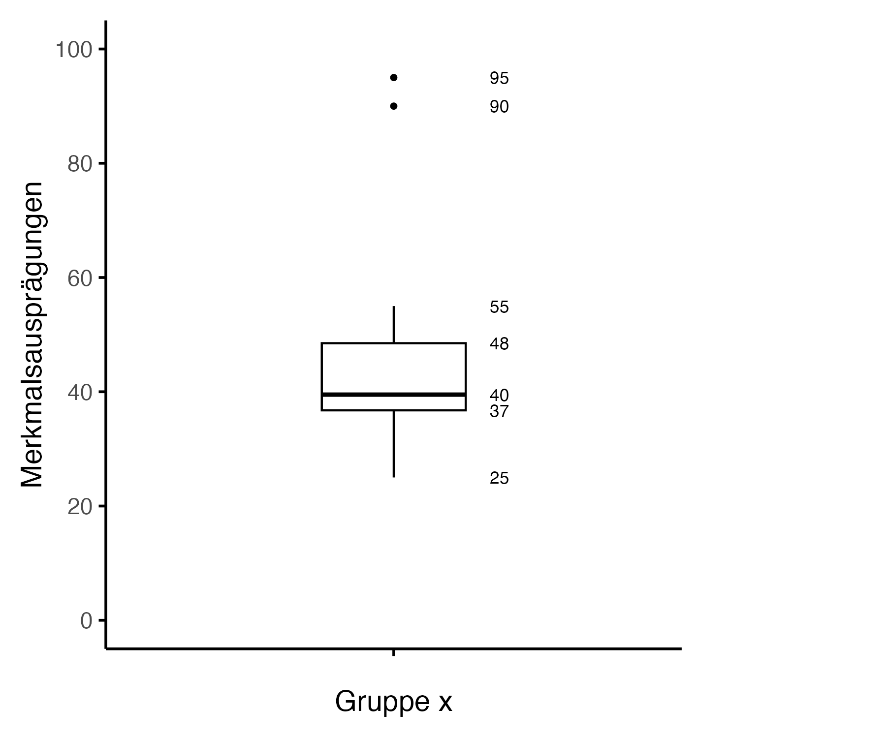
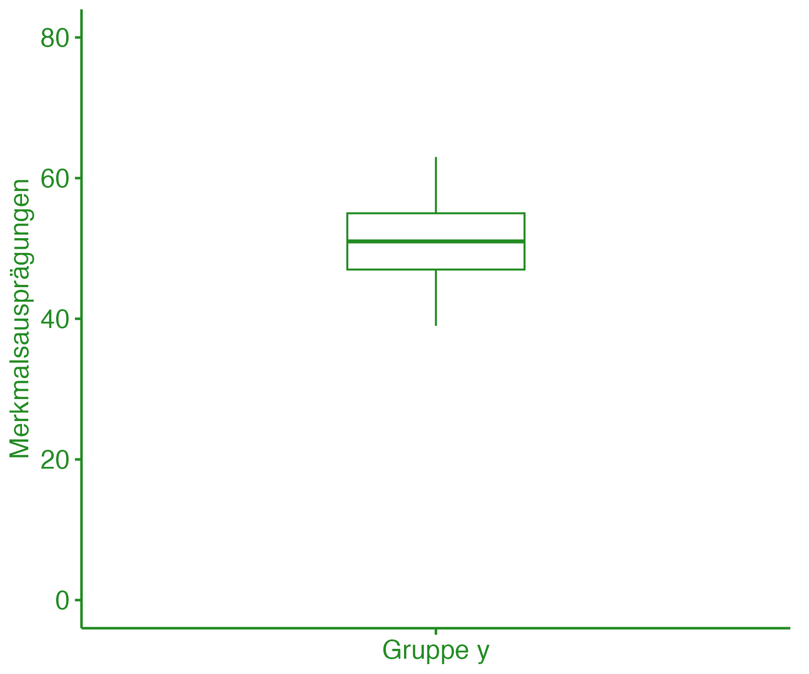

```{r setup, include=FALSE}
options(htmltools.dir.version = FALSE)

library(tidyverse)
library(kableExtra)
library(knitr)
library(ggplot2)
library(plotly)
library(htmlwidgets)
library(MASS)
library(ggpubr)
library(xaringanthemer)
library(xaringanExtra)
library(pdftools)
library(magick)
library(scales)

style_duo_accent(
  primary_color = "#621C37",
  secondary_color = "#EE0071",
  background_image = "blank.png"
)

xaringanExtra::use_xaringan_extra(c("tile_view"))

use_scribble(
  pen_color = "#EE0071",
  pen_size = 4
  )

knitr::opts_chunk$set(
  fig.retina = TRUE,
  warning = FALSE,
  message = FALSE
)
```

name: 1
class: middle, left
<br><br><br><br><br><br><br>
# Statistik 1
## Seminar
***
### Einheit 2
##### `r format(as.Date(data.frame(readxl::read_excel("CFH_Statistik_1_Seminar_Termine.xlsx"))$Datum), "%d.%m.%Y")[2]` | Janika Saretzki, MSc. 

---
name: 2
class: top, left

### Termine
<br><br><br><br>
~~**Einheit 1  02.05.25  14:45-16:15 Uhr  A + B  HS Audimax / P3**~~<br>
**Einheit 2  15.05.25  13:05-15:30 Uhr  A + B  HS Audimax / P3**  
<br>
**Einheit 3**  12.06.25  13:05-15:30 Uhr  A    HS P5 005  
**Einheit 3**  13.06.25  13:50-16:15 Uhr  B    HS P1 105  
<br>
**Einheit 4**  26.06.25  13:05-15:30 Uhr  A    HS P5 005  
**Einheit 4**  27.06.25  13:50-16:15 Uhr  B    HS P1 105 
<br><br>
**Einheit 5**  17.07.25  13:05-15:30 Uhr  A    HS P5 005  
**Einheit 5**  18.07.25  13:50-16:15 Uhr  B    HS P1 105  

---
name: 3
class: top, left

### Hinweise zur Einreichung der Studienleistungen

<br>

Bitte beachten Sie Folgendes, um eine reibungslose Verarbeitung Ihrer Studienleistungen zu gewährleisten:
<br><br><br>

- **Dateibenennung**: Benennen Sie Ihre Datei bitte nach dem folgenden Schema:  
  `IhrNachname_Seminar_Statistik_1_Studienleistung_#.pdf`  
  <br>
  Ersetzen Sie `#` durch die entsprechende Nummer der Studienleistung, also 1 bis 5.
<br><br>

- **Einreichung**: Reichen Sie Ihre Studienleistung **ab Studienleistung 2 über Studynet** ein. Eine entsprechende Nachricht über die Plattform auf dem Activity Board folgt im Laufe des Tages.

- Insofern Sie mir eine Nachricht schreiben möchten, verwenden Sie bitte **ausschließlich Ihre offizielle E-Mail**<br>
**Adresse der CFH**. E-Mails von privaten Adressen werden häufig als Spam eingestuft und nicht bearbeitet.

---
name: 4
class: center, middle
# Wiederholung

---
name: 5
class: top, left, smaller

### Skalenniveaus
<br><br>
**Nominalskala**
- Geschlecht: männlich (1), weiblich (2)
- Wer ist in Ihrem Haushalt hauptsächlich für das Kochen zuständig?<br>
Ich selbst (1), Eine andere Person im Haushalt (2), Wir kochen gemeinsam (3)
<br><br>

**Ordinalskala**
- Schulnoten (1 bis 6)
- Welche Ausbildung haben Sie?<br>
Pflichtschule (1), Pflichtschule oder Lehre (2), Abitur (3), Akademischer Abschluss (4)
<br><br>

**Metrische Skalen (Intervallskala, Verhältnisskala)**<br>
Standardisierte psychologische Tests, physiologische Daten  

---
name: 6
class: top, left, smaller

### Metrische Skalen (Intervallskala, Verhältnisskala)
<br><br><br><br>
**Äquidistanz**: Die Abstände zwischen den Zahlenwerten sind gleich groß. <br>
Beispiel: Der Unterschied zwischen 10 und 20 ist genauso groß wie zwischen 30 und 40.  
→Dies erlaubt Berechnungen wie **Mittelwert und Standardabweichung**.
<br><br><br><br><br>
**Unterscheidung zwischen Intervall- und Verhältnisskalen:** 

Hat die Skala einen **absoluten bzw. natürlichen Nullpunkt**?  
→ Dann handelt es sich um eine **Verhältnisskala**

---
name: 7
class: top, left

### Statistische Kennwerte
<br><br>
<ul>
  <li><strong>Maße der zentralen Tendenz (aka Lagemaße): <br>
  Modalwert (aka Modus), Arithmetisches Mittel (Mittelwert), Median
  </strong></li><br>
  <li><strong>Streuungsmaße (aka Dispersionsmaße): <br>
  Spannweite, Varianz, Standardabweichung, Quartilabstand
  </strong></li>
</ul><br>

<ul>
  <li>Maße der zentralen Tendenz können Verteilung nicht vollständig beschreiben</li>
  <li>Sehr unterschiedliche Verteilungen können das selbe Maß der zentralen Tendenz haben</li>
  <li>Streuungsmaße beschreiben, wie stark einzelne Werte einer Verteilung von zentraler Tendenz abweichen</li>
</ul><br><br>

---
name: 8
class: top, left

### Statistische Kennwerte
<br><br>
<ul>
  <li><strong>Maße der zentralen Tendenz (aka Lagemaße): <br>
  Modalwert (aka Modus), Arithmetisches Mittel (Mittelwert), Median
  </strong></li><br>
  <li><strong>Streuungsmaße (aka Dispersionsmaße): <br>
  Spannweite, Varianz, Standardabweichung, Quartilabstand
  </strong></li>
</ul><br>

<ul>
  <li>Maße der zentralen Tendenz können Verteilung nicht vollständig beschreiben</li>
  <li>Sehr unterschiedliche Verteilungen können das selbe Maß der zentralen Tendenz haben</li>
  <li>Streuungsmaße beschreiben, wie stark einzelne Werte einer Verteilung von zentraler Tendenz abweichen</li>
</ul>

<style>
  .cheat-link {
    color: #621C37;
    text-decoration: underline;
    font-weight: bold;
  }

  .cheat-link:hover {
    background-color: #f0f0f0;
    border-radius: 4px;
    padding: 2px 4px;
    transition: 0.2s;
  }
</style>

<div style="text-align: center; font-size: 1em; margin-top: 30px;">
  <p><strong>CHEAT-SHEETS: Maße der zentralen Tendenz, Streuungsmaße</strong></p>
</div>


```{r PDF to PNG, include=FALSE}

# pdf_files <- c("CHEAT-SHEET Maße der zentralen Tendenz.pdf",
#                "CHEAT-SHEET Streuungsmaße.pdf")
# 
# output_files <- c("CHEAT-SHEET Maße der zentralen Tendenz.png",
#                   "CHEAT-SHEET Streuungsmaße.png")
# 
# for (i in seq_along(pdf_files)) {
#   img <- image_read_pdf(pdf_files[i], density = 300, pages = 1)
#   img <- image_scale(img, "1920")
#   image_write(img, output_files[i], format = "png")
# }

```

---
name: 9
class: center, middle


---
name: 10
class: center, middle


---
name: 11
class: center, middle
# Übungsaufgaben

---
name: 12
class: top, left, smaller
### Übungsaufgabe 1

Berechnen Sie die **Spannweite (Range), Varianz und Standardabweichung** der Variable **Körpergröße**.
<br><br><br>
```{r Dataframe 1, echo=FALSE, results='asis', warning=FALSE, message=FALSE}

df <- data.frame(
  Person = 1:10,
  `Körpergröße (in cm)` = c(175, 163, 180, 167, 172, 160, 185, 168, 177, 170)
)

kable(df, format = "html", booktabs = TRUE, align = "c",
      col.names = c("Person", "Körpergröße (in cm)")) %>%
  kable_styling(full_width = FALSE,
                font_size = 16,
                html_font = "Arial",
                bootstrap_options = c("striped", "condensed"))

```

<style>
.table {
  margin-left: 0 !important;
}
</style>

---
name: 13
class: top, left, smaller
### Übungsaufgabe 1 - Lösung

Berechnen Sie die **Spannweite (Range), Varianz und Standardabweichung** der Variable **Körpergröße**.
<br><br><br>
```{r Dataframe 1 Lösung, echo=FALSE, results='asis', warning=FALSE, message=FALSE}

df <- data.frame(
  Person = 1:10,
  `Körpergröße (in cm)` = c(175, 163, 180, 167, 172, 160, 185, 168, 177, 170)
)

kable(df, format = "html", booktabs = TRUE, align = "c",
      col.names = c("Person", "Körpergröße (in cm)")) %>%
  kable_styling(full_width = FALSE,
                font_size = 16,
                html_font = "Arial",
                bootstrap_options = c("striped", "condensed"))

```

<style>
.table {
  margin-left: 0 !important;
}
</style>

---
name: 14
class: top, left, smaller
### Übungsaufgabe 1 - Lösung

Berechnen Sie die **Spannweite (Range), Varianz und Standardabweichung** der Variable **Körpergröße**.
<br><br><br>
```{r Dataframe 1b Lösung, echo=FALSE, results='asis', warning=FALSE, message=FALSE}

df <- data.frame(
  Person = 1:10,
  `Körpergröße (in cm)` = c(175, 163, 180, 167, 172, 160, 185, 168, 177, 170)
)

kable(df, format = "html", booktabs = TRUE, align = "c",
      col.names = c("Person", "Körpergröße (in cm)")) %>%
  kable_styling(full_width = FALSE,
                font_size = 16,
                html_font = "Arial",
                bootstrap_options = c("striped", "condensed"))

```

<style>
.table {
  margin-left: 0 !important;
}
</style>

---
name: 15
class: top, left, smaller
### Übungsaufgabe 2

Fünf Personen bearbeiten einen psychologischen Test. Der Test ergibt folgende Messwerte:
<div style="text-align: center; font-size: 1em; margin: 20px 0;">
  <strong>ID1: 94, ID2: 72, ID3: 66, ID4: 54, ID5: 42</strong>
</div>

a) Berechnen Sie das arithmetische Mittel der Testergebnisse.<br>
b) Berechnen Sie Varianz und Standardabweichung der Daten.
<br><br>
Die Tabelle enthält die Antwortwerte einer weiteren Stichprobe.
<div style="display: grid; grid-template-columns: 300px 1fr; gap: 20px; align-items: start;">
<div>
```{r Dataframe 2, echo=FALSE, results='asis', warning=FALSE, message=FALSE}

df <- data.frame(
  `Wert` = c(2, 7, 11, 5, 25, 16, 8),
  `Anzahl der Untersuchungspersonen mit diesem Wert` = c(2, 3, 2, 1, 4, 2, 1)
)

kable(df,
      format = "html",
      booktabs = TRUE,
      align = "c",
      escape = FALSE,  
      col.names = c("Wert", "Anzahl der Personen<br>mit diesem Wert")) %>%
  kable_styling(full_width = FALSE,
                font_size = 16,
                html_font = "Arial",
                bootstrap_options = c("striped", "condensed"))

```

</div> <div style="font-size: 1em;">
<br>
a) Berechnen Sie das 0.25-Quantil.<br><br><br>
b) Berechnen Sie den Interquartilabstand.<br><br><br>
c) Wie nennt man das 0.25-Quantil noch?
</div> </div>

---
name: 16
class: top, left, smaller
### Übungsaufgabe 2 - Lösung

Fünf Personen bearbeiten einen psychologischen Test. Der Test ergibt folgende Messwerte:
<div style="text-align: center; font-size: 1em; margin: 20px 0;">
  <strong>ID1: 94, ID2: 72, ID3: 66, ID4: 54, ID5: 42</strong>
</div>

a) Berechnen Sie das arithmetische Mittel der Testergebnisse.<br>
b) Berechnen Sie Varianz und Standardabweichung der Daten.


---
name: 17
class: top, left, smaller
### Übungsaufgabe 2 - Lösung

Die Tabelle enthält die Antwortwerte einer weiteren Stichprobe.
<div style="display: grid; grid-template-columns: 300px 1fr; gap: 20px; align-items: start;">
<div>
<br>
```{r Dataframe 2 Lösung, echo=FALSE, results='asis', warning=FALSE, message=FALSE}

df <- data.frame(
  `Wert` = c(2, 7, 11, 5, 25, 16, 8),
  `Anzahl der Untersuchungspersonen mit diesem Wert` = c(2, 3, 2, 1, 4, 2, 1)
)

kable(df,
      format = "html",
      booktabs = TRUE,
      align = "c",
      escape = FALSE,  
      col.names = c("Wert", "Anzahl der Personen<br>mit diesem Wert")) %>%
  kable_styling(full_width = FALSE,
                font_size = 16,
                html_font = "Arial",
                bootstrap_options = c("striped", "condensed"))

```

</div> <div style="font-size: 1em;">
<br>
a) Berechnen Sie das 0.25-Quantil.<br><br><br><br><br><br><br>

---
name: 18
class: top, left, smaller
### Übungsaufgabe 2 - Lösung

Die Tabelle enthält die Antwortwerte einer weiteren Stichprobe.
<div style="display: grid; grid-template-columns: 300px 1fr; gap: 20px; align-items: start;">
<div>
<br>
```{r Dataframe 2b Lösung, echo=FALSE, results='asis', warning=FALSE, message=FALSE}

df <- data.frame(
  `Wert` = c(2, 7, 11, 5, 25, 16, 8),
  `Anzahl der Untersuchungspersonen mit diesem Wert` = c(2, 3, 2, 1, 4, 2, 1)
)

kable(df,
      format = "html",
      booktabs = TRUE,
      align = "c",
      escape = FALSE,  
      col.names = c("Wert", "Anzahl der Personen<br>mit diesem Wert")) %>%
  kable_styling(full_width = FALSE,
                font_size = 16,
                html_font = "Arial",
                bootstrap_options = c("striped", "condensed"))

```

</div> <div style="font-size: 1em;">
<br>
b) Berechnen Sie den Interquartilabstand.<br><br><br><br><br><br><br>
</div> </div>
c) Wie nennt man das 0.25-Quantil noch?

---
name: 19
class: top, left, smaller

### Übungsaufgabe 3
<br>
<div style="display: flex; flex-direction: row; gap: 40px; align-items: flex-start;">
<div style="flex: 1;">
  
</div>

<div style="flex: 1.4; font-size: 0.95em; line-height: 1.5;">
  Sie analysieren einen Datensatz anhand des nebenstehenden Boxplots.  
  Ihr Ziel ist es, zentrale und streuungsbezogene Kennwerte zu bestimmen.  
  Dabei interessieren Sie sich für folgende Maße:  
  <br><br>
  Mittelwert, Standardabweichung, Varianz, unteres Quartil (Q1), oberes Quartil (Q3), Interquartilsabstand, Modus, potentielle Länge der Whisker, kleinster und größter Wert innerhalb dieser potentiellen Whisker-Grenzen.
  <br><br>
  <strong>a)</strong> Welche dieser Werte lassen sich direkt aus dem Boxplot ablesen oder unmittelbar berechnen? Geben Sie jeweils den geschätzten Wert an.  
  <br><br>
  <strong>b)</strong> Welche der genannten Kennwerte sind aus dem Boxplot nicht ersichtlich? Begründen Sie kurz.
</div>

</div>
```{r Dataframe 3, include=FALSE, echo=FALSE, results='asis', warning=FALSE, message=FALSE}

# df <- data.frame(
#   Gruppe = "",
#   Wert = c(25, 28, 32, 35, 36, 37, 38, 38, 39, 39, 40, 41,
#            42, 44, 48, 50, 52, 55, 90, 95)
# )
# 
# q1 <- quantile(df$Wert, 0.25)
# median <- median(df$Wert)
# q3 <- quantile(df$Wert, 0.75)
# iqr <- IQR(df$Wert)
# 
# lower_whisker <- min(df$Wert[df$Wert >= (q1 - 1.5 * iqr)])
# upper_whisker <- max(df$Wert[df$Wert <= (q3 + 1.5 * iqr)])
# outliers <- df %>% filter(Wert < lower_whisker | Wert > upper_whisker)
# labels_df <- data.frame(Wert = c(q1, median, q3, lower_whisker, upper_whisker))
# 
# boxplot <- ggplot(df, aes(x = Gruppe, y = Wert)) +
#   geom_boxplot(outlier.shape = NA, fill = "white", color = "black", width = 0.3) +
#   geom_point(data = outliers, aes(x = Gruppe, y = Wert), color = "black", size = 1) +
#   geom_text(data = labels_df, aes(x = 1.2, y = Wert, label = round(Wert)),
#             hjust = 0, size = 3, color = "black") +
#   geom_text(data = outliers, aes(x = 1.2, y = Wert, label = Wert),
#             hjust = 0, size = 3, color = "black") +
#   scale_y_continuous(limits = c(0, 100), breaks = seq(0, 100, 20)) +
#   labs(x = "Gruppe x", y = "Merkmalsausprägungen") +
#   theme_minimal(base_size = 14) +
#   theme(
#     panel.grid = element_blank(),
#     axis.line = element_line(color = "black"),
#     axis.ticks = element_line(color = "black"),
#     plot.margin = margin(10, 100, 10, 10)
#   )
# 
# ggsave("Boxplot_Übung_3.png", boxplot, width = 6, height = 5, dpi = 300)

```

---
name: 20
class: top, left, smaller

### Übungsaufgabe 3 - Lösung
<br>
<div style="display: flex; flex-direction: row; gap: 40px; align-items: flex-start;">
  <div style="flex: 1;">
    
  </div>
  <div style="flex: 1.4;"></div>
</div>

---
name: 21
class: top, left, smaller

### Übungsaufgabe 3 - Lösung
<br>
<div style="display: flex; flex-direction: row; gap: 40px; align-items: flex-start;">
  <div style="flex: 1;">
    
  </div>
  <div style="flex: 1.4;"></div>
</div>

---
name: 22
class: top, left, smaller

### Übungsaufgabe 3 - Lösung
<br>
<div style="display: flex; flex-direction: row; gap: 40px; align-items: flex-start;">
  <div style="flex: 1;">
    
  </div>
  <div style="flex: 1.4;"></div>
</div>

---
name: 23
class: top, left, smaller

### Übungsaufgabe 4

<div style="display: grid; grid-template-columns: 300px 1fr; gap: 20px; align-items: start;">
<div>
```{r Dataframe 4, echo=FALSE, results='asis', warning=FALSE, message=FALSE}

df <- data.frame(
  Nr1 = 1:15,
  Alter1 = c(17, 36, 41, 34, 32, 54, 45, 22, 71, 14, 86, 44, 34, 21, 54),
  Nr2 = 16:30,
  Alter2 = c(33, 22, 62, 44, 41, 56, 62, 23, 86, 41, 65, 53, 35, 21, 19)
)

kable(df,
      format = "html",
      booktabs = TRUE,
      align = "c",
      escape = FALSE,
      col.names = c("Nr.", "Alter", "Nr.", "Alter")) %>%
  kable_styling(full_width = FALSE,
                font_size = 16,
                html_font = "Arial",
                bootstrap_options = c("striped", "condensed"))

```

</div> <div style="font-size: 1em;">
<br><br><br><br><br>
30 Personen haben Angaben zu ihrem Alter gemacht. Die Daten sind im Nachfolgenden tabellarisch dargestellt.<br><br>
Sie kennen zusätzlich folgende Kennwerte: Q1 = 26.0, IQR = 28.0.<br><br><br><br>

<strong>Gibt es Ausreißer in den Daten?</strong>
</div> </div>

---
name: 24
class: top, left, smaller

### Übungsaufgabe 4 - Lösung

<div style="display: grid; grid-template-columns: 300px 1fr; gap: 20px; align-items: start;">
<div>
```{r Dataframe 4 Lösung, echo=FALSE, results='asis', warning=FALSE, message=FALSE}

df <- data.frame(
  Nr1 = 1:15,
  Alter1 = c(17, 36, 41, 34, 32, 54, 45, 22, 71, 14, 86, 44, 34, 21, 54),
  Nr2 = 16:30,
  Alter2 = c(33, 22, 62, 44, 41, 56, 62, 23, 86, 41, 65, 53, 35, 21, 19)
)

kable(df,
      format = "html",
      booktabs = TRUE,
      align = "c",
      escape = FALSE,
      col.names = c("Nr.", "Alter", "Nr.", "Alter")) %>%
  kable_styling(full_width = FALSE,
                font_size = 16,
                html_font = "Arial",
                bootstrap_options = c("striped", "condensed"))

```

---
name: 25
class: top, left, smaller

### Übungsaufgabe 5
Sie haben die folgenden Datenreihen der Gruppen **x** und **y** erhoben:

```{r Dataframe 5, echo=FALSE, results='asis', warning=FALSE, message=FALSE}

x_labels <- c("x₁", "x₂", "x₃", "x₄", "x₅", "x₆", "x₇", "x₈", "x₉", "x₁₀", "x₁₁", "x₁₂", "x₁₃", "x₁₄", "x₁₅", "x₁₆", "x₁₇")
x_values <- c(59, 61, 59, 63, 57, 61, 46, 63, 58, 56, 72, 54, 45, 57, 57, 72, 66)

y_labels <- c("y₁", "y₂", "y₃", "y₄", "y₅", "y₆", "y₇", "y₈", "y₉", "y₁₀", "y₁₁", "y₁₂", "y₁₃", "y₁₄", "y₁₅", "y₁₆", "y₁₇")
y_values <- c(55, 39, 45, 51, 47, 55, 52, 51, 61, 47, 53, 46, 59, 51, 63, 59, 45)

df_x <- rbind(x_labels, x_values)
colnames(df_x) <- NULL
rownames(df_x) <- NULL

df_y <- rbind(y_labels, y_values)
colnames(df_y) <- NULL
rownames(df_y) <- NULL

kable(df_x, format = "html", escape = FALSE, align = "c") %>%
  kable_styling(full_width = FALSE, font_size = 14)

cat("<div style='margin-bottom: 20px;'></div>")

kable(df_y, format = "html", escape = FALSE, align = "c") %>%
  kable_styling(full_width = FALSE, font_size = 14)

```
<br><br>
<strong>Von der Datenreihe der Gruppe y sind bereits folgende Kennwerte bekannt:</strong> <br>
M = 51.71, s = 6.49, Q1 = 47.0, Mdn = 51.0, Q3 = 55.0, IQR = 8.0 sowie Mo = 51.0

Welche Kennwerte fehlen Ihnen, um die Verteilung in Gruppe y als Boxplot darstellen zu können? <br>
Berechnen Sie die fehlenden Werte und zeichnen Sie den Boxplot.

---
name: 26
class: top, left, smaller

### Übungsaufgabe 5 - Lösung
Sie haben die folgenden Datenreihen der Gruppen **x** und **y** erhoben:

```{r Dataframe 5 Lösung, echo=FALSE, results='asis', warning=FALSE, message=FALSE}

x_labels <- c("x₁", "x₂", "x₃", "x₄", "x₅", "x₆", "x₇", "x₈", "x₉", "x₁₀", "x₁₁", "x₁₂", "x₁₃", "x₁₄", "x₁₅", "x₁₆", "x₁₇")
x_values <- c(59, 61, 59, 63, 57, 61, 46, 63, 58, 56, 72, 54, 45, 57, 57, 72, 66)

y_labels <- c("y₁", "y₂", "y₃", "y₄", "y₅", "y₆", "y₇", "y₈", "y₉", "y₁₀", "y₁₁", "y₁₂", "y₁₃", "y₁₄", "y₁₅", "y₁₆", "y₁₇")
y_values <- c(55, 39, 45, 51, 47, 55, 52, 51, 61, 47, 53, 46, 59, 51, 63, 59, 45)

df_x <- rbind(x_labels, x_values)
colnames(df_x) <- NULL
rownames(df_x) <- NULL

df_y <- rbind(y_labels, y_values)
colnames(df_y) <- NULL
rownames(df_y) <- NULL

kable(df_x, format = "html", escape = FALSE, align = "c") %>%
  kable_styling(full_width = FALSE, font_size = 14)

cat("<div style='margin-bottom: 20px;'></div>")

kable(df_y, format = "html", escape = FALSE, align = "c") %>%
  kable_styling(full_width = FALSE, font_size = 14)

```
<br><br>
<strong>Von der Datenreihe der Gruppe y sind bereits folgende Kennwerte bekannt:</strong> <br>
M = 51.71, s = 6.49, Q1 = 47.0, Mdn = 51.0, Q3 = 55.0, IQR = 8.0 sowie Mo = 51.0

Welche Kennwerte fehlen Ihnen, um die Verteilung in Gruppe y als Boxplot darstellen zu können? <br>

---
name: 27
class: top, left, smaller

### Übungsaufgabe 5 - Lösung
Sie haben die folgenden Datenreihen der Gruppen **x** und **y** erhoben:

```{r Dataframe 5b Lösung, echo=FALSE, results='asis', warning=FALSE, message=FALSE}

x_labels <- c("x₁", "x₂", "x₃", "x₄", "x₅", "x₆", "x₇", "x₈", "x₉", "x₁₀", "x₁₁", "x₁₂", "x₁₃", "x₁₄", "x₁₅", "x₁₆", "x₁₇")
x_values <- c(59, 61, 59, 63, 57, 61, 46, 63, 58, 56, 72, 54, 45, 57, 57, 72, 66)

y_labels <- c("y₁", "y₂", "y₃", "y₄", "y₅", "y₆", "y₇", "y₈", "y₉", "y₁₀", "y₁₁", "y₁₂", "y₁₃", "y₁₄", "y₁₅", "y₁₆", "y₁₇")
y_values <- c(55, 39, 45, 51, 47, 55, 52, 51, 61, 47, 53, 46, 59, 51, 63, 59, 45)

df_x <- rbind(x_labels, x_values)
colnames(df_x) <- NULL
rownames(df_x) <- NULL

df_y <- rbind(y_labels, y_values)
colnames(df_y) <- NULL
rownames(df_y) <- NULL

kable(df_x, format = "html", escape = FALSE, align = "c") %>%
  kable_styling(full_width = FALSE, font_size = 14)

cat("<div style='margin-bottom: 20px;'></div>")

kable(df_y, format = "html", escape = FALSE, align = "c") %>%
  kable_styling(full_width = FALSE, font_size = 14)

```
<br><br>
<strong>Von der Datenreihe der Gruppe y sind bereits folgende Kennwerte bekannt:</strong> <br>
M = 51.71, s = 6.49, Q1 = 47.0, Mdn = 51.0, Q3 = 55.0, IQR = 8.0 sowie Mo = 51.0

---
name: 28
class: top, left, smaller

### Übungsaufgabe 5 - Lösung

```{r Dataframe 5c Lösung, include=FALSE, echo=FALSE, message=FALSE, warning=FALSE, results='asis'}

# df <- data.frame(
#   Gruppe = "",
#   Wert = c(55, 39, 45, 51, 47, 55, 52, 51, 61, 47, 53, 46, 59, 51, 63, 59, 45)
# )
# 
# q1 <- quantile(df$Wert, 0.25)
# q3 <- quantile(df$Wert, 0.75)
# iqr <- IQR(df$Wert)
# lower_whisker <- min(df$Wert[df$Wert >= (q1 - 1.5 * iqr)])
# upper_whisker <- max(df$Wert[df$Wert <= (q3 + 1.5 * iqr)])
# outliers <- df %>% filter(Wert < lower_whisker | Wert > upper_whisker)
# 
# boxplot <- ggplot(df, aes(x = Gruppe, y = Wert)) +
#   geom_boxplot(outlier.shape = NA, fill = "white", color = "black", width = 0.3) +
#   geom_point(data = outliers, aes(x = Gruppe, y = Wert), color = "black", size = 1) +
#   scale_y_continuous(limits = c(0, 80), breaks = seq(0, 80, 20)) +
#   scale_x_discrete(labels = "Gruppe y") +
#   labs(x = NULL, y = "Merkmalsausprägungen") +
#   theme_minimal(base_size = 14) +
#   theme(
#     panel.grid = element_blank(),
#     axis.line = element_line(color = "black"),
#     axis.ticks = element_line(color = "black"),
#     axis.text = element_text(size = 14),
#     axis.title = element_text(size = 14),
#     plot.margin = margin(5, 10, 5, 5)
#   )
# 
# boxplot
# 
# ggsave("Boxplot_Übung_5.png", boxplot, width = 6, height = 5, dpi = 300)


# <br>
# <div style="display: flex; justify-content: center; margin-top: 20px;">
#   <div style="max-width: 400px;">
#     
#   </div>
# </div>
  
```
