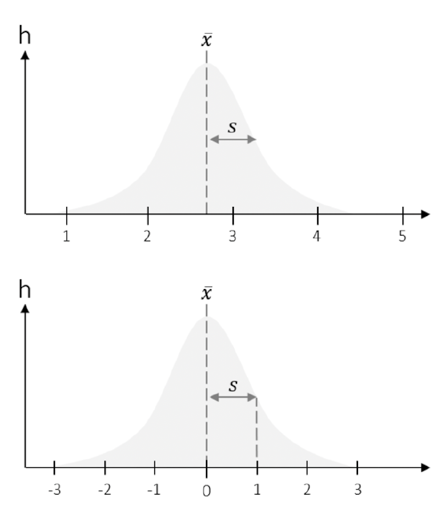

```{r setup, include=FALSE}
options(htmltools.dir.version = FALSE)

library(tidyverse)
library(kableExtra)
library(knitr)
library(ggplot2)
library(plotly)
library(htmlwidgets)
library(MASS)
library(ggpubr)
library(xaringanthemer)
library(xaringanExtra)
library(pdftools)
library(magick)
library(scales)
library(patchwork)
library(latex2exp)
library(RColorBrewer)
library(gridExtra)
library(grid)

style_duo_accent(
  primary_color = "#621C37",
  secondary_color = "#EE0071",
  background_image = "blank.png"
)

xaringanExtra::use_xaringan_extra(c("tile_view"))

use_scribble(
  pen_color = "#EE0071",
  pen_size = 4
  )

knitr::opts_chunk$set(
  fig.retina = TRUE,
  warning = FALSE,
  message = FALSE
)
```

name: 1
class: middle, left
<br><br><br><br><br><br><br>
# Statistik 1
## Seminar
***
### Einheit 3
##### `r format(as.Date(data.frame(readxl::read_excel("CFH_Statistik_1_Seminar_Termine.xlsx"))$Datum), "%d.%m.%Y")[4]` | Janika Saretzki, MSc. 

---
name: 2
class: top, left

### Termine
<br><br><br><br>
~~**Einheit 1  02.05.25  14:45-16:15 Uhr  A + B  HS Audimax / P3**~~<br>
~~**Einheit 2  15.05.25  13:05-15:30 Uhr  A + B  HS Audimax / P3**~~<br>
<br>
**Einheit 3**  12.06.25  13:05-15:30 Uhr  A    HS P5 005  
**Einheit 3**  13.06.25  13:50-16:15 Uhr  B    HS P1 105<br>
<br>
**Einheit 4**  26.06.25  13:20-15:45 Uhr  A    HS P5 005  
**Einheit 4**  27.06.25  13:50-16:15 Uhr  B    HS P1 105<br> 
<br>
**Einheit 5**  17.07.25  13:20-15:45 Uhr  A    HS P5 005  
**Einheit 5**  18.07.25  13:50-16:15 Uhr  B    HS P1 105<br>

---
name: 3
class: top, left, smallest

### Taschenrechner-Hacks

```{r Seminar 2, echo=FALSE, results='asis', warning=FALSE, message=FALSE}

x_labels <- c("x₁", "x₂", "x₃", "x₄", "x₅", "x₆", "x₇", "x₈", "x₉", "x₁₀", "x₁₁", "x₁₂", "x₁₃", "x₁₄", "x₁₅", "x₁₆", "x₁₇")
x_values <- c(59, 61, 59, 63, 57, 61, 46, 63, 58, 56, 72, 54, 45, 57, 57, 72, 66)

y_labels <- c("y₁", "y₂", "y₃", "y₄", "y₅", "y₆", "y₇", "y₈", "y₉", "y₁₀", "y₁₁", "y₁₂", "y₁₃", "y₁₄", "y₁₅", "y₁₆", "y₁₇")
y_values <- c(55, 39, 45, 51, 47, 55, 52, 51, 61, 47, 53, 46, 59, 51, 63, 59, 45)

df_x <- rbind(x_labels, x_values)
colnames(df_x) <- NULL
rownames(df_x) <- NULL

df_y <- rbind(y_labels, y_values)
colnames(df_y) <- NULL
rownames(df_y) <- NULL

kable(df_x, format = "html", escape = FALSE, align = "c") %>%
  kable_styling(full_width = FALSE, font_size = 14)

cat("<div style='margin-bottom: 20px;'></div>")

kable(df_y, format = "html", escape = FALSE, align = "c") %>%
  kable_styling(full_width = FALSE, font_size = 14)

```
<br><br>
<span style="font-size: 90%;">
<strong>Arithmetisches Mittel:</strong> Mode → 2: STAT → Eine Gruppe: 1-VAR <strong>oder</strong> zwei Gruppen: A+BX → Werte für Gruppe 1 und/oder Gruppe 2 eintragen (jeden Wert jeweils mit "Enter/=" bestätigen) → AC → Shift + 1 → 4: Var → 2: x̄ (Mittelwert für Gruppe x/1), 5: ȳ Mittelwert für Gruppe y/2 → "Enter/="<br>
</span>

$$
\small
\bar{x} = 59.18, \quad \bar{y} = 51.71
$$
<span style="font-size: 90%;">
<strong>Standardabweichung auf Populationsebene:</strong> Mode → 2: STAT → Eine Gruppe: 1-VAR <strong>oder</strong> zwei Gruppen: A+BX → Werte für Gruppe 1 und/oder Gruppe 2 eintragen (jeden Wert jeweils mit "Enter/=" bestätigen) → AC → Shift + 1 → 4: Var → 4: sx (Standardabweichung auf Populationsebene für Gruppe x/1), 7: sy (Standardabweichung auf Populationsebene für Gruppe y/2) → "Enter/="
</span>

$$
\small
\sigma_x = 7.02, \quad \sigma_y = 6.29
$$

---
name: 4
class: top, left, smallest

### Taschenrechner-Hacks

<br><br>
<span style="font-size: 90%;">
<strong>Median:</strong> Mode → 2: STAT → Eine Gruppe: 1-VAR → Werte für Gruppe 1/Gruppe 2 eintragen (jeden Wert jeweils mit "Enter/=" bestätigen) → AC → Shift + 1 → 5: MinMax → 4: med → "Enter/="<br>
</span>

$$
\small
\mathrm{Mdn}_x = 59{.}0,\quad \mathrm{Mdn}_y = 51{.}0
$$
<br>
<span style="font-size: 90%;">
<strong>Unteres Quartil:</strong> Mode → 2: STAT → Eine Gruppe: 1-VAR → Werte für Gruppe 1/Gruppe 2 eintragen (jeden Wert jeweils mit "Enter/=" bestätigen) → AC → Shift + 1 → 5: MinMax → 3: Q1 → "Enter/="<br>
</span>

$$
\small
\mathrm{Q1}_x = 56{.}5,\quad \mathrm{Q1}_y = 46{.}5
$$
<br>
<span style="font-size: 90%;">
<strong>Oberes Quartil:</strong> Mode → 2: STAT → Eine Gruppe: 1-VAR → Werte für Gruppe 1/Gruppe 2 eintragen (jeden Wert jeweils mit "Enter/=" bestätigen) → AC → Shift + 1 → 5: MinMax → 5: Q3 → "Enter/="<br>
</span>

$$
\small
\mathrm{Q3}_x = 63{.}0,\quad \mathrm{Q3}_y = 57{.}0
$$
---
name: 5
class: top, left, smaller

### Wiederholung

<strong>Logik des Schließens von Stichprobe auf Population</strong>
<br><br>
<div style="display: flex; justify-content: center;">
  
</div>

---
name: 6
class: top, left, smaller

### Wiederholung
<span style="font-size: 90%;">
<strong>Psychologische Fragestellung:</strong> Praktisch alle psychologischen Theorien erhalten Aussagen über Populationen (nicht nur über isolierte Stichproben). Zu ihrer empirischen Überprüfung sind dann immer <strong>inferenzstatistische Methoden</strong> notwendig.</span>

<span style="font-size: 90%;">
Logik des Schließens von einer Stichprobe auf die Population: Inferenzstatistik (Grundlage: <strong>Wahrscheinlichkeitsrechnung</strong>)</span>


<span style="font-size: 90%;"><strong>Stochastik = Die Kunst des Vermutens (altgriechisch)</strong></span>
- <span style="font-size: 90%;">Mathematik setzt Vorstellung von Zufall voraus (d.h. Modelle von Situationen, deren Ausgang ungewiss ist)<br></span>
- <span style="font-size: 90%;">Keine Einzelergebnisse vorhersagbar, aber: <br>
→ Erkennen von Regelmäßigkeiten bei Vorgängen, deren Ergebnisse vom Zufall abhängen<br></span>

- <span style="font-size: 90%;">Zentraler Begriff <strong>Zufallsexperiment</strong></span>
  - <span style="font-size: 90%;">Die Möglichen Ergebnisse eine Zufallsexperiments heißen <strong>Elementarereignisse</strong></span>
  - <span style="font-size: 90%;">Die Menge aller möglichen Ergebnisse eines Zufallsexperiments bezeichnet man als <strong>Ergebnisraum</strong></span>
<br><br>
    - <span style="font-size: 90%;">Der Ergebnisraum heißt <strong>diskret</strong>, wenn er aus abzählbar vielen Elementarereignissen besteht.</span>
    - <span style="font-size: 90%;">Der Ergebnisraum heißt <strong>stetig</strong>, wenn er aus überabzählbar vielen Elementarereignissen besteht.</span>
  
</span> 

---
name: 7
class: top, left, smaller
### Übungsaufgabe 1

Unten sehen Sie drei Verteilungen. Bitte ordnen Sie folgende Begriffe der passenden Grafik zu:<br>
**Binomialverteilung, Gleichverteilung, Normalverteilung.**<br>
Bestimmen Sie außerdem, ob es sich um eine spezielle diskrete oder eine spezielle stetige Verteilung handelt.<br><br>

```{r Dataframe 1, warning=FALSE, message=FALSE, echo=FALSE, fig.width=14, fig.height=4, dpi = 300}

my_theme <- theme_classic(base_size = 14) +
  theme(
    axis.line = element_line(size=0.5, color="black"),
    axis.ticks = element_line(size=0.5, color="black"),
    axis.title.y = element_text(size=14),
    axis.title.x = element_text(size=14),
    axis.text = element_text(color="black", size=14),
    plot.title = element_text(hjust=0.5, face="bold", size=14)
  )

# Plot 1
m <- 18
df_unif <- data.frame(x = 1:m, y = rep(1/m, m) * 40)
p1 <- ggplot(df_unif, aes(x=factor(x), y=y)) +
  geom_bar(stat="identity", fill="black", color="white", size=0.3, width=0.95) +
  scale_x_discrete(
    name = "1 bis m",
    breaks = as.character(seq(0, 20, 5)),
    limits = as.character(0:20),
    labels = as.character(seq(0, 20, 5))
  ) +
  scale_y_continuous(
    name = TeX("1/m"),
    breaks = seq(0, 6, 2),
    limits = c(0, 6)
  ) +
  ggtitle("") +
  my_theme

# Plot 2
n <- 18; p <- 0.5
df_binom <- data.frame(
  x = 0:n,
  y = dbinom(0:n, size=n, prob=p)
)
p2 <- ggplot(df_binom, aes(x=factor(x), y=y)) +
  geom_bar(stat="identity", fill="black", color="white", size=0.3, width=0.95) +
  scale_x_discrete(
    name = "x",
    breaks = c("5", "10", "15"),
    limits = as.character(0:20),
    labels = c("5", "10", "15")
  ) +
  scale_y_continuous(
    name = "Dichte"
  ) +
  ggtitle("") +
  my_theme

# Plot 3
mu <- 10; sigma <- 3
xseq <- seq(mu-4*sigma, mu+4*sigma, length.out=200)
df_norm <- data.frame(
  x = xseq,
  y = dnorm(xseq, mean=mu, sd=sigma)
)

xticks <- c(mu - sigma, mu, mu + sigma)
xlabels <- c(TeX("-\\sigma"), TeX("\\mu"), TeX("+\\sigma"))

p3 = ggplot(df_norm, aes(x=x, y=y)) +
  geom_line(size=0.7, color="black") +
  geom_vline(xintercept=mu, linetype="dashed", color="black", size=0.5) +
  geom_vline(xintercept=mu-c(sigma, -sigma), linetype="dotted", color="black", size=0.5) +
  scale_x_continuous(
    name = NULL,
    breaks = xticks,
    labels = xlabels
  ) +
  scale_y_continuous(
    name = TeX("\\varphi(x)"),
    breaks = 0,    
    labels = ""
  ) +
  ggtitle("") +
  my_theme +
  theme(
    axis.ticks.y = element_blank(),
    axis.text.y = element_blank(),
    axis.title.x = element_blank()
  )

(p1 | p2 | p3)

```

<!-- <div style="font-size:0.8em; display:flex; justify-content:space-between; align-items:flex-start; gap:1em; margin-top:-3em;"> -->
<!-- <div style="width:32%;text-align:left;"> -->
<!-- $$ -->
<!-- P(X = x) = \frac{1}{m} \quad \text{für alle}\ x = 1,2, ..., m \\ -->
<!-- E[X] = \frac{m+1}{2} \\ -->
<!-- \sigma^2 = \frac{m^2-1}{12} -->
<!-- $$ -->
<!-- </div> -->

<!-- <div style="width:32%;text-align:left;"> -->
<!-- $$ -->
<!-- P(X = k) = {n \choose k} p^k (1-p)^{n-k} \quad \text{für}\ k = 0,1,...,n \\ -->
<!-- E[X] = np \\ -->
<!-- \sigma^2 = np(1-p) -->
<!-- $$ -->
<!-- </div> -->

<!-- <div style="width:32%;text-align:left;"> -->
<!-- $$ -->
<!-- \varphi(x) = \frac{1}{\sigma \sqrt{2\pi}} \exp \left( -\frac{1}{2} \left( \frac{x-\mu}{\sigma} \right)^2 \right) -->
<!-- $$ -->
<!-- </div> -->
<!-- </div> -->

<div style="margin-top: -60px;">
  
</div>

---
name: 8
class: top, left, smaller
### Übungsaufgabe 1 - Lösung

Unten sehen Sie drei Verteilungen. Bitte ordnen Sie folgende Begriffe der passenden Grafik zu:<br>
**Binomialverteilung, Gleichverteilung, Normalverteilung.**<br>
Bestimmen Sie außerdem, ob es sich um eine spezielle diskrete oder eine spezielle stetige Verteilung handelt.<br><br>

```{r Dataframe 1b, warning=FALSE, message=FALSE, echo=FALSE, fig.width=14, fig.height=4, dpi = 300}

my_theme <- theme_classic(base_size = 14) +
  theme(
    axis.line = element_line(size=0.5, color="black"),
    axis.ticks = element_line(size=0.5, color="black"),
    axis.title.y = element_text(size=14),
    axis.title.x = element_text(size=14),
    axis.text = element_text(color="black", size=14),
    plot.title = element_text(hjust=0.5, size=14, color="darkgreen")
  )

# Plot 1
m <- 18
df_unif <- data.frame(x = 1:m, y = rep(1/m, m) * 40)
p1 <- ggplot(df_unif, aes(x=factor(x), y=y)) +
  geom_bar(stat="identity", fill="black", color="white", size=0.3, width=0.95) +
  scale_x_discrete(
    name = "1 bis m",
    breaks = as.character(seq(0, 20, 5)),
    limits = as.character(0:20),
    labels = as.character(seq(0, 20, 5))
  ) +
  scale_y_continuous(
    name = TeX("1/m"),
    breaks = seq(0, 6, 2),
    limits = c(0, 6)
  ) +
  ggtitle("Gleichverteilung (diskrete Verteilung)") +
  my_theme

# Plot 2
n <- 18; p <- 0.5
df_binom <- data.frame(
  x = 0:n,
  y = dbinom(0:n, size=n, prob=p)
)
p2 <- ggplot(df_binom, aes(x=factor(x), y=y)) +
  geom_bar(stat="identity", fill="black", color="white", size=0.3, width=0.95) +
  scale_x_discrete(
    name = "x",
    breaks = c("5", "10", "15"),
    limits = as.character(0:20),
    labels = c("5", "10", "15")
  ) +
  scale_y_continuous(
    name = "Dichte"
  ) +
  ggtitle("Binomialverteilung (diskrete Verteilung)") +
  my_theme

# Plot 3
mu <- 10; sigma <- 3
xseq <- seq(mu-4*sigma, mu+4*sigma, length.out=200)
df_norm <- data.frame(
  x = xseq,
  y = dnorm(xseq, mean=mu, sd=sigma)
)

xticks <- c(mu - sigma, mu, mu + sigma)
xlabels <- c(TeX("-\\sigma"), TeX("\\mu"), TeX("+\\sigma"))

p3 = ggplot(df_norm, aes(x=x, y=y)) +
  geom_line(size=0.7, color="black") +
  geom_vline(xintercept=mu, linetype="dashed", color="black", size=0.5) +
  geom_vline(xintercept=mu-c(sigma, -sigma), linetype="dotted", color="black", size=0.5) +
  scale_x_continuous(
    name = NULL,
    breaks = xticks,
    labels = xlabels
  ) +
  scale_y_continuous(
    name = TeX("\\varphi(x)"),
    breaks = 0,    
    labels = ""
  ) +
  ggtitle("Normalverteilung (stetige Verteilung)") +
  my_theme +
  theme(
    axis.ticks.y = element_blank(),
    axis.text.y = element_blank(),
    axis.title.x = element_blank()
  )

(p1 | p2 | p3)

```

<!-- <div style="font-size:0.8em; display:flex; justify-content:space-between; align-items:flex-start; gap:1em; margin-top:-3em;"> -->
<!-- <div style="width:32%;text-align:left;"> -->
<!-- $$ -->
<!-- P(X = x) = \frac{1}{m} \quad \text{für alle}\ x = 1,2, ..., m \\ -->
<!-- E[X] = \frac{m+1}{2} \\ -->
<!-- \sigma^2 = \frac{m^2-1}{12} -->
<!-- $$ -->
<!-- </div> -->

<!-- <div style="width:32%;text-align:left;"> -->
<!-- $$ -->
<!-- P(X = k) = {n \choose k} p^k (1-p)^{n-k} \quad \text{für}\ k = 0,1,...,n \\ -->
<!-- E[X] = np \\ -->
<!-- \sigma^2 = np(1-p) -->
<!-- $$ -->
<!-- </div> -->

<!-- <div style="width:32%;text-align:left;"> -->
<!-- $$ -->
<!-- \varphi(x) = \frac{1}{\sigma \sqrt{2\pi}} \exp \left( -\frac{1}{2} \left( \frac{x-\mu}{\sigma} \right)^2 \right) -->
<!-- $$ -->
<!-- </div> -->
<!-- </div> -->

<div style="margin-top: -60px;">
  
</div>

---
name: 9
class: top, left, smaller
### Übungsaufgabe 1 - Lösung
<div style="flex: 1.4; font-size: 0.95em; line-height: 1.5; color: green;">
<u>Gleichverteilung (diskrete Verteilung):</u> Die Balken sind alle gleich hoch, d.h. jeder Wert ist gleich wahrscheinlich (z.B. fairer Würfel).
<br>

<u>Binomialverteilung (diskrete Verteilung):</u> Beschreibt die Wahrscheinlichkeit, wie oft ein bestimmtes Ereignis in einer festen Anzahl von Versuchen vorkommen, wenn jeder Versuch nur zwei mögliche Ereignisse hat: Erfolg der Misserfolg. Die Verteilung ist symmetrisch bei p = 0.50.<br>
- "Wie oft passiert etwas, wenn ich n mal probiere?"<br>
- Wahrscheinlichkeiten ergeben sich aus "Anzahl Erfolge in n Versuchen"<br>
- Zählbare Ereignisse!<br>

Die Binomialverteilung ist oft die Grundlage für Tests und wird dann genähert an die Normalverteilung (binomiale Annahmen "im Hintergrund")
<br>

<u>Normalverteilung (stetige Verteilung):</u> Die Kurve ist glockenförmig und symmetrisch um den Mittelwert<br>
- Stetig, d.h. das Ergebnis kann jeden beliebigen Wert annehmen; glatt und glockenförmig<br>
- Keine Balkendiagramm, sondern Dichtefunktion (durchgezogene Linie)<br>
- "Wie ist etwas in der Natur verteilt?"<br>
- Messbare, kontinuierliche Merkmale

---
name: 10
class: top, left, smaller
### Übungsaufgabe 2

a) Warum handelt es sich bei der Standardnormalverteilung um eine spezielle Normalverteilung?<br>
b) Wie kann eine Normalverteilung in eine Standardnormalverteilung überführt werden?
<br>
<br><br>
```{r Dataframe 2, echo=FALSE, fig.width=8, fig.height=8, fig.align='left', dpi=300, out.width='35%'}

ggplot(df_norm, aes(x=x, y=y)) +
  geom_line(size=0.9, color="black") +
  geom_vline(xintercept=mu, linetype="dashed", color="black", size=0.8) +
  geom_vline(xintercept=mu-c(sigma, -sigma), linetype="dotted", color="black", size=0.8) +
  scale_x_continuous(
    name = NULL,
    breaks = xticks,
    labels = xlabels
  ) +
  scale_y_continuous(
    name = TeX("\\varphi(x)"),
    breaks = 0,
    labels = ""
  ) +
  ggtitle("") +
  my_theme +
  theme(
    axis.ticks.y = element_blank(),
    axis.text.y = element_blank(),
    axis.title.x = element_blank(),
    axis.text.x = element_text(size = 24),
    axis.title.y = element_text(size = 24),
  )

```

---
name: 11
class: top, left, smaller
### Übungsaufgabe 2 - Lösung

a) Warum handelt es sich bei der Standardnormalverteilung um eine spezielle Normalverteilung?<br>
b) Wie kann eine Normalverteilung in eine Standardnormalverteilung überführt werden?
<br>
<br><br>
```{r Dataframe 2b, echo=FALSE, fig.width=8, fig.height=8, fig.align='left', dpi=300, out.width='35%'}

ggplot(df_norm, aes(x=x, y=y)) +
  geom_line(size=0.9, color="black") +
  geom_vline(xintercept=mu, linetype="dashed", color="black", size=0.8) +
  geom_vline(xintercept=mu-c(sigma, -sigma), linetype="dotted", color="black", size=0.8) +
  scale_x_continuous(
    name = NULL,
    breaks = xticks,
    labels = xlabels
  ) +
  scale_y_continuous(
    name = TeX("\\varphi(x)"),
    breaks = 0,
    labels = ""
  ) +
  ggtitle("") +
  my_theme +
  theme(
    axis.ticks.y = element_blank(),
    axis.text.y = element_blank(),
    axis.title.x = element_blank(),
    axis.text.x = element_text(size = 24),
    axis.title.y = element_text(size = 24),
  )

```
<div style="margin-left: 40%; margin-top: -38%; font-size: 0.95em; line-height: 1.6; color: green;">
<span style="font-size: 90%;">
<u>a) Mittelwert = 0, Standardabweichung = 1</u>
Jede Normalverteilung hat grundsätzlich irgendeinen Mittelwert und irgendeine Standardabweichung. Die Standardnormalverteilung ist genau die Normalverteilung, die auf 0 zentriert ist und eine "Standard Breite" von 1 hat → z-standardisierte Normalverteilung

<br>
<u>b) Standardisierung (z-Transformation)</u><br>

$$
\small
z = \frac{x - \mu}{\sigma}
$$

<li> Von jedem x-Wert ziehen wir den Mittelwert ab (Verschiebung von M auf 0)</li>
<li> Dann teilen wir durch die Standardabweichung (Streuung wird auf 1 skaliert)</li>
<li> Jeder Wert bekommt einen z-Wert</li>
<li> Nach der Transformation ist die Verteilung eine Standardnormalverteilung
  </div>
</span>

---
name: 12
class: top, left, smaller
### Übungsaufgabe 3

<strong>Unten sehen Sie zwei Glücksräder.</strong><br>
<br>
a) In welchem Fall macht die Berechnung einer Laplace-Wahrscheinlichkeit Sinn?<br>
b) Wie ist die Zufallsvariable, eine bestimmte Farbe zu drehen, verteilt?<br>
c) Wie hoch ist die Wahrscheinlichkeit, ein grünes (hell oder dunkel) Feld zu drehen?<br>

```{r Dataframe 3, echo=FALSE, fig.width=10, fig.height=4, out.width='60%', fig.align='center', warning=FALSE, message=FALSE, dpi=300}

rad1 <- data.frame(gruppe = factor(1:10), wert = rep(1,10))
rad2 <- data.frame(gruppe = factor(1:10), wert = c(2,2,2,1,1,1,1,3,3,3))

# p1 <- ggplot(rad1, aes(x = "", y = wert, fill = gruppe)) +
#   geom_bar(width = 1, stat = "identity", color = "white") +
#   coord_polar(theta = "y") +
#   theme_void() +
#   ggtitle("Glücksrad 1") +
#   theme(plot.title = element_text(hjust = 0.5, size = 22), legend.position = "none")
# 
# p2 <- ggplot(rad2, aes(x = "", y = wert, fill = gruppe)) +
#   geom_bar(width = 1, stat = "identity", color = "white") +
#   coord_polar(theta = "y") +
#   theme_void() +
#   ggtitle("Glücksrad 2") +
#   theme(plot.title = element_text(hjust = 0.5, size = 22), legend.position = "none")
# 
# p1 + p2
# 

farben <- brewer.pal(10, "Paired")

p1 <- ggplot(rad1, aes(x = "", y = wert, fill = gruppe)) +
  geom_bar(width = 1, stat = "identity", color = "white") +
  coord_polar(theta = "y") +
  scale_fill_manual(values = farben) +
  theme_void() +
  ggtitle("Glücksrad 1") +
  theme(plot.title = element_text(hjust = 0.5, size = 22), legend.position = "none")

p2 <- ggplot(rad2, aes(x = "", y = wert, fill = gruppe)) +
  geom_bar(width = 1, stat = "identity", color = "white") +
  coord_polar(theta = "y") +
  scale_fill_manual(values = farben) +
  theme_void() +
  ggtitle("Glücksrad 2") +
  theme(plot.title = element_text(hjust = 0.5, size = 22), legend.position = "none")

p1 + p2

```

<div style="text-align: center; margin-top: 1.2em; font-size: 50%;">
$$
P(A) = \frac{\text{Anzahl der } \omega \text{ in } A}{\text{Anzahl der } \omega \text{ in } \Omega}
= \frac{\text{Anzahl der für A 'günstigen' Ereignisse}}{\text{Anzahl der möglichen Ereignisse}}
$$
</div>

---
name: 13
class: top, left, smaller
### Übungsaufgabe 3 - Lösung

<strong>Unten sehen Sie zwei Glücksräder.</strong><br>
<br>
a) In welchem Fall macht die Berechnung einer Laplace-Wahrscheinlichkeit Sinn?<br>
b) Wie ist die Zufallsvariable, eine bestimmte Farbe zu drehen, verteilt?<br>
c) Wie hoch ist die Wahrscheinlichkeit, ein grünes (hell oder dunkel) Feld zu drehen?<br>

<div style="font-size: 0.95em; line-height: 1.6; color: green;">
<span style="font-size: 90%;">
a) Die Laplace-Wahrscheinlichkeit setzt voraus, dass alle Ausgänge gleich wahrscheinlich sind. Das ist nur dann der Fall, wenn alle Felder gleich groß sind, denn dann hat jede Farbe die gleiche Chance, getroffen zu werden. Das trifft auf <u>Glücksrad 1</u> zu.
<br><br>
b) Glücksrad 1: <u>Diskrete Gleichverteilung</u>, da jede Farbe mit der gleichen Wahrscheinlichkeit auftreten kann. Bei Glücksrad 2 liegt keine Gleichverteilung vor, die Felder unterscheiden sich in ihrer Größe; einie Farben sind wahrscheinlicher als andere.
<br><br>
c) Glücksrad 1 hat insgesamt 10 gleich große Felder, davon zwei grüne Felder (hell + dunkel):

$$
\small
P(grün) = \frac{2}{10} = \frac{1}{5} = 0,2 
$$
Die Wahrscheinlichkeit, ein grünes Feld zu drehen, liegt bei 20%.<br><br>
  </div>
</span>

---
name: 14
class: top, left, smaller
### Übungsaufgabe 4

<strong>Sie untersuchen, ob das Geben eines Zuckerwürfels dazu führt, dass eine Ratte innerhalb von fünf Minuten hyperaktiv wird. Sie interessieren sich dafür, mit welcher Wahrscheinlichkeit dieses Verhalten nach der Zuckeraufnahme auftritt.</strong><br><br>
a) Warum handelt es sich hierbei um ein Zufallsexperiment?<br>
b) Welche Zufallsvariable erkennen Sie in diesem Experiment und wie ist diese verteilt?<br>
c) Ist der Ereignisraum diskret oder stetig?<br>
d) Bestimmen Sie Erwartungswert und Varianz der Zufallsvariablen, wenn die Wahrscheinlichkeit, dass die Ratte nach fünf Minuten hyperaktiv wird, 85% beträgt.<br>
e) Welche Verteilung würde man erhalten, würde das Experiment an mehreren Ratten durchgeführt werden?

---
name: 15
class: top, left, smaller
### Übungsaufgabe 4 - Lösung

<strong>Sie untersuchen, ob das Geben eines Zuckerwürfels dazu führt, dass eine Ratte innerhalb von fünf Minuten hyperaktiv wird. Sie interessieren sich dafür, mit welcher Wahrscheinlichkeit dieses Verhalten nach der Zuckeraufnahme auftritt.</strong><br>

a) Warum handelt es sich hierbei um ein Zufallsexperiment?<br>
b) Welche Zufallsvariable erkennen Sie in diesem Experiment und wie ist diese verteilt?<br>

<div style="font-size: 0.95em; line-height: 1.6; color: green;">
<span style="font-size: 90%;">
a) Im Prinzip beliebig oft wiederholbarer Vorgang, der nach bestimmter Vorschrift ausgeführt wird, wobei das Ergebnis vom Zufall abhängt, d.h. der Ausgang kann nicht eindeutig im Voraus bestimmt werden.<br>
- Folge von gleichartigen, voneinander unabhängigen Versuchen möglich<br>
- Entweder Folge voneinander unabhängiger Versuche mit einem Objekt oder jeweils einmaliger Versuch mit "gleichartigen" (unabhängigen) Objekten<br>
- Ergebnis kann nicht sicher vorhergesagt werden; ist vom Zufall abhängig
<br>

b) Bernoulli-verteilte Zufallsvariable ("Ausgang des Experiments"), da zwei mögliche Ausgänge bei n = 1: Hyperaktiv vs. Nicht-Hyperaktiv. Eine Bernoulli-Verteilung ist die einfachste Wahrscheinlichkeitsverteilung für einen Zufallsversuch mit genau zwei möglichen Ausgängen: Erfolg (kodiert mit 1) und Misserfolg (kodiert mit 0) <br>
→ Dichotome Zufallsvariable mit nur zwei möglichen Ausgängen
</div>
</span>

---
name: 16
class: top, left, smaller
### Übungsaufgabe 4 - Lösung

<strong>Sie untersuchen, ob das Geben eines Zuckerwürfels dazu führt, dass eine Ratte innerhalb von fünf Minuten hyperaktiv wird. Sie interessieren sich dafür, mit welcher Wahrscheinlichkeit dieses Verhalten nach der Zuckeraufnahme auftritt.</strong><br>

c) Ist der Ereignisraum diskret oder stetig?<br>
d) Bestimmen Sie Erwartungswert und Varianz der Zufallsvariablen, wenn die Wahrscheinlichkeit, dass die Ratte nach fünf Minuten hyperaktiv wird, 85% beträgt.<br>

<div style="font-size: 0.95em; line-height: 1.6; color: green;">
<span style="font-size: 90%;">
c) Ereignisraum ist <u>diskret</u>; Es gibt nur zwei mögliche, abzählbare Ereignisse/Ausgänge: Hyperaktiv vs. Nicht-Hypaeraktiv
<br>

d) Wir haben eine Zufallsvariable X, die den Wert ...
- ... X = 1 annimmt, wenn die Ratte hyperaktiv wird; <br>
- ... X = 0 annimmt, wenn die Ratte nicht hyperaktiv wird. <br>

Wir wissen: Die Wahrscheinlichkeit für X = 1 ist p = 0.85

$$
\small
E (X) = p = 0.85
$$
Der Erwartungswert gibt an, wie oft wir im Durchschnitt bei vielen Versuchen "Erfolg" erwarten dürfen. Wenn wir das Experiment sehr oft wiederholen, werden im Durchschnitt 85% der Ratten hyperaktiv.
</div>
</span>

---
name: 17
class: top, left, smaller
### Übungsaufgabe 4 - Lösung

<strong>Sie untersuchen, ob das Geben eines Zuckerwürfels dazu führt, dass eine Ratte innerhalb von fünf Minuten hyperaktiv wird. Sie interessieren sich dafür, mit welcher Wahrscheinlichkeit dieses Verhalten nach der Zuckeraufnahme auftritt.</strong><br>

e) Welche Verteilung würde man erhalten, würde das Experiment an mehreren Ratten durchgeführt werden?

<div style="font-size: 0.95em; line-height: 1.6; color: green;">
<span style="font-size: 90%;">
Die Varianz Var(X) beschreibt, wie stark die einzelnen Untersuchungsergebnisse um den Erwartungswert streuen:

$$
\small
\text{Var}(X) = p \cdot (1 - p) = 0{,}85 \cdot (1 - 0{,}85) = 0{,}85 \cdot 0{,}15 = 0{,}1275
$$

Die Varianz gibt an, wie unterschiedlich die Einzelergebnisse ausfallen können. Da es nur zwei mögliche Ergebnisse gibt (0 oder 1), ist die Varianz in diese Fall sehr gering. Je näher p and 0 oder 1 liegt, desto kleiner ist die Varianz. Am größten ist sie bei p = 0.50.
<br><br>
e) Wenn das Experiment an n Ratten durchgeführt wird und jede Ratte unabhängig von den anderen entweder hyperaktiv wird oder nicht, dann ist die Verteilung <u>binomial</u>: Zwei mögliche Ausgänge, n > 1

X ~ Binomial (n, p): X ist binomialverteilt mit den Parameter
- n: Anzahl der unabhängigen Versuche (Ratten)<br>
- p: Wahrscheinlichkeit für Hyperaktivität
</div>
</span>

---
name: 18
class: top, left, smaller
### Übungsaufgabe 4 - Lösung

<strong>Sie untersuchen, ob das Geben eines Zuckerwürfels dazu führt, dass eine Ratte innerhalb von fünf Minuten hyperaktiv wird. Sie interessieren sich dafür, mit welcher Wahrscheinlichkeit dieses Verhalten nach der Zuckeraufnahme auftritt.</strong><br><br>

<div style="font-size: 0.95em; line-height: 1.6; color: green;">
<span style="font-size: 90%;">
<br><br><br><br>
<strong>Bernoulli- und Binomialverteilung hängen eng miteinander zusammen:
- Eine Bernoulli Verteilung beschreibt <u>einen einzigen Versuch</u> mit zwei möglichen Ausgängen: Erfolg vs. Misserfolg<br>
- Eine Binomialverteilung beschreibt die Gesamtheit mehrerer unabhängiger Bernoulli-Versuche
</strong>
</div>
</span>

---
name: 19
class: top, left, smaller
### Übungsaufgabe 5

<strong>In einer Schule befinden Sich 750 Schülerinnen und Schüler. Bei 30% wurde eine depressive Symptomatik festgestellt. Der zuständige Schulpsychologe untersucht die achten Klassen mit insgesamt 123 Schülerinnen und Schülern.</strong><br><br>
a) Sie interessieren sich für die Wahrscheinlichkeit, dass ein bestimmter Anteil der untersuchten Schülerinnen und Schüler eine depressive Symptomatik aufweise. Was bedeutet in diesem Zusammenhang ein "Erfolg" der Zufallsvariable, und wie ist diese verteilt?<br>
b) Wie groß ist die Wahrscheinlichkeit, dass genau 35 der 123 untersuchten Schülerinnen und Schüler eine depressive Symptomatik zeigt?

---
name: 20
class: top, left, smaller
### Übungsaufgabe 5 - Lösung

<strong>In einer Schule befinden Sich 750 Schülerinnen und Schüler. Bei 30% wurde eine depressive Symptomatik festgestellt. Der zuständige Schulpsychologe untersucht die achten Klassen mit insgesamt 123 Schülerinnen und Schülern.</strong><br>

<div style="font-size: 0.95em; line-height: 1.6; color: green;">
<span style="font-size: 90%;">
a) "Erfolg" ist in diesem Fall, dass eine Schülerin bzw. ein Schüler eine depressive Symptomatik aufweist (das, was wir zählen; binomialverteilt). Wenn wir aus den 123 untersuchten Schülerinnen und Schülern zufällig eine Person untersuchen, ist die Zufallsvariable<br>
- X = 1, wenn die Person depressiv ist ("Erfolg")
- X = 0. wenn die Person nicht depressiv ist ("Misserfolg")
<br><br>

b) Wir berechnen die Binomialwahrscheinlichkeit für k = 35:

$$
\small
P(X = k) = \binom{n}{k} \cdot p^k \cdot (1 - p)^{n - k}    
$$

$$
\small
P(X = 35) = \binom{123}{35} \cdot 0,30^{35} \cdot (1 - 0,3)^{123 - 35} = 0,0740
$$
Die Wahrscheinlichkeit, dass genau 35 der 123 Schülerinnen und Schüler eine depressive Symptomatik zeigt, liegt bei 7,4%.
</div>
</span>

---
name: 21
class: top, left, smaller
### Wiederholung
<br>
<div style="display: flex; flex-direction: row; gap: 40px; align-items: flex-start;">
<div style="flex: 1;">
```{r Dataframe 4, echo=FALSE, fig.width=8, fig.height=8, fig.align='left', dpi=300, out.width='100%'}

ggplot(df_norm, aes(x=x, y=y)) +
  geom_line(size=0.9, color="black") +
  geom_vline(xintercept=mu, linetype="dashed", color="black", size=0.8) +
  geom_vline(xintercept=mu-c(sigma, -sigma), linetype="dotted", color="black", size=0.8) +
  scale_x_continuous(
    name = NULL,
    breaks = xticks,
    labels = xlabels
  ) +
  scale_y_continuous(
    name = TeX("\\varphi(x)"),
    breaks = 0,
    labels = ""
  ) +
  ggtitle("") +
  my_theme +
  theme(
    axis.ticks.y = element_blank(),
    axis.text.y = element_blank(),
    axis.title.x = element_blank(),
    axis.text.x = element_text(size = 24),
    axis.title.y = element_text(size = 24),
  )

```
</div>

<div style="flex: 1.4; font-size: 0.95em; line-height: 1.5;">
Dichtefunktion: 

<div style="width:100%;text-align:center;">
$$
\varphi(x) = \frac{1}{\sigma \sqrt{2\pi}} \exp \left( -\frac{1}{2} \left( \frac{x-\mu}{\sigma} \right)^2 \right)
$$

<br>
<strong>Integral über der Dichtefunktion</strong> → Bestimmung von Flächen (Wahrscheinlichkeiten) unter der Normalverteilung

</div>
</div>

---
name: 22
class: top, left, smaller
### Wiederholung
<br>
<div style="display: flex; flex-direction: row; gap: 40px; align-items: flex-start;">
<div style="flex: 1;">
```{r Dataframe 4b, echo=FALSE, fig.width=8, fig.height=8, fig.align='left', dpi=300, out.width='100%'}

ggplot(df_norm, aes(x=x, y=y)) +
  geom_line(size=0.9, color="black") +
  geom_vline(xintercept=mu, linetype="dashed", color="black", size=0.8) +
  geom_vline(xintercept=mu-c(sigma, -sigma), linetype="dotted", color="black", size=0.8) +
  scale_x_continuous(
    name = NULL,
    breaks = xticks,
    labels = xlabels
  ) +
  scale_y_continuous(
    name = TeX("\\varphi(x)"),
    breaks = 0,
    labels = ""
  ) +
  ggtitle("") +
  my_theme +
  theme(
    axis.ticks.y = element_blank(),
    axis.text.y = element_blank(),
    axis.title.x = element_blank(),
    axis.text.x = element_text(size = 24),
    axis.title.y = element_text(size = 24),
  )

```
</div>

<div style="flex: 1.4; font-size: 0.95em; line-height: 1.5;">
Dichtefunktion: 

<div style="width:100%;text-align:center;">
$$
\varphi(x) = \frac{1}{\sigma \sqrt{2\pi}} \exp \left( -\frac{1}{2} \left( \frac{x-\mu}{\sigma} \right)^2 \right)
$$

<br>
<strong>Integral über der Dichtefunktion</strong> → Bestimmung von Flächen (Wahrscheinlichkeiten) unter der Normalverteilung<br><br>

<strong> Einfacher: z-Standardisierung und z-Tabelle!</strong><br><br>

→ Das aufwändige Berechnen von Integralen entfällt <br>
→ Sie können die Wahrscheinlichkeiten direkt ablesen!

</div>
</div>

---
name: 23
class: top, left, smaller
### Wiederholung

<br>
<div style="display: flex; flex-direction: row; gap: 40px; align-items: flex-start;">
<div style="flex: 1;">
  
</div>

<div style="flex: 1.4; font-size: 0.95em; line-height: 1.5;">
<br><br><br><br>
Z-Transformation:
  
$$
Z_i = \frac{x_i - \mu}{\sigma}
$$
<br><br>
<center><strong>Normalverteilung → Standardnormalverteilung</strong></center>
</div>
</div>

---
name: 24
class: top, left, smaller
<br><br><center>
<div style="display: flex; flex-direction: row; gap: 40px; align-items: flex-start;">
<div style="flex: 1;">
  
</div></center>

---
name: 25
class: top, left, smaller
### z-Tabelle
<br>
<span style="font-size: 90%;">
- Wahrscheinlichkeit für jeden z-Wer kann abgelesen werden<br>
- Zeile 1 (bis 1 Stelle nach dem Komma) und Spalte (2. Stelle nach dem Komma)<br>
- Anhand der Tabelle kann abgelesen werden, wie wahrscheinlich die Werte einer Verteilung sind 
<br>
- <strong>Voraussetzung ist, dass die Größe selbst normalverteilt ist</strong>
<br>
- Um die Standardnormalverteilungs-Tabelle nutzen zu können, brauchen Sie entweder ...
  - ... einen gegebenen z-Wert <strong>oder</strong> 
  - ... eine gegebene Wahrscheinlichkeit<br>
- Die Berechnung eines z-Werts kann für jeden Wert einer normalverteilten Variable erfolgen<br>
- Dieser Prozess nennt sich <strong>z-Transformation</strong> oder kurz <strong>Standardisierung</strong><br>
- Dafür braucht man nichts weiter als den Mittelwert und die Standardabweichung der Verteilung
<br><br>

<strong>Vorteil der Standardisierung:</strong><br>
- Messwerte von Personen verschiedener Populationen sind oft nicht direkt vergleichbar<br>
- Dennoch möchte man ausdrücken können, wie gut die beiden Leistungen innerhalb der Bezugsgruppe sind<br>
</span>

---
name: 26
class: top, left, smaller
<br><br><center>
<div style="display: flex; flex-direction: row; gap: 40px; align-items: flex-start;">
<div style="flex: 1;">
  
</div></center>

---
name: 27
class: top, left, smaller
### z-Tabelle

Ordnen Sie die markierten Werte in der Tabelle der letzten Folie der richtigen Visualisierung zu.
<div style="margin-top: 80px;"></div>
```{r Dataframe z, fig.align='center', echo=FALSE, warning=FALSE, message=FALSE, fig.width=12, fig.height=4, dpi=300}

z_vals <- seq(-3, 3, length.out = 1000)
df <- data.frame(z = z_vals, density = dnorm(z_vals))
y_max <- max(df$density)

make_plot <- function(shade_range = NULL, label_top = "") {
  ggplot(df, aes(x = z, y = density)) +
    {if (!is.null(shade_range)) geom_area(data = filter(df, z >= shade_range[1] & z <= shade_range[2]), 
                                          fill = "#621C37")} +
    geom_line(size = 0.5) +
    geom_segment(aes(x = -3, xend = 3, y = 0, yend = 0), 
                 color = "black", linewidth = 0.5) +
    geom_segment(aes(x = -3, xend = -3, y = 0, yend = y_max), 
                 color = "black", linewidth = 0.5) +
    scale_x_continuous(breaks = -3:3, limits = c(-3, 3)) +
    scale_y_continuous(expand = expansion(mult = c(0, 0.05))) +
    labs(x = "z", y = "F(z)") +
    annotate("text", x = 0, y = 0.43, label = label_top, color = "black", size = 3.5) +
    theme_minimal(base_size = 16) +
    theme(
      panel.grid = element_blank(),
      axis.ticks = element_blank(),
      axis.line = element_blank(),
      plot.title = element_blank()
    )
}


p1 <- make_plot(
  shade_range = c(-3, 1),
  label_top = "Plot 1"
)

p2 <- make_plot(
  shade_range = c(-3, 0),
  label_top = "Plot 2"
)

p3 <- make_plot(
  shade_range = c(-3, 1.99),
  label_top = "Plot 3"
)

gridExtra::grid.arrange(p1, p2, p3, ncol = 3)

```

</div>

---
name: 28
class: top, left, smaller
### z-Tabelle - Lösung

Ordnen Sie die markierten Werte in der Tabelle der letzten Folie der richtigen Visualisierung zu.
<div style="margin-top: 80px;"></div>
```{r Dataframe zb, fig.align='center', echo=FALSE, warning=FALSE, message=FALSE, fig.width=12, fig.height=4, dpi=300}

z_vals <- seq(-3, 3, length.out = 1000)
df <- data.frame(z = z_vals, density = dnorm(z_vals))
y_max <- max(df$density)

make_plot <- function(shade_range = NULL, label_top = "") {
  ggplot(df, aes(x = z, y = density)) +
    {if (!is.null(shade_range)) geom_area(data = filter(df, z >= shade_range[1] & z <= shade_range[2]), 
                                          fill = "#621C37")} +
    geom_line(size = 0.5) +
    geom_segment(aes(x = -3, xend = 3, y = 0, yend = 0), 
                 color = "black", linewidth = 0.5) +
    geom_segment(aes(x = -3, xend = -3, y = 0, yend = y_max), 
                 color = "black", linewidth = 0.5) +
    scale_x_continuous(breaks = -3:3, limits = c(-3, 3)) +
    scale_y_continuous(expand = expansion(mult = c(0, 0.05))) +
    labs(x = "z", y = "F(z)") +
    annotate("text", x = 0, y = 0.43, label = label_top, color = "darkgreen", size = 3.5) +
    theme_minimal(base_size = 16) +
    theme(
      panel.grid = element_blank(),
      axis.ticks = element_blank(),
      axis.line = element_blank(),
      plot.title = element_blank()
    )
}


p1 <- make_plot(
  shade_range = c(-3, 1),
  label_top = "P(Z ≤ 1) = 0,8413 → 84,13%-Quantil"
)

p2 <- make_plot(
  shade_range = c(-3, 0),
  label_top = "P(Z ≤ 0) = 0,5000 → Median (50%-Quantil)"
)

p3 <- make_plot(
  shade_range = c(-3, 1.99),
  label_top = "P(Z ≤ 1,99) = 0,9767 → 97,67%-Quantil"
)

gridExtra::grid.arrange(p1, p2, p3, ncol = 3)

```

</div>

---
name: 29
class: top, left, smaller
### Übungsaufgabe 6
<strong>Für die normalverteilte Zufallsvariable „Körpergröße“ sind die Parameter für die männliche und weibliche Bevölkerung eines Landes wie folgt gegeben:

$$
\small
\text{Männer: } \mu = 1{,}80\,\mathrm{m},\ \sigma = 0{,}10\,\mathrm{m} \qquad
\text{Frauen: } \mu = 1{,}70\,\mathrm{m},\ \sigma = 0{,}10\,\mathrm{m}
$$


</strong><br>
a) Wie groß ist der Anteil der Männer, deren Körpergröße höchstens 1.95m beträgt?<br>
b) Wie groß ist der Anteil der Männer, deren Körpergröße mehr als 1.95m beträgt?<br>
c) Für welche Körpergröße liegt der Anteil der Männer, die mindestens so groß sind, knapp unter 5%?<br>
d) Wie groß müsste eine Frau sein, um - bezogen auf ihre Verteilung - denselben z-Score (Abstand zum Mittelwert in Standardabweichungen) zu erreichen wie ein Mann mit 1.95m Körpergröße?

---
name: 30
class: top, left, smaller
### Übungsaufgabe 6 - Lösung
<strong>Für die normalverteilte Zufallsvariable „Körpergröße“ sind die Parameter für die männliche und weibliche Bevölkerung eines Landes wie folgt gegeben:

$$
\small
\text{Männer: } \mu = 1{,}80\,\mathrm{m},\ \sigma = 0{,}10\,\mathrm{m} \qquad
\text{Frauen: } \mu = 1{,}70\,\mathrm{m},\ \sigma = 0{,}10\,\mathrm{m}
$$

</strong><br>
a) Wie groß ist der Anteil der Männer, deren Körpergröße höchstens 1.95m beträgt?<br>

<div style="font-size: 0.95em; line-height: 1.6; color: green;">
<span style="font-size: 90%;">
Höchstens = kleiner oder gleich, d.h. wir suchen nach P(X ≤ 1.95). Dafür müssen wir, in einem ersten Schritt, das gesuchte x = 1,95 in einen z-Wert umwandeln, wenn nur P(Z ≤ z) können wir in der Tabelle ablesen.
<br>
<u>1. Standardisierung (Z-Transformation):</u> Die Normalverteilung wird mit der z-Transformation auf die Standardnormalverteilung (Mittelwert 0, Standardabweichung 1) gebracht.

$$
\small
Z_i = \frac{x_i - \mu}{\sigma} = \frac{1,95 - 1,80}{0,1} = 1,5
$$
Das bedeutet: 1,95m liegt 1,5 Standardabweichungen über dem Mittelwert.
<br>
<u>Nachschlagen in der z-Tabelle:</u> Nun, im zweiten Schritt, lesen wir aus der z-Tabelle den folgenden Wert ab: P(Z ≤ 1,5) = 0,9332. Das bedeutet: 93,32% der Männer sind höchstens 1,95m groß.
<br>
→ Es besteht eine 93,32%ige Wahrscheinlichkeit, dass ein zufällig ausgewählter Mann höchstens 1,95m groß ist.
</div>
</span>

---
name: 31
class: top, left, smaller
### Übungsaufgabe 6 - Lösung
<strong>Für die normalverteilte Zufallsvariable „Körpergröße“ sind die Parameter für die männliche und weibliche Bevölkerung eines Landes wie folgt gegeben:

$$
\small
\text{Männer: } \mu = 1{,}80\,\mathrm{m},\ \sigma = 0{,}10\,\mathrm{m} \qquad
\text{Frauen: } \mu = 1{,}70\,\mathrm{m},\ \sigma = 0{,}10\,\mathrm{m}
$$

</strong><br>
b) Wie groß ist der Anteil der Männer, deren Körpergröße mehr als 1.95m beträgt?<br>

<div style="font-size: 0.95em; line-height: 1.6; color: green;">
<span style="font-size: 90%;">
Gesucht ist P(X > 1,95) = P(Z > 1,5), wir können die Gegenwahrscheinlichkeit nutzen (siehe Ergebnis a))

$$
\small
1 - P(X ≤ 1,95) = 1 - P(Z ≤ 1,5) = 1 - 0,9332 = 0,0668
$$
→ 6,68% der Männer sind größer als 1,95m <br>
→ Die Wahrscheinlichkeit, dass ein zufällig ausgewählter Mann über 1,95m groß ist, beträgt 6,68%.

<br>
<strong>Die Standardnormalverteilung ist symmetrisch, aber: Die meisten Tabellen zeigen nur die linke Fläche unter der Kurve, also P(Z ≤ z). Wenn Sie wissen möchten, wie viel rechts von einem bestimmten z.Wert liegt, müssen Sie den Rest berechnen:

$$
\small
P(Z > z) = \text{Gesamtfläche (1) - Fläche links von } z
$$


</strong></div>
</span>

---
name: 32
class: top, left, smaller
### Übungsaufgabe 6 - Lösung
<strong>Für die normalverteilte Zufallsvariable „Körpergröße“ sind die Parameter für die männliche und weibliche Bevölkerung eines Landes wie folgt gegeben:

$$
\small
\text{Männer: } \mu = 1{,}80\,\mathrm{m},\ \sigma = 0{,}10\,\mathrm{m} \qquad
\text{Frauen: } \mu = 1{,}70\,\mathrm{m},\ \sigma = 0{,}10\,\mathrm{m}
$$

</strong><br>
c) Für welche Körpergröße liegt der Anteil der Männer, die mindestens so groß sind, knapp unter 5%?<br>

<div style="font-size: 0.95em; line-height: 1.6; color: green;">
<span style="font-size: 90%;">
Anders formuliert: Wie groß muss ein Mann mindestens sein, um zu den größten 5% zu gehören?<br>
Gesucht ist der x-Wert (Körpergröße), für den gilt: P(X ≥ x) = 0,05 bzw. P(X < x) = 0,95
<br><br>
Wir suchen also den 95. Perzentilwert der Verteilung. 
<br><br><strong>Ein Perzentilwert gibt an, bis zu welchem Wert ein bestimmter Prozentsatz der Daten liegt. Der 95. Perzentilwert ist der Wert, unter dem 95% aller beobachteten Werte liegen. Oder anders gesagt: 5% der Werte sind größer als dieser Wert.</strong>
</div>
</span>

---
name: 33
class: top, left, smaller
### Übungsaufgabe 6 - Lösung
<strong>Für die normalverteilte Zufallsvariable „Körpergröße“ sind die Parameter für die männliche und weibliche Bevölkerung eines Landes wie folgt gegeben:

$$
\small
\text{Männer: } \mu = 1{,}80\,\mathrm{m},\ \sigma = 0{,}10\,\mathrm{m} \qquad
\text{Frauen: } \mu = 1{,}70\,\mathrm{m},\ \sigma = 0{,}10\,\mathrm{m}
$$

</strong><br>
c) Für welche Körpergröße liegt der Anteil der Männer, die mindestens so groß sind, knapp unter 5%?<br>

<div style="font-size: 0.95em; line-height: 1.6; color: green;">
<span style="font-size: 90%;">
<u>Schritt 1: z-Wert zum 95%-Quantil bestimmen</u><br>
In der z-Tabelle suchen wir den Wert, bei dem P(Z ≤ z) = 0,9505. Dieser liegt bei z = 1,65. Das bedeutet, ein Wert, der 1,65 Standardabweichungen übr dem Mittelwert liegt, hat eine Wahrscheinlichkeit von ca. 95%, unterschritten zu werden.<br><br>
<u>Schritt 2: Rückrechnung von z auf x (Originaleinheit Meter)</u><br>

$$
\small
Z_i = \frac{x_i - \mu}{\sigma}
$$

$$
\small
Z_i \cdot \sigma = x_i - \mu
$$

$$
\small
x_i = Z_i \cdot \sigma + \mu = 1{,}65 \cdot 0{,}10 + 1{,}80 = 1{,}965
$$

Ein Mann muss mind. 1,97m groß sein, um zu den größten 5% zu gehören. Oder anders: Nur 5% der Männer sind größer als 1,97m.
<br>

</div>
</span>

---
name: 34
class: top, left, smaller
### Übungsaufgabe 6 - Lösung
<strong>Für die normalverteilte Zufallsvariable „Körpergröße“ sind die Parameter für die männliche und weibliche Bevölkerung eines Landes wie folgt gegeben:

$$
\small
\text{Männer: } \mu = 1{,}80\,\mathrm{m},\ \sigma = 0{,}10\,\mathrm{m} \qquad
\text{Frauen: } \mu = 1{,}70\,\mathrm{m},\ \sigma = 0{,}10\,\mathrm{m}
$$

</strong><br>
c) Für welche Körpergröße liegt der Anteil der Männer, die mindestens so groß sind, knapp unter 5%?<br>

<div style="font-size: 0.95em; line-height: 1.6; color: green;">
<span style="font-size: 90%;">
<u>Schritt 3: Zusatz: Untere 5%<br></u>
So wie 5% der Männer größer als ein bestimmter Wert sind (oberes 5%-Perzentil), sind auch 5% der Männer kleiner als ein entsprechender Wert auf der linken Seite der Verteilung, d.h. auch bei z = - 1,65 liegt die Fläche unter der Kurve bei ca 4,95%

$$
\small
Z_i = \frac{x_i - \mu}{\sigma}
$$

$$
\small
Z_i \cdot \sigma = x_i - \mu
$$

$$
\small
x_i = Z_i \cdot \sigma + \mu = -1{,}65 \cdot 0{,}10 + 1{,}80 = 1{,}635
$$

Nur 5% der Männer sind kleiner als 1,64m.
<br>

</div>
</span>
---
name: 35
class: top, left, smaller
### Übungsaufgabe 6 - Lösung
<strong>Für die normalverteilte Zufallsvariable „Körpergröße“ sind die Parameter für die männliche und weibliche Bevölkerung eines Landes wie folgt gegeben:

$$
\small
\text{Männer: } \mu = 1{,}80\,\mathrm{m},\ \sigma = 0{,}10\,\mathrm{m} \qquad
\text{Frauen: } \mu = 1{,}70\,\mathrm{m},\ \sigma = 0{,}10\,\mathrm{m}
$$

</strong><br>
d) Wie groß müsste eine Frau sein, um - bezogen auf ihre Verteilung - denselben z-Score (Abstand zum Mittelwert in Standardabweichungen) zu erreichen wie ein Mann mit 1.95m Körpergröße?

<div style="font-size: 0.95em; line-height: 1.6; color: green;">
<span style="font-size: 90%;">

$$
\small
Z_i = \frac{x_i - \mu}{\sigma}
$$
$$
\small
1,5 = \frac{x_i - 1,70}{0,1}
$$


$$
\small
x_i - 1,70= 1,5 * 0,1 
$$

$$
\small
x_i = 1,5 * 0,1 + 1,70 = 1,85
$$

Eine Frau müsste 1,85m groß sein, um denselben z-Wert (1,5) zu erreichen wie ein Mann mit 1,95m.
<br>

---
name: 36
class: top, left, smaller
### Möglichkeit der Visualisierung

```{r Dataframe 5, echo=FALSE, fig.width=8, fig.height=8, fig.align='center', dpi=300, out.width='50%'}

z_vals <- seq(-3, 3, length.out = 1000)
df <- data.frame(
  z = z_vals,
  density = dnorm(z_vals)
)

y_max <- max(df$density)

ggplot(df, aes(x = z, y = density)) +
  geom_line(size = 0.5) +
  
  geom_segment(aes(x = -3, xend = 3, y = 0, yend = 0), 
               color = "black", linewidth = 0.5) +
  
  geom_segment(aes(x = -3, xend = -3, y = 0, yend = y_max), 
               color = "black", linewidth = 0.5) +
  
  scale_x_continuous(
    breaks = -3:3,
    limits = c(-3, 3)
  ) +
  scale_y_continuous(expand = expansion(mult = c(0, 0.05))) +
  labs(title = "",
       x = "z",
       y = "F(z)") +
  theme_minimal(base_size = 16) +
  theme(
    panel.grid = element_blank(),
    axis.ticks = element_blank(),
    axis.line = element_blank()  
  )

```
