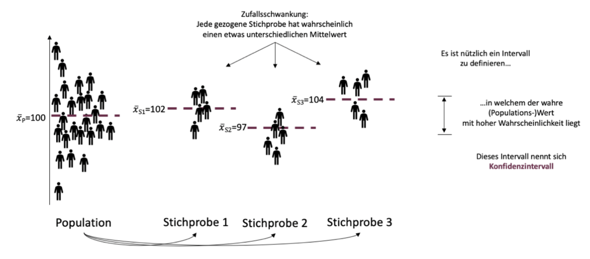
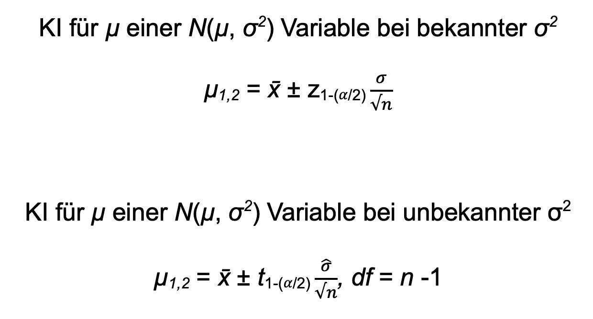
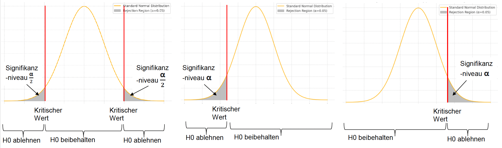
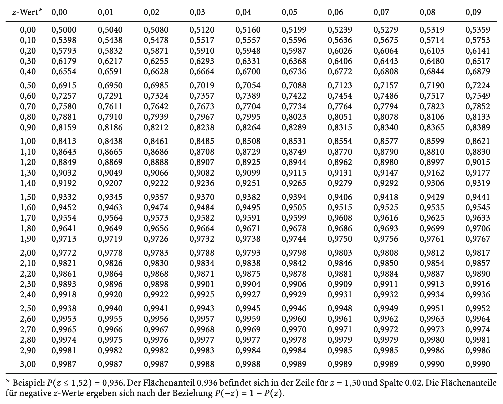

```{r setup, include=FALSE}
options(htmltools.dir.version = FALSE)

library(tidyverse)
library(kableExtra)
library(knitr)
library(ggplot2)
library(plotly)
library(htmlwidgets)
library(MASS)
library(ggpubr)
library(xaringanthemer)
library(xaringanExtra)
library(pdftools)
library(magick)
library(scales)
library(patchwork)
library(latex2exp)
library(RColorBrewer)
library(gridExtra)
library(grid)

style_duo_accent(
  primary_color = "#621C37",
  secondary_color = "#EE0071",
  background_image = "blank.png"
)

xaringanExtra::use_xaringan_extra(c("tile_view"))

use_scribble(
  pen_color = "#EE0071",
  pen_size = 4
  )

knitr::opts_chunk$set(
  fig.retina = TRUE,
  warning = FALSE,
  message = FALSE
)
```

name: 1
class: middle, left
<br><br><br><br><br><br><br>
# Statistik 1
## Seminar
***
### Einheit 4
##### `r format(as.Date(data.frame(readxl::read_excel("CFH_Statistik_1_Seminar_Termine.xlsx"))$Datum), "%d.%m.%Y")[5]` | Janika Saretzki, MSc. 

---
name: 2
class: top, left

### Termine
<br><br>
~~**Einheit 1  02.05.25  14:45-16:15 Uhr  A + B  HS Audimax / P3**~~<br>
~~**Einheit 2  15.05.25  13:05-15:30 Uhr  A + B  HS Audimax / P3**~~<br>
<br>
~~**Einheit 3**  12.06.25  13:05-15:30 Uhr  A    HS P5 005~~  
~~**Einheit 3**  13.06.25  13:50-16:15 Uhr  B    HS P1 105~~<br>
<br>
**Einheit 4**  26.06.25  13:20-15:45 Uhr  A    HS P5 005  
**Einheit 4**  27.06.25  13:50-16:15 Uhr  B    HS P1 105<br> 
<br>
**Einheit 5**  17.07.25  13:20-15:45 Uhr  A    HS P5 005  
**Einheit 5**  18.07.25  13:50-16:15 Uhr  B    HS P1 105<br>

---
name: 3
class: top, left

### Termine
<br><br>
~~**Einheit 1  02.05.25  14:45-16:15 Uhr  A + B  HS Audimax / P3**~~<br>
~~**Einheit 2  15.05.25  13:05-15:30 Uhr  A + B  HS Audimax / P3**~~<br>
<br>
~~**Einheit 3**  12.06.25  13:05-15:30 Uhr  A    HS P5 005~~  
~~**Einheit 3**  13.06.25  13:50-16:15 Uhr  B    HS P1 105~~<br>
<br>
**Einheit 4**  26.06.25  13:20-15:45 Uhr  A    HS P5 005  
**Einheit 4**  27.06.25  13:50-16:15 Uhr  B    HS P1 105<br> 
<br>
**Einheit 5**  17.07.25  13:20-15:45 Uhr  A    HS P5 005  
**Einheit 5**  18.07.25  13:50-16:15 Uhr  B    HS P1 105<br>
<br>
**Tutorium  21.07.25  10:00-15:30 Uhr  A + B  HS Audimax / P3**<br>
**Tutorium  22.07.25  10:00-15:30 Uhr  B + B  HS Audimax / P3**<br> 

---
name: 4
class: top, left, smaller

### Recap

<br><br><br>
<strong>Boxplot</strong>
<br><br>
Ein Boxplot visualisiert die Verteilung zumindest ordinal skalierter Daten. Um einen Boxplot zu zeichnen, <strong>werden zunächst Median, das erste (Q1) und das dritte Quartil (Q3) berechnet.</strong> Diese drei Werte bilden die sogenannte Box. Der Interquartilsabstand (IQR) ergibt sich aus Q3 minus Q1 und beschreibt die Streubreite der mittleren 50% der Daten. <strong>An die Box schließen sich sogenannte Whisker an.</strong> Sie reichen jeweils bis zum letzten Datenpunkt, der noch innerhalb des Bereichs von Q1 - 1,5 x IQR bzw. Q3 + 1,5 x IQR liegt. Werte, die außerhalb dieser Grenzen liegen, gelten als Ausreißer und werden im Plot als einzelne Punkte (oder Sternchen) dargestellt.
<br><br>
Ein Boxplot zeigt damit auf kompakte Weise die zentrale Tendenz, die Streuung und potenzielle Ausreißer - und eignet sich besonders gut, um mehrere Gruppen miteinander zu vergleichen.

---
name: 5
class: top, left, smaller

### Recap

<br><br><br>
<strong>Boxplot</strong>
<br><br>
Ein Dozent hat die Ergebnisse einer Statistik-Klausur in einem Kurs mit 12 Teilnehmenden erfasst. Die erreichten Punktzahlen liegen im Bereich von 0 bis 100. Der Median beträgt 75,0, das erste Quartil 72,5, das dritte Quartil 85,5<br>
<br>
Daten (in Punkten): 58, 67, 71, 73, 74, 74, 76, 87, 80, 84, 88, 92
<br><br>
<strong><u>Aufgabe:</u> Bestimmen Sie den Interquartilsabstand (IQR) und etwaige Ausreißer. Zeichnen Sie zudem einen Boxplot und beschriften dabei die Achsen sinnvoll.</strong>

---
name: 6
class: top, left, smaller

### Recap - Lösung
<div style="flex: 1.4; font-size: 0.95em; line-height: 1.5; color: green;">
<br><br><br>
Die Daten sind bereits sortiert, d.h. in Form einer geordneten Urliste vorliegend. Wir kennen zudem den Median (Mdn = 75,0), das erste Quartil (Q1 = 72,5) und das dritte Quartil (Q3 = 85,5).
<br><br>
1. Berechnung des Interquartilsabstandes: IQR = Q3 - Q1 = 85,5 - 72,5 = 13,0<br>
2. Berechnung der potenziellen Länge der Whisker: <ul>
  <li>Unterer Whisker von Q1 bis Q1 – 1,5 × IQR, d.h. von 72,5 bis 72,5 – 1,5 × 13,0 = 53,0</li>
  <li>Oberer Whisker: von Q3 bis Q3 + 1,5 × IQR, d.h. von 85,5 bis 85,5 + 1,5 × 13,0 = 105,0</li>
</ul><br>
3. Ausreißer identifizierten: Beobachtete Werte reichen von 58 bis 92, d.h. kein Wert < 53,0 und kein Wert > 105,0. <br><u>Es sind daher keine Ausreißer vorhanden!</u>
</ul><br>

</div>

---
name: 7
class: top, left, smaller
### Recap - Lösung

<br><br>
```{r Recap, echo=FALSE, fig.align='center', fig.width=6, fig.height=4.5, out.width='50%', dpi=300}

# punkte <- c(58, 67, 71, 73, 74, 74, 76, 80, 84, 87, 88, 92)
# 
# df <- data.frame(Punkte = punkte, Gruppe = "")
# 
# ggplot(df, aes(x = Gruppe, y = Punkte)) +
#   geom_boxplot(
#     fill = NA,
#     color = "darkgreen",
#     width = 0.3,
#     outlier.color = "darkgreen",
#     outlier.shape = 16
#   ) +
#   scale_y_continuous(
#     limits = c(50, 100),
#     breaks = seq(50, 100, 10)
#   ) +
#   labs(
#     x = "Statistik-Kurs",
#     y = "Klausurpunktzahl",
#     title = ""
#   ) +
#   theme_minimal(base_size = 14) +
#   theme(
#     panel.grid = element_blank(),
#     axis.line = element_line(color = "darkgreen"),
#     axis.ticks = element_line(color = "darkgreen"),
#     axis.text = element_text(color = "darkgreen"),
#     axis.title = element_text(color = "darkgreen"),
#     plot.title = element_text(color = "darkgreen", hjust = 0.5, face = "bold")
#   )

```


---
name: 8
class: top, left, smaller

### Wiederholung

<strong>Logik des Schließens von Stichprobe auf Population</strong>
<br><br>
<div style="display: flex; justify-content: center;">
  
</div>

---
name: 9
class: top, left, smaller

### Wiederholung

<strong>Logik des Schließens von Stichprobe auf Population</strong>
<br><br>
<div style="display: flex; justify-content: center;">
  
</div>
<br>
<div style="text-align: center; font-size: 90%;">
<strong>Schätzwert =</strong> Wert, von dem wir auf Basis unserer Stichprobe davon ausgehen, dass er "möglichst nahe" an dem wahren Parameterwert bzw. dem wahren Wert der Maßzahl in der Population liegt <strong>(x̄ und s als Schätzwerte für die Population)</strong>
</div>

---
name: 10
class: top, left, smaller

### Wiederholung
<div style="text-align: center;">
  
</div>
<br>
<div style="text-align: center; font-size: 90%;">
Die Genauigkeit der Schätzung hängt von der Streuung der Stichprobenkennwerteverteilung ab. Diese Streuung ist die Standardabweichung der Schätzfunktion und wird <strong>Standardfehler</strong> genannt.
</div>
<br>
$$
\small
\sigma_{\bar{x}} = \sqrt{\frac{\sigma_x^2}{n}} = \frac{\sigma_x}{\sqrt{n}}
$$

---
name: 11
class: top, left, smaller

### Wiederholung
<br>
```{r Dataframe 1, echo=FALSE, fig.align='center', fig.width=6, fig.height=4.5, out.width='50%', dpi=300}

set.seed(123)
mu = 40
sigma = 10
n = 10
a = 25000

means = replicate(a, mean(rnorm(n, mean = mu, sd = sigma)))
theo_sd = sigma / sqrt(n)

df = data.frame(Mittelwert = means)

ggplot(df, aes(x = Mittelwert)) +
  geom_histogram(aes(y = ..density..), bins = 100, fill = "#621C37", alpha = 0.9) +
  stat_function(fun = dnorm, args = list(mean = mu, sd = theo_sd),
                color = "black", linetype = "solid", linewidth = 0.5) +
  theme(
    panel.background = element_blank(),
    panel.grid = element_blank(),
    axis.line = element_line(color = "black"),
    axis.ticks = element_line(color = "black"),
    axis.text = element_text(color = "black"),
    axis.title = element_text(color = "black"),
    plot.title = element_text(size = 14, face = "bold", hjust = 0.5)
  ) +
  labs(
    title = "Stichprobenkennwerteverteilung",
    x = NULL,
    y = "f(x)"
  ) +
  annotate("text", x = 22, y = 0.25, hjust = 0,
           label = "", size = 5) +
  annotate("text", x = 48, y = 0.25, hjust = 0,
           label = sprintf("",
                           mean(means), sd(means), n, a), size = 5)
```

<div style="text-align: center; font-size: 90%;">
<strong>Computersimulation einer Stichprobenkennwerteverteilung mit der Stichprobengröße n = 10</strong
<br><br>
Theoretische Kennwerte: µ = 40,00, σ = 3,16, n = 10; Empirische Kennwerte: x̄ =  4,12, σ = 3,21, n = 10, a = 25.000
</div>

---
name: 12
class: top, left, smaller

### Wiederholung
<br><br>
<div style="text-align: center; font-size: 90%;">
Ein <strong>Konfidenzintervall</strong> ist ein auf Stichprobendaten basierendes Intervall, das bei wiederholter Ziehung in einem festgelegten Anteil der Fälle (z.B. 95%) den wahren Wert des Populationsparameters enthalten würde.
</div>
<br><br>
<div style="display: flex; justify-content: center;">
  
</div>

---
name: 13
class: top, left, smallest
<br>
<center>
<div style="display: flex; flex-direction: row; gap: 40px; align-items: flex-start;">
<div style="flex: 1;">
  
</div></center>

---
name: 14
class: top, left, smaller

### Wiederholung
<br>
<div style="text-align: left; font-size: 90%; line-height: 1.6;">

<strong>Wie lese ich die Tabelle?</strong>
  <br><br><br>

  <strong>Erster Schritt</strong><br>
  • Berechne den Wert (d.h. das benötigte Quantil) von 1 - α/2 (zweiseitiges Konfidenzintervall) bzw. 1 - α (einseitiges Konfidenzintervall)<br>
  • Bestimme die Freiheitsgrade: n - 1
  <br><br>

  <strong>Zweiter Schritt</strong><br>
  • In der ersten Spalte stehen die Freiheitsgrade (df)<br>
  • In der ersten Zeile stehen die Werte von  1 - α/2 (zweiseitiges Konfidenzintervall) bzw. 1 - α (einseitiges Konfidenzintervall)<br>
  <br>
  • <strong>Die Zelle, in der sich beide schneiden, enthält den gesuchten t-Wert</strong>

</div>

---
name: 15
class: top, left, smaller
### Übungsaufgabe 1

Eine Psychologin interessiert sich für das Stresslevel von Universitätsstudierenden. Sie verwendet eine Skala von 0 bis 100, wobei 0 für "kein Stress" und 100 für "extremen Stress" steht. Dazu erhebt sie eine Stichprobe von 30 Studierenden. Die gemessenen Stresswerte ergeben im Durchschnitt einen Wert von 75, mit einer Standardabweichung von 12. Sie möchte nun Rückschlüsse auf das Stresslevel aller Universitätsstudierenden ziehen.

a) Welche Werte aus dem Text entsprechen den folgenden statistischen Kennwerten:  
$$
\mu,\ \sigma,\ \bar{x},\ s
$$

b) Berechnen Sie den **Standardfehler des Mittelwerts**. Was sagt dieser aus, und wovon hängt er ab?

c) Geben Sie die Formel für das **95%-Konfidenzintervall** an und berechnen Sie es.

---
name: 16
class: top, left, smaller
### Übungsaufgabe 1 - Lösung

Eine Psychologin interessiert sich für das Stresslevel von Universitätsstudierenden. Sie verwendet eine Skala von 0 bis 100, wobei 0 für "kein Stress" und 100 für "extremen Stress" steht. Dazu erhebt sie eine Stichprobe von 30 Studierenden. Die gemessenen Stresswerte ergeben im Durchschnitt einen Wert von 75, mit einer Standardabweichung von 12. Sie möchte nun Rückschlüsse auf das Stresslevel aller Universitätsstudierenden ziehen.

a) Welche Werte aus dem Text entsprechen den folgenden statistischen Kennwerten:  
$$
\mu,\ \sigma,\ \bar{x},\ s
$$

---
name: 17
class: top, left, smaller
### Übungsaufgabe 1 - Lösung

Eine Psychologin interessiert sich für das Stresslevel von Universitätsstudierenden. Sie verwendet eine Skala von 0 bis 100, wobei 0 für "kein Stress" und 100 für "extremen Stress" steht. Dazu erhebt sie eine Stichprobe von 30 Studierenden. Die gemessenen Stresswerte ergeben im Durchschnitt einen Wert von 75, mit einer Standardabweichung von 12. Sie möchte nun Rückschlüsse auf das Stresslevel aller Universitätsstudierenden ziehen.

b) Berechnen Sie den **Standardfehler des Mittelwerts**. Was sagt dieser aus, und wovon hängt er ab?

---
name: 18
class: top, left, smaller
### Übungsaufgabe 1 - Lösung

Eine Psychologin interessiert sich für das Stresslevel von Universitätsstudierenden. Sie verwendet eine Skala von 0 bis 100, wobei 0 für "kein Stress" und 100 für "extremen Stress" steht. Dazu erhebt sie eine Stichprobe von 30 Studierenden. Die gemessenen Stresswerte ergeben im Durchschnitt einen Wert von 75, mit einer Standardabweichung von 12. Sie möchte nun Rückschlüsse auf das Stresslevel aller Universitätsstudierenden ziehen.

c) Geben Sie die Formel für das **95%-Konfidenzintervall** an und berechnen Sie es.

---
name: 19
class: top, left, smaller
### Übungsaufgabe 2

Im Rahmen eines psychologischen Experiments wird die Rundenzeit einer Ratte in einem Parcours untersucht. In einer Trainingssession absolviert die Ratte 54 Runden. Die durchschnittliche Rundenzeit beträgt 17 Minuten und 30 Sekunden. Es wird angenommen, dass die Rundenzeiten normalverteilt sind, mit einer (Populations-)Varianz von 2,5 Minuten<sup>2</sup>.

Wie lautet das 90%-Konfidenzintervall für den Mittelwert der Rundenzeit?

---
name: 20
class: top, left, smaller
### Übungsaufgabe 2 - Lösung

Im Rahmen eines psychologischen Experiments wird die Rundenzeit einer Ratte in einem Parcours untersucht. In einer Trainingssession absolviert die Ratte 54 Runden. Die durchschnittliche Rundenzeit beträgt 17 Minuten und 30 Sekunden. Es wird angenommen, dass die Rundenzeiten normalverteilt sind, mit einer (Populations-)Varianz von 2,5 Minuten<sup>2</sup>.

Wie lautet das 90%-Konfidenzintervall für den Mittelwert der Rundenzeit?

---
name: 21
class: top, left, smaller
### Übungsaufgabe 2 - Lösung

Im Rahmen eines psychologischen Experiments wird die Rundenzeit einer Ratte in einem Parcours untersucht. In einer Trainingssession absolviert die Ratte 54 Runden. Die durchschnittliche Rundenzeit beträgt 17 Minuten und 30 Sekunden. Es wird angenommen, dass die Rundenzeiten normalverteilt sind, mit einer (Populations-)Varianz von 2,5 Minuten<sup>2</sup>.

Wie lautet das 90%-Konfidenzintervall für den Mittelwert der Rundenzeit?

---
name: 22
class: top, left, smaller
### Wiederholung
Zur Durchführung eines Hypothesentests sind folgende Schritte notwendig:

**1. Formulierung der Hypothesen:**
$$
\small
H_0: \text{Kein Effekt} \\
\small
H_1: \text{Es liegt ein Effekt vor}
$$

**2. Auswahl der zugrunde liegenden Verteilung**

**3. Festlegung von Annahme- und Ablehnungsbereich:** Bestimmung des kritischen Werts

**4. Einordnung des Beobachtungswerts in die Verteilung**

  - **Binomialverteilung**: Wahrscheinlichkeiten  
  - **z-Verteilung**: Mittelwerte bei bekanntem σ 
  - **t-Verteilung**: Mittelwerte bei unbekanntem σ
  - **F-Verteilung**: Varianzvergleiche  
  - **Chi-Quadrat-Verteilung**: Häufigkeiten / Proportionen

**5. Vergleich von Teststatistik und kritischem Wert**

**6. Entscheidung:** Test signifikant oder nicht signifikant
</span>

---
name: 23
class: top, left, smaller

### Wiederholung
<div style="text-align: left; font-size: 90%;">
<strong><u>Ein-Stichproben Test für Mittelwerte</u></strong>
<br><br><br>
<strong>1. Hypothesenpaar</strong>
<br>
Hypothese über µ einer normalverteilten Variable, wobei die Populationsvarianz bekannt ist
<br><br>

Statistische Hypothesenpaare:
</div>

$$
\small
\begin{aligned}
H_0\!:~ \mu = \mu_0, \quad & H_1\!:~ \mu \neq \mu_0 \quad && \text{(ungerichtet)} \quad \text{→ zweiseitig} \\
H_0\!:~ \mu \leq \mu_0, \quad & H_1\!:~ \mu > \mu_0 \quad && \text{(gerichtet)} \quad \text{→ einseitig (rechtsseitig)} \\
H_0\!:~ \mu \geq \mu_0, \quad & H_1\!:~ \mu < \mu_0 \quad && \text{(gerichtet)} \quad \text{→ einseitig (linksseitig)} \\
\end{aligned}
$$
<br>
$$
\small 
\mu = \text{Populationsmittelwert}; \quad \mu_0 = \text{hypothetischer Populationsparameter}
$$

<br><div style="text-align: left; font-size: 90%;">
<strong>2. Bestimmung einer zugrundeliegenden Verteilung</strong>
<br>
<li>Wenn wir an Mittelwerten interessiert sind UND die Populationsvarianz bekannt ist: <strong>z-Verteilung</strong><br></li>
<li>Wenn wir an Mittelwerten interessiert sind und die Populationsvarianz NICHT bekannt ist: <strong>t-Verteilung</strong></li></div>

---
name: 24
class: top, left, smaller

### Wiederholung
<div style="text-align: left; font-size: 90%;">
<strong>3. Annahme- und Ablehnungsbereich der Nullhypothese</strong>
<br></div>




<div style="text-align: center; font-size: 90%;">
Der kritische Wert wird in der Verteilungstabelle abgelesen:
</div>

$$
\small
\text{Einseitiger Test:} \quad z_{\text{kritisch}} = 1 - {\alpha}
$$

$$
\small
\text{Zweiseitiger Test:} \quad z_{\text{kritisch}} = 1 - \frac{\alpha}{2}
$$

---
name: 25
class: top, left, smaller
### Übungsaufgabe 3
Ein Psychologe möchte untersuchen, ob Kinder mit jüngeren Geschwistern im Durchschnitt eine höhere Intelligenzleistung aufweisen als die Population aller Kinder. In einer Stichprobe von N = 225 Kindern mit jüngeren Geschwistern wird ein Mittelwert von x̄ = 101,8 beobachtet. Der Intelligenzquotient (IQ) unter Kindern gilt als normalverteilt mit einem Erwartungswert von µ = 100 und einer Standardabweichung von σ = 15.

a) Handelt es sich bei der Fragestellung um eine gerichtete oder ungerichtete Hypothese? Formulieren Sie die inhaltliche und statistische Null- und Alternativhypothese entsprechend.<br>
b) Angenommen, der Forscher hat das Signifikanzniveau vorab auf 5% festgelegt - zu welcher Entscheidung hinsichtlich der Nullhypothese kommt er?<br>
c) Wie würde das Testergebnis ausfallen, wenn stattdessen ein ungerichteter Test auf dem 5%-Niveau durchgeführt würde?

---
name: 26
class: top, left, smaller
### Übungsaufgabe 3 - Lösung
Ein Psychologe möchte untersuchen, ob Kinder mit jüngeren Geschwistern im Durchschnitt eine höhere Intelligenzleistung aufweisen als die Population aller Kinder. In einer Stichprobe von N = 225 Kindern mit jüngeren Geschwistern wird ein Mittelwert von x̄ = 101,8 beobachtet. Der Intelligenzquotient (IQ) unter Kindern gilt als normalverteilt mit einem Erwartungswert von µ = 100 und einer Standardabweichung von σ = 15.

a) Handelt es sich bei der Fragestellung um eine gerichtete oder ungerichtete Hypothese? Formulieren Sie die inhaltliche und statistische Null- und Alternativhypothese entsprechend.<br>

---
name: 27
class: top, left, smaller
### Übungsaufgabe 3 - Lösung
Ein Psychologe möchte untersuchen, ob Kinder mit jüngeren Geschwistern im Durchschnitt eine höhere Intelligenzleistung aufweisen als die Population aller Kinder. In einer Stichprobe von N = 225 Kindern mit jüngeren Geschwistern wird ein Mittelwert von x̄ = 101,8 beobachtet. Der Intelligenzquotient (IQ) unter Kindern gilt als normalverteilt mit einem Erwartungswert von µ = 100 und einer Standardabweichung von σ = 15.

b) Angenommen, der Forscher hat das Signifikanzniveau vorab auf 5% festgelegt - zu welcher Entscheidung hinsichtlich der Nullhypothese kommt er?

---
name: 28
class: top, left, smaller
### Übungsaufgabe 3 - Lösung
Ein Psychologe möchte untersuchen, ob Kinder mit jüngeren Geschwistern im Durchschnitt eine höhere Intelligenzleistung aufweisen als die Population aller Kinder. In einer Stichprobe von N = 225 Kindern mit jüngeren Geschwistern wird ein Mittelwert von x̄ = 101,8 beobachtet. Der Intelligenzquotient (IQ) unter Kindern gilt als normalverteilt mit einem Erwartungswert von µ = 100 und einer Standardabweichung von σ = 15.

c) Wie würde das Testergebnis ausfallen, wenn stattdessen ein ungerichteter Test auf dem 5%-Niveau durchgeführt würde?

---
name: 29
class: top, left, smaller
### z-Tabelle
<center>
<div style="display: flex; flex-direction: row; gap: 40px; align-items: flex-start;">
<div style="flex: 1;">
  
</div></center>

---
name: 30
class: top, left, smaller
### Möglichkeit der Visualisierung

```{r Dataframe 5, echo=FALSE, fig.width=8, fig.height=8, fig.align='center', dpi=300, out.width='50%'}

z_vals = seq(-3, 3, length.out = 1000)
df = data.frame(
  z = z_vals,
  density = dnorm(z_vals)
)

y_max = max(df$density)

ggplot(df, aes(x = z, y = density)) +
  geom_line(size = 0.5) +
  
  geom_segment(aes(x = -3, xend = 3, y = 0, yend = 0), 
               color = "black", linewidth = 0.5) +
  
  geom_segment(aes(x = -3, xend = -3, y = 0, yend = y_max), 
               color = "black", linewidth = 0.5) +
  
  scale_x_continuous(
    breaks = -3:3,
    limits = c(-3, 3)
  ) +
  scale_y_continuous(expand = expansion(mult = c(0, 0.05))) +
  labs(title = "",
       x = "z",
       y = "F(z)") +
  theme_minimal(base_size = 16) +
  theme(
    panel.grid = element_blank(),
    axis.ticks = element_blank(),
    axis.line = element_blank()  
  )

```