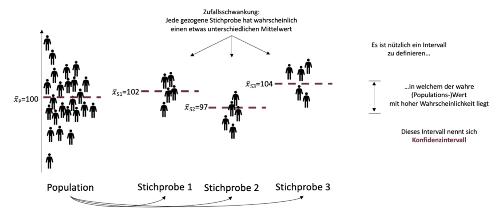
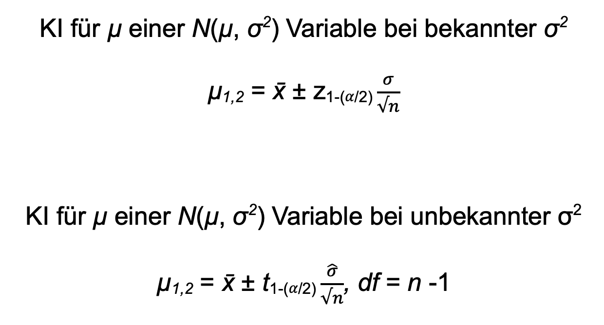
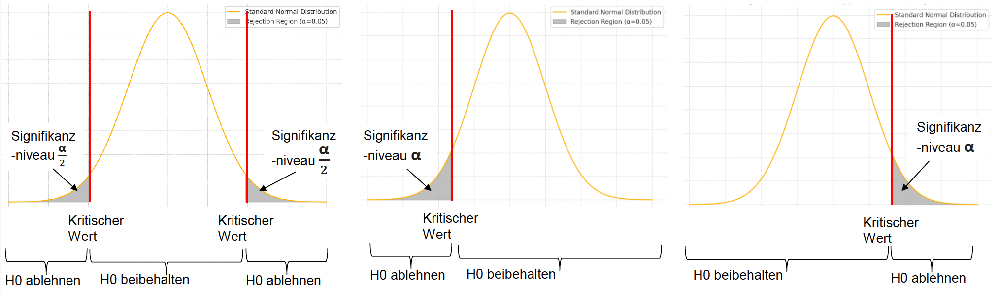
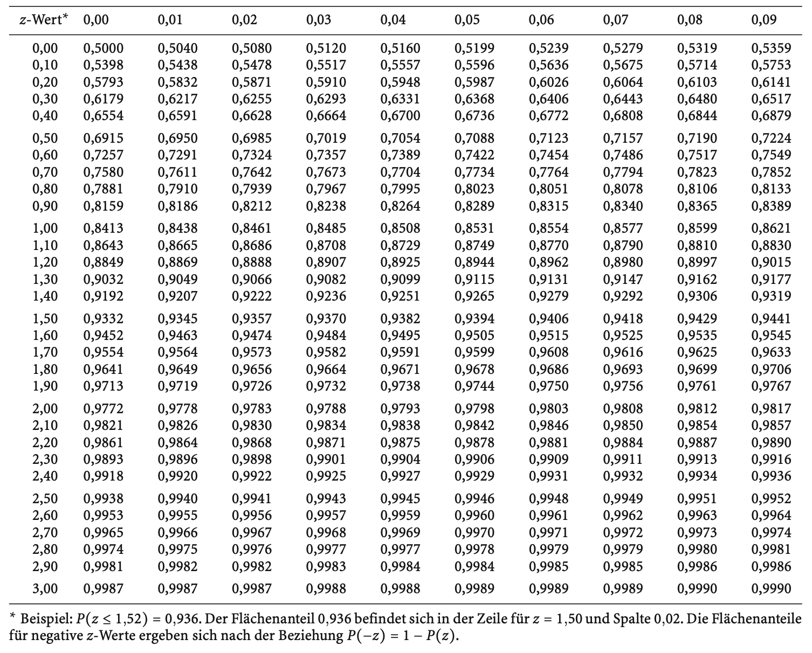

```{r setup, include=FALSE}
options(htmltools.dir.version = FALSE)

library(tidyverse)
library(kableExtra)
library(knitr)
library(ggplot2)
library(plotly)
library(htmlwidgets)
library(MASS)
library(ggpubr)
library(xaringanthemer)
library(xaringanExtra)
library(pdftools)
library(magick)
library(scales)
library(patchwork)
library(latex2exp)
library(RColorBrewer)
library(gridExtra)
library(grid)

style_duo_accent(
  primary_color = "#621C37",
  secondary_color = "#EE0071",
  background_image = "blank.png"
)

xaringanExtra::use_xaringan_extra(c("tile_view"))

use_scribble(
  pen_color = "#EE0071",
  pen_size = 4
  )

knitr::opts_chunk$set(
  fig.retina = TRUE,
  warning = FALSE,
  message = FALSE
)
```

name: 1
class: middle, left
<br><br><br><br><br><br><br>
# Statistik 1
## Seminar
***
### Einheit 4
##### `r format(as.Date(data.frame(readxl::read_excel("CFH_Statistik_1_Seminar_Termine.xlsx"))$Datum), "%d.%m.%Y")[5]` | Janika Saretzki, MSc. 

---
name: 2
class: top, left

### Termine
<br><br>
~~**Einheit 1  02.05.25  14:45-16:15 Uhr  A + B  HS Audimax / P3**~~<br>
~~**Einheit 2  15.05.25  13:05-15:30 Uhr  A + B  HS Audimax / P3**~~<br>
<br>
~~**Einheit 3**  12.06.25  13:05-15:30 Uhr  A    HS P5 005~~  
~~**Einheit 3**  13.06.25  13:50-16:15 Uhr  B    HS P1 105~~<br>
<br>
**Einheit 4**  26.06.25  13:20-15:45 Uhr  A    HS P5 005  
**Einheit 4**  27.06.25  13:50-16:15 Uhr  B    HS P1 105<br> 
<br>
**Einheit 5**  17.07.25  13:20-15:45 Uhr  A    HS P5 005  
**Einheit 5**  18.07.25  13:50-16:15 Uhr  B    HS P1 105<br>

---
name: 3
class: top, left

### Termine
<br><br>
~~**Einheit 1  02.05.25  14:45-16:15 Uhr  A + B  HS Audimax / P3**~~<br>
~~**Einheit 2  15.05.25  13:05-15:30 Uhr  A + B  HS Audimax / P3**~~<br>
<br>
~~**Einheit 3**  12.06.25  13:05-15:30 Uhr  A    HS P5 005~~  
~~**Einheit 3**  13.06.25  13:50-16:15 Uhr  B    HS P1 105~~<br>
<br>
**Einheit 4**  26.06.25  13:20-15:45 Uhr  A    HS P5 005  
**Einheit 4**  27.06.25  13:50-16:15 Uhr  B    HS P1 105<br> 
<br>
**Einheit 5**  17.07.25  13:20-15:45 Uhr  A    HS P5 005  
**Einheit 5**  18.07.25  13:50-16:15 Uhr  B    HS P1 105<br>
<br>
**Tutorium  21.07.25  10:00-15:30 Uhr  A + B  HS Audimax / P3**<br>
**Tutorium  22.07.25  10:00-15:30 Uhr  B + B  HS Audimax / P3**<br> 

---
name: 4
class: top, left, smaller

### Recap

<br><br><br>
<strong>Boxplot</strong>
<br><br>
Ein Boxplot visualisiert die Verteilung zumindest ordinal skalierter Daten. Um einen Boxplot zu zeichnen, <strong>werden zunächst Median, das erste (Q1) und das dritte Quartil (Q3) berechnet.</strong> Diese drei Werte bilden die sogenannte Box. Der Interquartilsabstand (IQR) ergibt sich aus Q3 minus Q1 und beschreibt die Streubreite der mittleren 50% der Daten. <strong>An die Box schließen sich sogenannte Whisker an.</strong> Sie reichen jeweils bis zum letzten Datenpunkt, der noch innerhalb des Bereichs von Q1 - 1,5 x IQR bzw. Q3 + 1,5 x IQR liegt. Werte, die außerhalb dieser Grenzen liegen, gelten als Ausreißer und werden im Plot als einzelne Punkte (oder Sternchen) dargestellt.
<br><br>
Ein Boxplot zeigt damit auf kompakte Weise die zentrale Tendenz, die Streuung und potenzielle Ausreißer - und eignet sich besonders gut, um mehrere Gruppen miteinander zu vergleichen.

---
name: 5
class: top, left, smaller

### Recap

<br><br><br>
<strong>Boxplot</strong>
<br><br>
Ein Dozent hat die Ergebnisse einer Statistik-Klausur in einem Kurs mit 12 Teilnehmenden erfasst. Die erreichten Punktzahlen liegen im Bereich von 0 bis 100. Der Median beträgt 75,0, das erste Quartil 72,5, das dritte Quartil 85,5<br>
<br>
Daten (in Punkten): 58, 67, 71, 73, 74, 74, 76, 87, 80, 84, 88, 92
<br><br>
<strong><u>Aufgabe:</u> Bestimmen Sie den Interquartilsabstand (IQR) und etwaige Ausreißer. Zeichnen Sie zudem einen Boxplot und beschriften dabei die Achsen sinnvoll.</strong>

---
name: 6
class: top, left, smaller

### Recap - Lösung
<div style="flex: 1.4; font-size: 0.95em; line-height: 1.5; color: green;">
<br><br><br>
Die Daten sind bereits sortiert, d.h. in Form einer geordneten Urliste vorliegend. Wir kennen zudem den Median (Mdn = 75,0), das erste Quartil (Q1 = 72,5) und das dritte Quartil (Q3 = 85,5).
<br><br>
1. Berechnung des Interquartilsabstandes: IQR = Q3 - Q1 = 85,5 - 72,5 = 13,0<br>
2. Berechnung der potenziellen Länge der Whisker: <ul>
  <li>Unterer Whisker von Q1 bis Q1 – 1,5 × IQR, d.h. von 72,5 bis 72,5 – 1,5 × 13,0 = 53,0</li>
  <li>Oberer Whisker: von Q3 bis Q3 + 1,5 × IQR, d.h. von 85,5 bis 85,5 + 1,5 × 13,0 = 105,0</li>
</ul><br>
3. Ausreißer identifizierten: Beobachtete Werte reichen von 58 bis 92, d.h. kein Wert < 53,0 und kein Wert > 105,0. <br><u>Es sind daher keine Ausreißer vorhanden!</u>
</ul><br>
</div>

---
name: 7
class: top, left, smaller

### Recap - Lösung
<br><br>
```{r Recap, echo=FALSE, fig.align='center', fig.width=6, fig.height=4.5, out.width='50%', dpi=300}

punkte <- c(58, 67, 71, 73, 74, 74, 76, 80, 84, 87, 88, 92)

df <- data.frame(Punkte = punkte, Gruppe = "")

ggplot(df, aes(x = Gruppe, y = Punkte)) +
  geom_boxplot(
    fill = NA,
    color = "darkgreen",
    width = 0.3,
    outlier.color = "darkgreen",
    outlier.shape = 16
  ) +
  scale_y_continuous(
    limits = c(50, 100),
    breaks = seq(50, 100, 10)
  ) +
  labs(
    x = "Statistik-Kurs",
    y = "Klausurpunktzahl",
    title = ""
  ) +
  theme_minimal(base_size = 14) +
  theme(
    panel.grid = element_blank(),
    axis.line = element_line(color = "darkgreen"),
    axis.ticks = element_line(color = "darkgreen"),
    axis.text = element_text(color = "darkgreen"),
    axis.title = element_text(color = "darkgreen"),
    plot.title = element_text(color = "darkgreen", hjust = 0.5, face = "bold")
  )

```

---
name: 8
class: top, left, smaller

### Wiederholung

<strong>Logik des Schließens von Stichprobe auf Population</strong>
<br><br>
<div style="display: flex; justify-content: center;">
  
</div>

---
name: 9
class: top, left, smaller

### Wiederholung

<strong>Logik des Schließens von Stichprobe auf Population</strong>
<br><br>
<div style="display: flex; justify-content: center;">
  
</div>
<br>
<div style="text-align: center; font-size: 90%;">
<strong>Schätzwert =</strong> Wert, von dem wir auf Basis unserer Stichprobe davon ausgehen, dass er "möglichst nahe" an dem wahren Parameterwert bzw. dem wahren Wert der Maßzahl in der Population liegt <strong>(x̄ und s als Schätzwerte für die Population)</strong>
</div>

---
name: 10
class: top, left, smaller

### Wiederholung
<div style="text-align: center;">
  
</div>
<br>
<div style="text-align: center; font-size: 90%;">
Die Genauigkeit der Schätzung hängt von der Streuung der Stichprobenkennwerteverteilung ab. Diese Streuung ist die Standardabweichung der Schätzfunktion und wird <strong>Standardfehler</strong> genannt.
</div>
<br>
$$
\small
\sigma_{\bar{x}} = \sqrt{\frac{\sigma_x^2}{n}} = \frac{\sigma_x}{\sqrt{n}}
$$

---
name: 11
class: top, left, smaller

### Wiederholung
<br>
```{r Dataframe 1, echo=FALSE, fig.align='center', fig.width=6, fig.height=4.5, out.width='50%', dpi=300}

set.seed(123)
mu = 40
sigma = 10
n = 10
a = 25000

means = replicate(a, mean(rnorm(n, mean = mu, sd = sigma)))
theo_sd = sigma / sqrt(n)

df = data.frame(Mittelwert = means)

ggplot(df, aes(x = Mittelwert)) +
  geom_histogram(aes(y = ..density..), bins = 100, fill = "#621C37", alpha = 0.9) +
  stat_function(fun = dnorm, args = list(mean = mu, sd = theo_sd),
                color = "black", linetype = "solid", linewidth = 0.5) +
  theme(
    panel.background = element_blank(),
    panel.grid = element_blank(),
    axis.line = element_line(color = "black"),
    axis.ticks = element_line(color = "black"),
    axis.text = element_text(color = "black"),
    axis.title = element_text(color = "black"),
    plot.title = element_text(size = 14, face = "bold", hjust = 0.5)
  ) +
  labs(
    title = "Stichprobenkennwerteverteilung",
    x = NULL,
    y = "f(x)"
  ) +
  annotate("text", x = 22, y = 0.25, hjust = 0,
           label = "", size = 5) +
  annotate("text", x = 48, y = 0.25, hjust = 0,
           label = sprintf("",
                           mean(means), sd(means), n, a), size = 5)
```

<div style="text-align: center; font-size: 90%;">
<strong>Computersimulation einer Stichprobenkennwerteverteilung mit der Stichprobengröße n = 10</strong
<br><br>
Theoretische Kennwerte: µ = 40,00, σ = 3,16, n = 10; Empirische Kennwerte: x̄ =  4,12, σ = 3,21, n = 10, a = 25.000
</div>

---
name: 12
class: top, left, smaller

### Wiederholung
<br><br>
<div style="text-align: center; font-size: 90%;">
Ein <strong>Konfidenzintervall</strong> ist ein auf Stichprobendaten basierendes Intervall, das bei wiederholter Ziehung in einem festgelegten Anteil der Fälle (z.B. 95%) den wahren Wert des Populationsparameters enthalten würde.
</div>
<br><br>
<div style="display: flex; justify-content: center;">
  
</div>

---
name: 13
class: top, left, smallest
<br>
<center>
<div style="display: flex; flex-direction: row; gap: 40px; align-items: flex-start;">
<div style="flex: 1;">
  
</div></center>

---
name: 14
class: top, left, smaller

### Wiederholung
<br>
<div style="text-align: left; font-size: 90%; line-height: 1.6;">

<strong>Wie lese ich die Tabelle?</strong>
  <br><br><br>

  <strong>Erster Schritt</strong><br>
  • Berechne den Wert (d.h. das benötigte Quantil) von 1 - α/2 (zweiseitiges Konfidenzintervall) bzw. 1 - α (einseitiges Konfidenzintervall)<br>
  • Bestimme die Freiheitsgrade: n - 1
  <br><br>

  <strong>Zweiter Schritt</strong><br>
  • In der ersten Spalte stehen die Freiheitsgrade (df)<br>
  • In der ersten Zeile stehen die Werte von  1 - α/2 (zweiseitiges Konfidenzintervall) bzw. 1 - α (einseitiges Konfidenzintervall)<br>
  <br>
  • <strong>Die Zelle, in der sich beide schneiden, enthält den gesuchten t-Wert</strong>

</div>

---
name: 15
class: top, left, smaller
### Übungsaufgabe 1

Eine Psychologin interessiert sich für das Stresslevel von Universitätsstudierenden. Sie verwendet eine Skala von 0 bis 100, wobei 0 für "kein Stress" und 100 für "extremen Stress" steht. Dazu erhebt sie eine Stichprobe von 30 Studierenden. Die gemessenen Stresswerte ergeben im Durchschnitt einen Wert von 75, mit einer Standardabweichung von 12. Sie möchte nun Rückschlüsse auf das Stresslevel aller Universitätsstudierenden ziehen.

a) Welche Werte aus dem Text entsprechen den folgenden statistischen Kennwerten:  
$$
\mu,\ \sigma,\ \bar{x},\ s
$$

b) Berechnen Sie den **Standardfehler des Mittelwerts**. Was sagt dieser aus, und wovon hängt er ab?

c) Geben Sie die Formel für das **95%-Konfidenzintervall** an und berechnen Sie es.

---
name: 16
class: top, left, smaller
### Übungsaufgabe 1 - Lösung

Eine Psychologin interessiert sich für das Stresslevel von Universitätsstudierenden. Sie verwendet eine Skala von 0 bis 100, wobei 0 für "kein Stress" und 100 für "extremen Stress" steht. Dazu erhebt sie eine Stichprobe von 30 Studierenden. Die gemessenen Stresswerte ergeben im Durchschnitt einen Wert von 75, mit einer Standardabweichung von 12. Sie möchte nun Rückschlüsse auf das Stresslevel aller Universitätsstudierenden ziehen.

a) Welche Werte aus dem Text entsprechen den folgenden statistischen Kennwerten:  
$$
\mu,\ \sigma,\ \bar{x},\ s
$$
<div style="flex: 1.4; font-size: 0.90em; line-height: 1.5; color: green; margin-top: 40px;">
  <ul>
    <li>x̄ = 75 (durchschnittliches Stresslevel in der Stichprobe)</li>
    <li>s = 12 (Streuung des Stresslevels in der Stichprobe, Stichprobenstandardabweichung)</li>
    <br>
    <li>µ (durchschnittliches Stresslevel in der Population): unbekannt</li>
    <li>σ (Streuung des Stresslevels in der Population, Populationsstandardabweichung): unbekannt</li>
  </ul>
<br>
<div style="text-align: center;">
→ Stichproben- vs. Populationsebene<br>
→ Wir verwenden x̄ und s als Schätzwerte für µ und σ
</div></div>

---
name: 17
class: top, left, smaller
### Übungsaufgabe 1 - Lösung

Eine Psychologin interessiert sich für das Stresslevel von Universitätsstudierenden. Sie verwendet eine Skala von 0 bis 100, wobei 0 für "kein Stress" und 100 für "extremen Stress" steht. Dazu erhebt sie eine Stichprobe von 30 Studierenden. Die gemessenen Stresswerte ergeben im Durchschnitt einen Wert von 75, mit einer Standardabweichung von 12. Sie möchte nun Rückschlüsse auf das Stresslevel aller Universitätsstudierenden ziehen.

b) Berechnen Sie den **Standardfehler des Mittelwerts**. Was sagt dieser aus, und wovon hängt er ab?

<div style="flex: 1.4; font-size: 0.90em; line-height: 1.5; color: green; margin-top: 40px;">

$$
\small
\text{Standardabweichung der Stichprobenmittelwerte: } \sigma_{\bar{x}} = \sqrt{ \frac{\sigma_x^2}{n} } = \frac{\sigma_x}{\sqrt{n}}
$$
Der Standardfehler gibt an, wie stark der Mittelwert aus der Stichprobe typischerweise vom wahren Populationsmittelwert abweicht – also wie präzise die Schätzung ist. Er wird durch a) die Streuung der Messwerte in der Population/Stichprobenkennwerteverteilung und b) die Stichprobengröße beeinflusst (siehe Formel).
<br>
Der Standardfehler ist umso kleiner, je a) kleiner die Streuung ist und b) größer die Stichprobe ist.

$$
\small
\text{In der Praxis: Verwendung der empirischen Standardabweichung (= Stichprobenebene) }
$$
$$
\small
\sigma_{\bar{x}} = \frac{s}{\sqrt{n}} = \frac{12}{\sqrt{30}} = 2,19
$$
</div>

---
name: 18
class: top, left, smaller
### Übungsaufgabe 1 - Lösung

Eine Psychologin interessiert sich für das Stresslevel von Universitätsstudierenden. Sie verwendet eine Skala von 0 bis 100, wobei 0 für "kein Stress" und 100 für "extremen Stress" steht. Dazu erhebt sie eine Stichprobe von 30 Studierenden. Die gemessenen Stresswerte ergeben im Durchschnitt einen Wert von 75, mit einer Standardabweichung von 12. Sie möchte nun Rückschlüsse auf das Stresslevel aller Universitätsstudierenden ziehen.

c) Geben Sie die Formel für das **95%-Konfidenzintervall** an und berechnen Sie es.

<div style="flex: 1.4; font-size: 0.85em; line-height: 1.5; color: green; margin-top: 40px;">
Die Populationsvarianz ist nicht bekannt, daher: Verwendung der t-Verteilung!

$$
\small
\mu_{1,2} = \bar{x} \pm t_{1 - \alpha/2} \cdot \frac{\hat{\sigma}}{\sqrt{n}}
$$

$$
\small
df = n - 1
$$
Werte einsetzen:

$$
\small
t_{1 - \alpha/2} = t_{1 - 0,05/2} = t_{0,975}
$$

$$
\small
df = 30 - 1 = 29
$$

... mit diesen Werten werfen wir nun einen Blick in die t-Tabelle!
</div>

---
name: 19
class: top, left, smaller
### Übungsaufgabe 1 - Lösung

Eine Psychologin interessiert sich für das Stresslevel von Universitätsstudierenden. Sie verwendet eine Skala von 0 bis 100, wobei 0 für "kein Stress" und 100 für "extremen Stress" steht. Dazu erhebt sie eine Stichprobe von 30 Studierenden. Die gemessenen Stresswerte ergeben im Durchschnitt einen Wert von 75, mit einer Standardabweichung von 12. Sie möchte nun Rückschlüsse auf das Stresslevel aller Universitätsstudierenden ziehen.

c) Geben Sie die Formel für das **95%-Konfidenzintervall** an und berechnen Sie es.

<div style="flex: 1.4; font-size: 0.85em; line-height: 1.5; color: green; margin-top: 40px;">

$$
\small
\mu_{1,2} = 75 \pm 2,045 \cdot \frac{12}{\sqrt{30}}
$$

$$
\small
\mu_{1} = 70,52
$$

$$
\small
\mu_{2} = 79,48
$$

Auf Basis unserer Stichprobe ergibt sich ein 95%-Konfidenzintervall von 70,52 bis 79,48.
Dieses Intervall wurde so berechnet, dass es mit 95%iger Konfidenz den wahren Mittelwert der Population überdeckt.
<br><br>
<strong> Wenn wir viele Stichproben ziehen und jeweils ein 95%-Konfidenzintervall berechnen, dann würden etwa 95% dieser Intervalle den wahren Populationsmittelwert einschließen.</strong>
</div>

---
name: 20
class: top, left, smaller
### Übungsaufgabe 2

Im Rahmen eines psychologischen Experiments wird die Rundenzeit einer Ratte in einem Parcours untersucht. In einer Trainingssession absolviert die Ratte 54 Runden. Die durchschnittliche Rundenzeit beträgt 17 Minuten und 30 Sekunden. Es wird angenommen, dass die Rundenzeiten normalverteilt sind, mit einer (Populations-)Varianz von 2,5 Minuten<sup>2</sup>.

Wie lautet das 90%-Konfidenzintervall für den Mittelwert der Rundenzeit?

---
name: 21
class: top, left, smaller
### Übungsaufgabe 2 - Lösung

Im Rahmen eines psychologischen Experiments wird die Rundenzeit einer Ratte in einem Parcours untersucht. In einer Trainingssession absolviert die Ratte 54 Runden. Die durchschnittliche Rundenzeit beträgt 17 Minuten und 30 Sekunden. Es wird angenommen, dass die Rundenzeiten normalverteilt sind, mit einer (Populations-)Varianz von 2,5 Minuten<sup>2</sup>.

Wie lautet das 90%-Konfidenzintervall für den Mittelwert der Rundenzeit?

<div style="flex: 1.4; font-size: 0.85em; line-height: 1.5; color: green; margin-top: 40px;">

$$
\small
\begin{array}{rl}
\textbf{Gegeben ist:} & \\
n & = 54 \\
\bar{x} & = 17{,}5 \, \text{min} \\
\text{Populationsvarianz: } \sigma^2 & = 2{,}5 \Rightarrow \sigma = \sqrt{2{,}5} = 1{,}58 \, \text{min} \\
\text{Konfidenzniveau: } 90\% & \Rightarrow \alpha = 0{,}10
\end{array}
$$


<br>
Die Populationsvarianz ist bekannt, daher: Verwendung der z-Verteilung!

$$
\small
z_{1 - \alpha/2} = z_{1 - 0,10/2} = z_{0,95}
$$

$$
\small
\mu_{1,2} = \bar{x} \pm z_{1 - \alpha/2} \cdot \frac{{\sigma}}{\sqrt{n}}
$$
</div>

---
name: 22
class: top, left, smaller
### Übungsaufgabe 2 - Lösung

Im Rahmen eines psychologischen Experiments wird die Rundenzeit einer Ratte in einem Parcours untersucht. In einer Trainingssession absolviert die Ratte 54 Runden. Die durchschnittliche Rundenzeit beträgt 17 Minuten und 30 Sekunden. Es wird angenommen, dass die Rundenzeiten normalverteilt sind, mit einer (Populations-)Varianz von 2,5 Minuten<sup>2</sup>.

Wie lautet das 90%-Konfidenzintervall für den Mittelwert der Rundenzeit?

<div style="flex: 1.4; font-size: 0.80em; line-height: 1.5; color: green; margin-top: 20px;">
Beachte: Beim Nachschlagen in der t-Tabelle sucht man den kritischen t-Wert anhand der Freiheitsgrade (df) und dem gewünschten Konfidenzniveaus. <u> In der z-Tabelle hingegen sucht man die Fläche (bzw. Wahrscheinlichkeit) unter der Normalverteilung und liest dazu den passenden z-Wert ab.</u>
<br><br>
→ Fläche: 0,9495 (bzw. 0,9505)<br>
→ z-Wert: 1,64 oder 1,65 (beides wäre richtig)

$$
\small
\mu_{1,2} = 17,5 \pm 1,64 \cdot \frac{{1,58}}{\sqrt{54}}
$$
$$
\small
\mu_{1} = 17,15
$$

$$
\small
\mu_{2} = 17,85
$$
Auf Basis der Stichprobe ergibt sich ein 90%-Konfidenzintervall von 17,15 bis 17,85. Das bedeutet: Wir gehen mit 90% Konfidenz davon aus, dass der wahre Mittelwert μ der Population innerhalb dieses Intervalls liegt.
</div>

---
name: 23
class: top, left, smaller
### Wiederholung
Zur Durchführung eines Hypothesentests sind folgende Schritte notwendig:

**1. Formulierung der Hypothesen:**
$$
\small
H_0: \text{Kein Effekt} \\
\small
H_1: \text{Es liegt ein Effekt vor}
$$

**2. Auswahl der zugrunde liegenden Verteilung**

**3. Festlegung von Annahme- und Ablehnungsbereich:** Bestimmung des kritischen Werts

**4. Einordnung des Beobachtungswerts in die Verteilung**

  - **Binomialverteilung**: Wahrscheinlichkeiten  
  - **z-Verteilung**: Mittelwerte bei bekanntem σ 
  - **t-Verteilung**: Mittelwerte bei unbekanntem σ
  - **F-Verteilung**: Varianzvergleiche  
  - **Chi-Quadrat-Verteilung**: Häufigkeiten / Proportionen

**5. Vergleich von Teststatistik und kritischem Wert**

**6. Entscheidung:** Test signifikant oder nicht signifikant
</span>

---
name: 24
class: top, left, smaller

### Wiederholung
<div style="text-align: left; font-size: 90%;">
<strong><u>Ein-Stichproben Test für Mittelwerte</u></strong>
<br><br><br>
<strong>1. Hypothesenpaar</strong>
<br>
Hypothese über µ einer normalverteilten Variable, wobei die Populationsvarianz bekannt ist
<br><br>

Statistische Hypothesenpaare:
</div>

<div style="text-align: center;">
  
</div>
<br>
<div style="text-align: left; font-size: 90%;">
<strong>2. Bestimmung einer zugrundeliegenden Verteilung</strong>
<br>
<li>Wenn wir an Mittelwerten interessiert sind UND die Populationsvarianz bekannt ist: <strong>z-Verteilung</strong><br></li>
<li>Wenn wir an Mittelwerten interessiert sind und die Populationsvarianz NICHT bekannt ist: <strong>t-Verteilung</strong></li></div>
---
name: 25
class: top, left, smaller

### Wiederholung
<div style="text-align: left; font-size: 90%;">
<strong>3. Annahme- und Ablehnungsbereich der Nullhypothese</strong>
<br></div>




<div style="text-align: center; font-size: 90%;">
Der kritische Wert wird in der Verteilungstabelle abgelesen:
</div>

$$
\small
\text{Einseitiger Test:} \quad z_{\text{kritisch}} = 1 - {\alpha}
$$

$$
\small
\text{Zweiseitiger Test:} \quad z_{\text{kritisch}} = 1 - \frac{\alpha}{2}
$$

---
name: 26
class: top, left, smaller
### Übungsaufgabe 3
Ein Psychologe möchte untersuchen, ob Kinder mit jüngeren Geschwistern im Durchschnitt eine höhere Intelligenzleistung aufweisen als die Population aller Kinder. In einer Stichprobe von N = 225 Kindern mit jüngeren Geschwistern wird ein Mittelwert von x̄ = 101,8 beobachtet. Der Intelligenzquotient (IQ) unter Kindern gilt als normalverteilt mit einem Erwartungswert von µ = 100 und einer Standardabweichung von σ = 15.

a) Handelt es sich bei der Fragestellung um eine gerichtete oder ungerichtete Hypothese? Formulieren Sie die inhaltliche und statistische Null- und Alternativhypothese entsprechend.<br>
b) Angenommen, der Forscher hat das Signifikanzniveau vorab auf 5% festgelegt - zu welcher Entscheidung hinsichtlich der Nullhypothese kommt er?<br>
c) Wie würde das Testergebnis ausfallen, wenn stattdessen ein ungerichteter Test auf dem 5%-Niveau durchgeführt würde?

---
name: 27
class: top, left, smaller
### Übungsaufgabe 3 - Lösung
Ein Psychologe möchte untersuchen, ob Kinder mit jüngeren Geschwistern im Durchschnitt eine höhere Intelligenzleistung aufweisen als die Population aller Kinder. In einer Stichprobe von N = 225 Kindern mit jüngeren Geschwistern wird ein Mittelwert von x̄ = 101,8 beobachtet. Der Intelligenzquotient (IQ) unter Kindern gilt als normalverteilt mit einem Erwartungswert von µ = 100 und einer Standardabweichung von σ = 15.

a) Handelt es sich bei der Fragestellung um eine gerichtete oder ungerichtete Hypothese? Formulieren Sie die inhaltliche und statistische Null- und Alternativhypothese entsprechend.<br>

<div style="flex: 1.4; font-size: 0.80em; line-height: 1.5; color: green; margin-top: 20px;">
Es handelt sich um eine gerichtete Hypothese, da ein Richtungseffekt („höher“) angenommen wird.
<br><br>
Inhaltliche Hypothesen:
<ul>
  <li>Nullhypothese (H₀): Es gibt keinen höheren IQ bei Kindern mit jüngeren Geschwistern im Vergleich zur Gesamtpopulation.</li>
  <li>Alternativhypothese (H₁): Kinder mit jüngeren Geschwistern haben einen höheren IQ als der Populationsmittelwert.</li>
</ul>
<br>
Statistische Hypothesen:
$$
H_0: \mu \leq 100
$$

$$
H_1: \mu > 100
$$

</div>

---
name: 28
class: top, left, smaller

### Übungsaufgabe 3 - Lösung
Ein Psychologe möchte untersuchen, ob Kinder mit jüngeren Geschwistern im Durchschnitt eine höhere Intelligenzleistung aufweisen als die Population aller Kinder. In einer Stichprobe von N = 225 Kindern mit jüngeren Geschwistern wird ein Mittelwert von x̄ = 101,8 beobachtet. Der Intelligenzquotient (IQ) unter Kindern gilt als normalverteilt mit einem Erwartungswert von µ = 100 und einer Standardabweichung von σ = 15.

b) Angenommen, der Forscher hat das Signifikanzniveau vorab auf 5% festgelegt - zu welcher Entscheidung hinsichtlich der Nullhypothese kommt er?

<div style="flex: 1.4; font-size: 0.80em; line-height: 1.5; color: green; margin-top: 20px;">
<u>Einstichproben z-Test:</u> Es wird geprüft, ob der Mittelwert einer Grundgesamtheit von einem bestimmten Wert abweicht, in diesem Fall ob der beobachtete Stichprobenmittelwert (signifikant) größer ist als der erwartete Populationsmittelwert.<br>
Wir berechnen also den empirischen z-Wert (die Teststatistik) auf Basis der Stichprobe und vergleichen diesen mit dem kritischen z-Wert, der dem gewählten Signifikanzniveau entspricht. Liegt der empirische z-Wert im Ablehnungsbereich, wird die Nullhypothese verworfen.

$$
\small
z_{\text{emp}} = \sqrt{n} \cdot \frac{ \bar{x} - \mu_0 }{ \sigma }
$$

$$
\small
z_{\text{emp}} = \sqrt{225} \cdot \frac{ {101,8} - 100 }{ 15 } = 1,8
$$

</div>

---
name: 29
class: top, left, smaller

### Übungsaufgabe 3 - Lösung
Ein Psychologe möchte untersuchen, ob Kinder mit jüngeren Geschwistern im Durchschnitt eine höhere Intelligenzleistung aufweisen als die Population aller Kinder. In einer Stichprobe von N = 225 Kindern mit jüngeren Geschwistern wird ein Mittelwert von x̄ = 101,8 beobachtet. Der Intelligenzquotient (IQ) unter Kindern gilt als normalverteilt mit einem Erwartungswert von µ = 100 und einer Standardabweichung von σ = 15.

b) Angenommen, der Forscher hat das Signifikanzniveau vorab auf 5% festgelegt - zu welcher Entscheidung hinsichtlich der Nullhypothese kommt er?

<div style="flex: 1.4; font-size: 0.80em; line-height: 1.5; color: green; margin-top: 20px;">
Bei einem Signifikanzniveau von 5% und rechtsseitiger Testung ist der kritische z-Wert 1,64, denn:

$$
\small
z_{\text{krit}} = z_{1 - \alpha} = z_{1 - 0,05} = z_{0,95}
$$

$$
\small
z_{0,95} = 1,64
$$

$$
\small
1,8 > 1,64
$$

Der empirische z-Wert liegt im Ablehnungsbereich der Nullhypothese – der kritische z-Wert markiert die Schwelle, ab der ein Ergebnis unter der Annahme der Nullhypothese als sehr unwahrscheinlich gilt.
Ist in diesem Fall - entsprechend der Hypothese - die Bedingung ...

$$
z_{\text{emp}} > z_{\text{krit}}
$$

... erfüllt, betrachten wir den beobachteten Effekt als statistisch signifikant. Die Nullhypothese wird verworfen, da das Ergebnis nicht mehr mit bloßem Zufall erklärbar erscheint. Der Forscher würde daraus schließen, dass Kinder mit jüngeren Geschwistern im Mittel eine höhere Intelligenzleistung aufweisen als Kinder in der Gesamtpopulation.
</div>

---
<br>
```{r Dataframe 2, echo=FALSE, fig.align='center', fig.width=6, fig.height=4.5, out.width='70%', dpi=300}

z_emp <- 1.8
z_crit <- 1.64

x <- seq(-4, 4, length.out = 1000)
y <- dnorm(x)
df <- data.frame(x, y)

ggplot(df, aes(x, y)) +
  geom_line(color = "black", size = 0.5) +

  geom_area(data = subset(df, x >= z_crit), fill = "red", alpha = 0.4) +

  geom_vline(xintercept = z_crit, linetype = "dotted", color = "red") +
  annotate("text", x = z_crit, y = 0.1, label = "kritischer \nz-Wert = 1.64", hjust = -0.2, size = 3, color = "red") +

  geom_vline(xintercept = z_emp, linetype = "dashed", color = "blue") +
  annotate("text", x = z_emp - 0.1, y = 0.18, label = "empirischer \nz-Wert = 1.80", hjust = 1, size = 3, color = "blue") +

  annotate("text", x = 3.4, y = 0.025, label = "Ablehnungs-\nbereich", color = "red", size = 3, hjust = 0.5) +

  labs(x = "z-Wert", y = "Dichte") +
  xlim(-4, 4) +
  ylim(0, 0.45) +
  theme_minimal(base_size = 12) +
  theme(
    panel.grid = element_blank(),
    axis.line = element_line(color = "black"),
    plot.margin = margin(10, 30, 10, 10),
    plot.title.position = "plot",
    clip = "off"
  ) +
  scale_x_continuous(expand = expansion(mult = c(0.01, 0.1)))

```

---
name: 30
class: top, left, smaller

### Übungsaufgabe 3 - Lösung
Ein Psychologe möchte untersuchen, ob Kinder mit jüngeren Geschwistern im Durchschnitt eine höhere Intelligenzleistung aufweisen als die Population aller Kinder. In einer Stichprobe von N = 225 Kindern mit jüngeren Geschwistern wird ein Mittelwert von x̄ = 101.8 beobachtet. Der Intelligenzquotient (IQ) unter Kindern gilt als normalverteilt mit einem Erwartungswert von µ = 100 und einer Standardabweichung von σ = 15.

c) Wie würde das Testergebnis ausfallen, wenn stattdessen ein ungerichteter Test auf dem 5%-Niveau durchgeführt würde?

<div style="flex: 1.4; font-size: 0.80em; line-height: 1.5; color: green; margin-top: 20px;">

Bei einem Signifikanzniveau von 5% und zweiseitiger Testung ergibt sich folgender kritischer z-Wert:
$$
\small
z_{\text{krit}} = z_{1 - \frac{\alpha}{2}} = z_{1 - 0{,}025} = z_{0{,}975} \approx \pm 1{,}96
$$
... das bedeutet: Jeweils 2,5% Irrtumswahrscheinlichkeit liegen in den beiden äußeren Bereichen der Normalverteilung.<br>
<br>
Erinnerung:

$$
\small
z_{\text{emp}} = 1,8
$$
$$
\small
1,8 < 1,96
$$
Würde es sich um einen zweiseitigen Test handeln, läge der empirische Wert nicht im Ablehnungsbereich. Die Nullhypothese würde beibehalten, da das Ergebnis nicht signifikant ist. Der Forscher würde also keinen belegbaren Unterschied zur Gesamtpopulation feststellen.
</div>

---

<br>
```{r Dataframe 3, echo=FALSE, fig.align='center', fig.width=6, fig.height=4.5, out.width='70%', dpi=300}

z_emp <- 1.8
z_crit <- 1.96

x <- seq(-4, 4, length.out = 1000)
y <- dnorm(x)
df <- data.frame(x, y)

ggplot(df, aes(x, y)) +
  geom_line(color = "black", size = 0.5) +

  geom_area(data = subset(df, x <= -z_crit), fill = "red", alpha = 0.4) +
  geom_area(data = subset(df, x >= z_crit), fill = "red", alpha = 0.4) +

  geom_vline(xintercept = c(-z_crit, z_crit), linetype = "dotted", color = "red") +
  annotate("text", x = -z_crit, y = 0.1, label = "kritischer \nz-Wert = -1.96", hjust = 1.2, size = 3, color = "red") +
  annotate("text", x = z_crit, y = 0.1, label = "kritischer \nz-Wert = 1.96", hjust = -0.2, size = 3, color = "red") +

  geom_vline(xintercept = z_emp, linetype = "dashed", color = "blue") +
  annotate("text", x = z_emp - 0.1, y = 0.18, label = "empirischer \nz-Wert = 1.80", hjust = 1, size = 3, color = "blue") +

  annotate("text", x = -3.4, y = 0.025, label = "Ablehnungs-\nbereich", color = "red", size = 3, hjust = 0.5) +
  annotate("text", x = 3.4, y = 0.025, label = "Ablehnungs-\nbereich", color = "red", size = 3, hjust = 0.5) +

  labs(x = "z-Wert", y = "Dichte") +
  xlim(-4, 4) +
  ylim(0, 0.45) +
  theme_minimal(base_size = 12) +
  theme(
    panel.grid = element_blank(),
    axis.line = element_line(color = "black"),
    plot.margin = margin(10, 30, 10, 10),
    plot.title.position = "plot",
    clip = "off"
  ) +
  scale_x_continuous(expand = expansion(mult = c(0.01, 0.1)))

```

---
name: 31
class: top, left, smaller

### z-Tabelle
<center>
<div style="display: flex; flex-direction: row; gap: 40px; align-items: flex-start;">
<div style="flex: 1;">
  
</div></center>

---
name: 32
class: top, left, smaller

### Möglichkeit der Visualisierung

```{r Dataframe 4, echo=FALSE, fig.width=8, fig.height=8, fig.align='center', dpi=300, out.width='50%'}

z_vals = seq(-3, 3, length.out = 1000)
df = data.frame(
  z = z_vals,
  density = dnorm(z_vals)
)

y_max = max(df$density)

ggplot(df, aes(x = z, y = density)) +
  geom_line(size = 0.5) +
  
  geom_segment(aes(x = -3, xend = 3, y = 0, yend = 0), 
               color = "black", linewidth = 0.5) +
  
  geom_segment(aes(x = -3, xend = -3, y = 0, yend = y_max), 
               color = "black", linewidth = 0.5) +
  
  scale_x_continuous(
    breaks = -3:3,
    limits = c(-3, 3)
  ) +
  scale_y_continuous(expand = expansion(mult = c(0, 0.05))) +
  labs(title = "",
       x = "z",
       y = "F(z)") +
  theme_minimal(base_size = 16) +
  theme(
    panel.grid = element_blank(),
    axis.ticks = element_blank(),
    axis.line = element_blank()  
  )

```