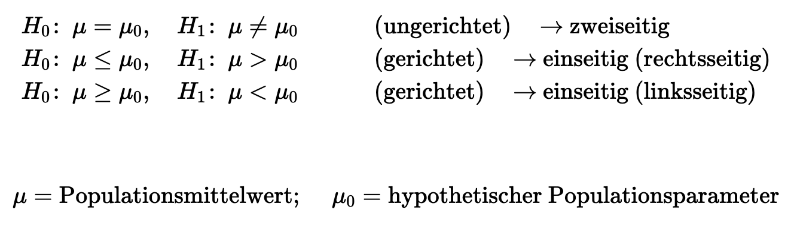
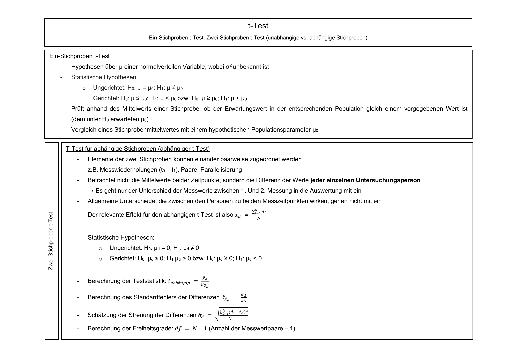
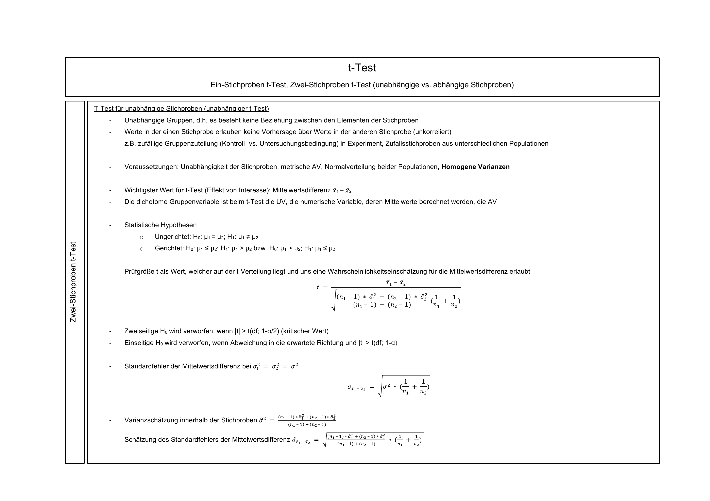
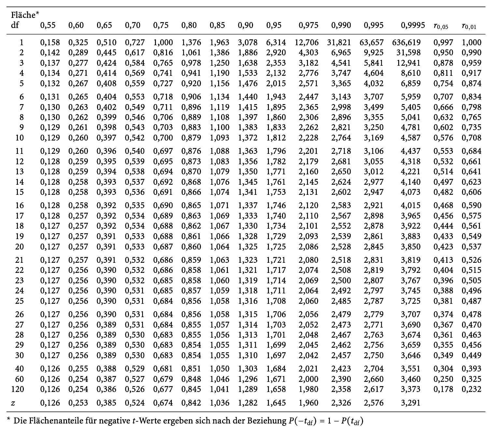
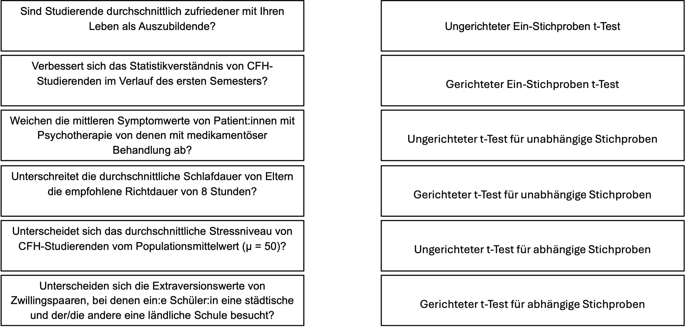
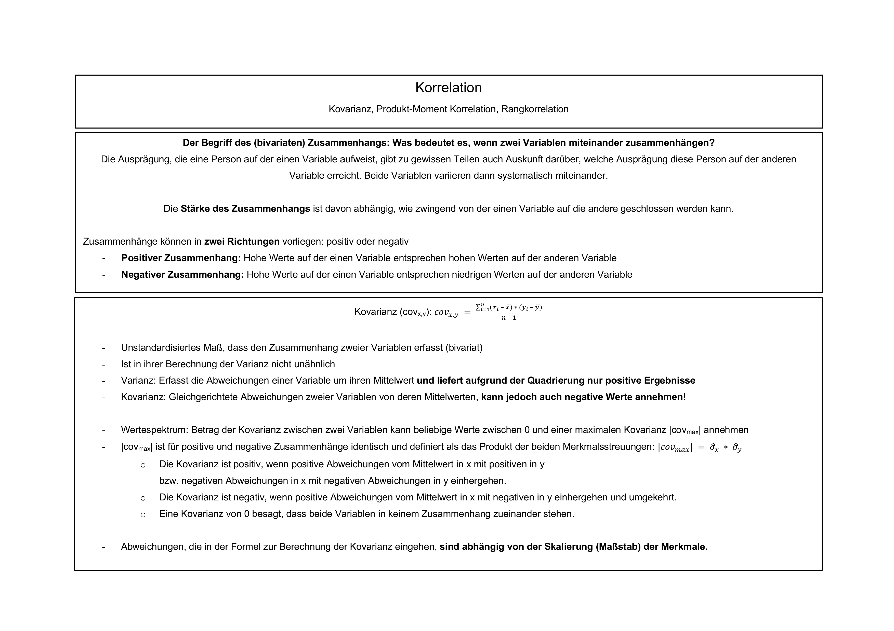
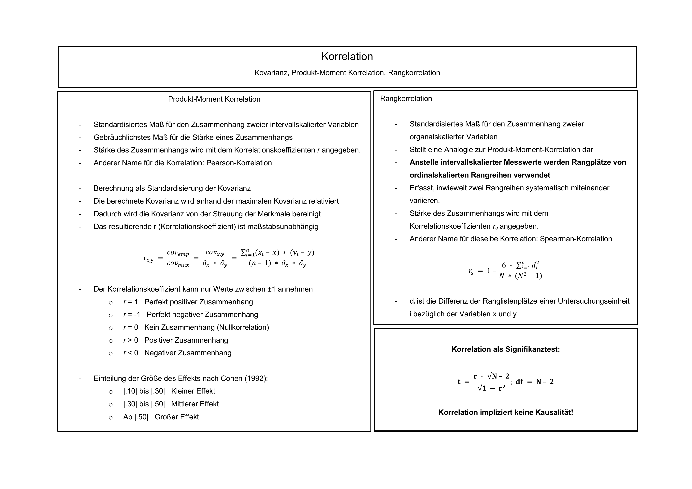
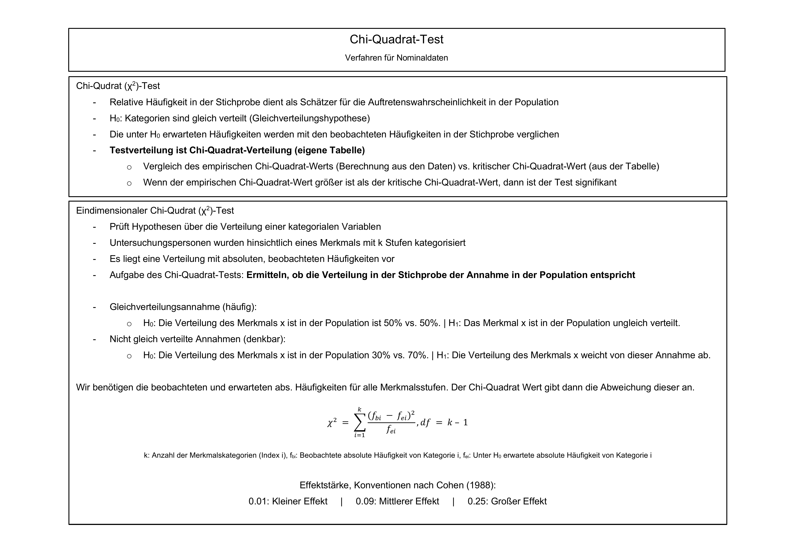
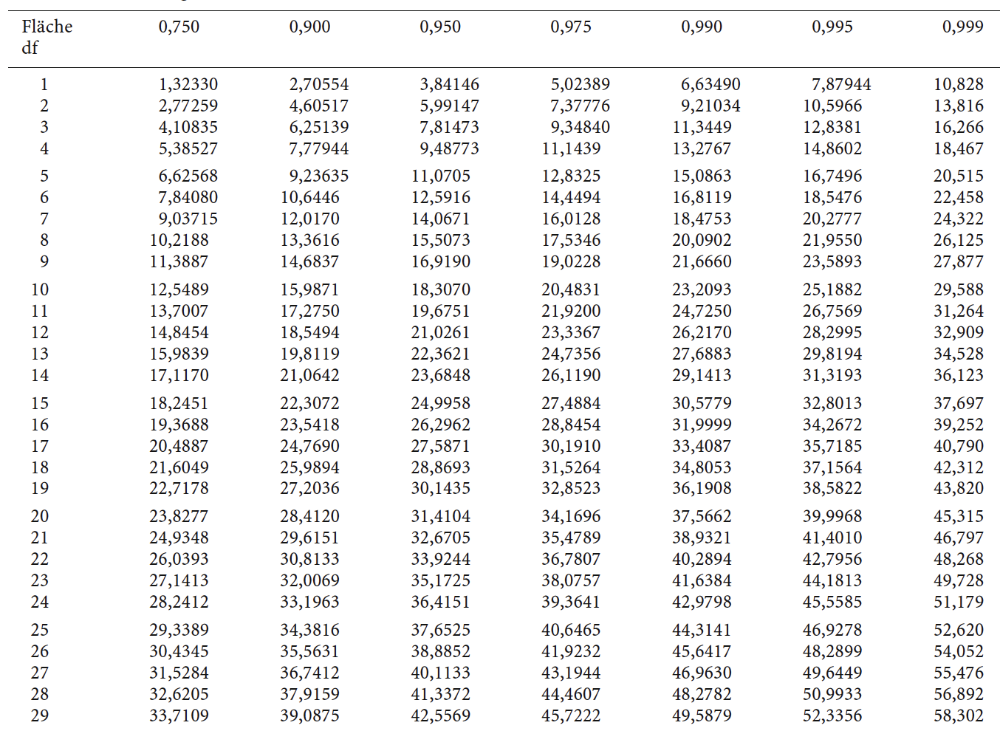

```{r setup, include=FALSE}
options(htmltools.dir.version = FALSE)

library(tidyverse)
library(kableExtra)
library(knitr)
library(ggplot2)
library(plotly)
library(htmlwidgets)
library(MASS)
library(ggpubr)
library(xaringanthemer)
library(xaringanExtra)
library(pdftools)
library(magick)
library(scales)
library(patchwork)
library(latex2exp)
library(RColorBrewer)
library(gridExtra)
library(grid)

style_duo_accent(
  primary_color = "#621C37",
  secondary_color = "#EE0071",
  background_image = "blank.png"
)

xaringanExtra::use_xaringan_extra(c("tile_view"))

use_scribble(
  pen_color = "#EE0071",
  pen_size = 4
  )

knitr::opts_chunk$set(
  fig.retina = TRUE,
  warning = FALSE,
  message = FALSE
)
```

name: 1
class: middle, left
<br><br><br><br><br><br><br>
# Statistik 1
## Seminar
***
### Einheit 5
##### `r format(as.Date(data.frame(readxl::read_excel("CFH_Statistik_1_Seminar_Termine.xlsx"))$Datum), "%d.%m.%Y")[8]` | Janika Saretzki, MSc. 

---
name: 2
class: top, left

### Termine
<br><br>
~~**Einheit 1  02.05.25  14:45-16:15 Uhr  A + B  HS Audimax / P3**~~<br>
~~**Einheit 2  15.05.25  13:05-15:30 Uhr  A + B  HS Audimax / P3**~~<br>
<br>
~~**Einheit 3**  12.06.25  13:05-15:30 Uhr  A    HS P5 005~~  
~~**Einheit 3**  13.06.25  13:50-16:15 Uhr  B    HS P1 105~~<br>
<br>
~~**Einheit 4**  26.06.25  13:20-15:45 Uhr  A    HS P5 005~~  
~~**Einheit 4**  27.06.25  13:50-16:15 Uhr  B    HS P1 105~~<br> 
<br>
**Einheit 5**  17.07.25  13:20-15:45 Uhr  A    HS P5 005  
**Einheit 5**  18.07.25  13:50-16:15 Uhr  B    HS P1 105<br>
<br>
**Tutorium  21.07.25  10:00-15:30 Uhr  A + B  HS Audimax / P3**<br>
**Tutorium  22.07.25  10:00-15:30 Uhr  B + B  HS Audimax / P3**<br> 

---
name: 3
class: top, left smaller

### Klausur
<br><br><br><br><br>
<div style="text-align: left; font-size: 95%;">
<strong>Bearbeitungszeit: 90 Minuten </strong><br>
<div style="margin-left: 20px; margin-top: 10px;">
  <div>- <strong>1/3</strong> Multiple-Choice-Fragen</div>
  <div>- <strong>2/3</strong> Rechenaufgaben</div>
</div>

<br>
<strong>Erlaubte Hilfsmittel:</strong> Nicht-programmierbarer Taschenrechner, Gestellte Formelsammlung (inkl. Verteilungstabellen), Selbst erstelltes Din-A4-Blatt (einseitig handgeschrieben), Geodreieck/Lineal, Schreibzeug (Kugelschreiber, Bleistift etc.)

---
name: 4
class: top, left smaller

<br><br><br>
<p style="text-align: center;">
  
</p>
---
name: 5
class: top, left smaller

<br><br><br><br>
<div style="display: flex; justify-content: center; align-items: flex-start; gap: 2%;">
  
  
</div>
<br>
<div style="text-align: center; margin-top: 1em; font-size: 90%;">
  <a href="https://daze02-stephan-goerigk.shinyapps.io/Statistik_trainer/" target="_blank">
    <strong>Statistiktrainer,</strong>
  </a> 
  <a href="https://daze02-stephan-goerigk.shinyapps.io/QM1_CFH/#section-willkommen" target="_blank">
   <strong>Übungsaufgaben</strong>
  </a>
</div>

---
name: 6
class: top, left, smaller
### Wiederholung
<div style="text-align: left; font-size: 90%;">
Zur Durchführung eines Hypothesentests sind folgende Schritte notwendig:

<br>
**1. Formulierung der Hypothesen:**
$$
\small
H_0: \text{Kein Effekt} \\
\small
H_1: \text{Es liegt ein Effekt vor}
$$

**2. Auswahl der zugrunde liegenden Verteilung**

**3. Festlegung von Annahme- und Ablehnungsbereich:** Bestimmung des kritischen Werts

**4. Einordnung des Beobachtungswerts in die Verteilung**

  - **Binomialverteilung**: Wahrscheinlichkeiten  
  - **z-Verteilung**: Mittelwerte bei bekanntem σ 
  - **t-Verteilung**: Mittelwerte bei unbekanntem σ
  - **F-Verteilung**: Varianzvergleiche  
  - **Chi-Quadrat-Verteilung**: Häufigkeiten / Proportionen

**5. Vergleich von Teststatistik und kritischem Wert**

**6. Entscheidung:** Test signifikant oder nicht signifikant
</div>
</span>

---
name: 7
class: top, left, smaller

### Wiederholung
<div style="text-align: left; font-size: 90%;">
<strong><u>Ein-Stichproben Test für Mittelwerte</u></strong>
<br><br><br>
<strong>Hypothesenpaar</strong>
<br>
Hypothese über µ einer normalverteilten Variable, wobei die Populationsvarianz bekannt ist
<br><br>

Statistische Hypothesenpaare:
</div>

<div style="text-align: center;">
  
</div>
<br>
<div style="text-align: left; font-size: 90%;">
<strong>Bestimmung einer zugrundeliegenden Verteilung</strong>
<br>
<li>Wenn wir an Mittelwerten interessiert sind UND die Populationsvarianz bekannt ist: <strong>z-Verteilung</strong><br></li>
<li>Wenn wir an Mittelwerten interessiert sind und die Populationsvarianz NICHT bekannt ist: <strong>t-Verteilung</strong></li></div>

---
name: 8
class: center, middle

```{r PDF to PNG, include=FALSE}

# pdf_files <- c("CHEAT-SHEET t-Test.pdf")
# img <- image_read_pdf(pdf_files[1], density = 300)
# 
# for (i in seq_along(img)) {
#   image_write(img[i], paste0("CHEAT-SHEET_t-Test_page", i, ".png"), format = "png")
# }

```



---
name: 9
class: center, middle


---
name: 10
class: top, left, smaller

### Übungsaufgabe 1 
<div style="text-align: left; font-size: 95%;">
Ein Medikamentenhersteller gibt an, dass jede Dose eines Psychopharmakums 200 Gramm (g) enthält. Es besteht der Verdacht, dass systematisch weniger abgefüllt wird. Wir kaufen daher 20 Dosen und wiegen den Inhalt. Die empirische Standardabweichung beträgt 7,28 g. Es wird angenommen, dass die Füllmengen normalverteilt sind.
<br><br>
```{r Dataframe 1, echo=FALSE, results='asis', warning=FALSE, message=FALSE}

pack_row1 <- 1:10
pack_row2 <- 11:20

gewicht_row1 <- c(200.3, 184.8, 192.2, 207.1, 187.5, 204.0, 200.1, 199.9, 188.5, 200.0)
gewicht_row2 <- c(191.1, 196.3, 206.1, 200.7, 199.0, 189.3, 183.4, 186.2, 200.2, 192.0)

gewicht_row1_chr <- gsub("\\.", ",", format(gewicht_row1, nsmall = 1))
gewicht_row2_chr <- gsub("\\.", ",", format(gewicht_row2, nsmall = 1))

tbl <- rbind(
  c("Packung", pack_row1),
  c("Gewicht (g)", gewicht_row1_chr),
  c("Packung", pack_row2),
  c("Gewicht (g)", gewicht_row2_chr)
)

kable(tbl, format = "html", align = "c", escape = FALSE) |>
  kable_styling(full_width = FALSE, font_size = 14, position = "center") |>
  row_spec(c(1,3), bold = TRUE, extra_css = "border-top: 1px solid black;") |>
  row_spec(c(2,4), extra_css = "border-bottom: 1px solid black;")

```
<br><br>
a) Formulieren Sie die statistischen Hypothesen, um die Herstellerangabe zu überprüfen.<br>
b) Entscheiden Sie, welcher Testtyp für diese Fragestellung angemessen ist.<br>
c) Berechnen Sie den empirischen Testwert auf Basis der Stichprobendaten.<br>
d) Bestimmen Sie den kritischen Wert für ein Signifikanzniveau von 5%.<br>
e) Treffen Sie auf Basis der Ergebnisse eine Schlussfolgerung.

</div>

---
name: 11
class: top, left, smaller

### Übungsaufgabe 1 - Lösung
<div style="text-align: left; font-size: 95%;">
Ein Medikamentenhersteller gibt an, dass jede Dose eines Psychopharmakums 200 Gramm (g) enthält. Es besteht der Verdacht, dass systematisch weniger abgefüllt wird. Wir kaufen daher 20 Dosen und wiegen den Inhalt. Die empirische Standardabweichung beträgt 7,28 g. Es wird angenommen, dass die Füllmengen normalverteilt sind.
<br><br>
```{r Dataframe 1b, echo=FALSE, results='asis', warning=FALSE, message=FALSE}

pack_row1 <- 1:10
pack_row2 <- 11:20

gewicht_row1 <- c(200.3, 184.8, 192.2, 207.1, 187.5, 204.0, 200.1, 199.9, 188.5, 200.0)
gewicht_row2 <- c(191.1, 196.3, 206.1, 200.7, 199.0, 189.3, 183.4, 186.2, 200.2, 192.0)

gewicht_row1_chr <- gsub("\\.", ",", format(gewicht_row1, nsmall = 1))
gewicht_row2_chr <- gsub("\\.", ",", format(gewicht_row2, nsmall = 1))

tbl <- rbind(
  c("Packung", pack_row1),
  c("Gewicht (g)", gewicht_row1_chr),
  c("Packung", pack_row2),
  c("Gewicht (g)", gewicht_row2_chr)
)

kable(tbl, format = "html", align = "c", escape = FALSE) |>
  kable_styling(full_width = FALSE, font_size = 14, position = "center") |>
  row_spec(c(1,3), bold = TRUE, extra_css = "border-top: 1px solid black;") |>
  row_spec(c(2,4), extra_css = "border-bottom: 1px solid black;")

```
<br><br>
a) Formulieren Sie die statistischen Hypothesen, um die Herstellerangabe zu überprüfen.<br>
</div>

---
name: 12
class: top, left, smaller

### Übungsaufgabe 1 - Lösung
<div style="text-align: left; font-size: 95%;">
Ein Medikamentenhersteller gibt an, dass jede Dose eines Psychopharmakums 200 Gramm (g) enthält. Es besteht der Verdacht, dass systematisch weniger abgefüllt wird. Wir kaufen daher 20 Dosen und wiegen den Inhalt. Die empirische Standardabweichung beträgt 7,28 g. Es wird angenommen, dass die Füllmengen normalverteilt sind.
<br><br>
```{r Dataframe 1c, echo=FALSE, results='asis', warning=FALSE, message=FALSE}

pack_row1 <- 1:10
pack_row2 <- 11:20

gewicht_row1 <- c(200.3, 184.8, 192.2, 207.1, 187.5, 204.0, 200.1, 199.9, 188.5, 200.0)
gewicht_row2 <- c(191.1, 196.3, 206.1, 200.7, 199.0, 189.3, 183.4, 186.2, 200.2, 192.0)

gewicht_row1_chr <- gsub("\\.", ",", format(gewicht_row1, nsmall = 1))
gewicht_row2_chr <- gsub("\\.", ",", format(gewicht_row2, nsmall = 1))

tbl <- rbind(
  c("Packung", pack_row1),
  c("Gewicht (g)", gewicht_row1_chr),
  c("Packung", pack_row2),
  c("Gewicht (g)", gewicht_row2_chr)
)

kable(tbl, format = "html", align = "c", escape = FALSE) |>
  kable_styling(full_width = FALSE, font_size = 14, position = "center") |>
  row_spec(c(1,3), bold = TRUE, extra_css = "border-top: 1px solid black;") |>
  row_spec(c(2,4), extra_css = "border-bottom: 1px solid black;")

```
<br><br>
b) Entscheiden Sie, welcher Testtyp für diese Fragestellung angemessen ist.<br>
</div>

---
name: 13
class: top, left, smaller

### Übungsaufgabe 1 - Lösung
<div style="text-align: left; font-size: 95%;">
Ein Medikamentenhersteller gibt an, dass jede Dose eines Psychopharmakums 200 Gramm (g) enthält. Es besteht der Verdacht, dass systematisch weniger abgefüllt wird. Wir kaufen daher 20 Dosen und wiegen den Inhalt. Die empirische Standardabweichung beträgt 7,28 g. Es wird angenommen, dass die Füllmengen normalverteilt sind.
<br><br>
```{r Dataframe 1d, echo=FALSE, results='asis', warning=FALSE, message=FALSE}

pack_row1 <- 1:10
pack_row2 <- 11:20

gewicht_row1 <- c(200.3, 184.8, 192.2, 207.1, 187.5, 204.0, 200.1, 199.9, 188.5, 200.0)
gewicht_row2 <- c(191.1, 196.3, 206.1, 200.7, 199.0, 189.3, 183.4, 186.2, 200.2, 192.0)

gewicht_row1_chr <- gsub("\\.", ",", format(gewicht_row1, nsmall = 1))
gewicht_row2_chr <- gsub("\\.", ",", format(gewicht_row2, nsmall = 1))

tbl <- rbind(
  c("Packung", pack_row1),
  c("Gewicht (g)", gewicht_row1_chr),
  c("Packung", pack_row2),
  c("Gewicht (g)", gewicht_row2_chr)
)

kable(tbl, format = "html", align = "c", escape = FALSE) |>
  kable_styling(full_width = FALSE, font_size = 14, position = "center") |>
  row_spec(c(1,3), bold = TRUE, extra_css = "border-top: 1px solid black;") |>
  row_spec(c(2,4), extra_css = "border-bottom: 1px solid black;")

```
<br><br>
c) Berechnen Sie den empirischen Testwert auf Basis der Stichprobendaten.<br>
</div>

---
name: 14
class: top, left, smaller

### Übungsaufgabe 1 - Lösung
<div style="text-align: left; font-size: 95%;">
Ein Medikamentenhersteller gibt an, dass jede Dose eines Psychopharmakums 200 Gramm (g) enthält. Es besteht der Verdacht, dass systematisch weniger abgefüllt wird. Wir kaufen daher 20 Dosen und wiegen den Inhalt. Die empirische Standardabweichung beträgt 7,28 g. Es wird angenommen, dass die Füllmengen normalverteilt sind.
<br><br>
```{r Dataframe 1e, echo=FALSE, results='asis', warning=FALSE, message=FALSE}

pack_row1 <- 1:10
pack_row2 <- 11:20

gewicht_row1 <- c(200.3, 184.8, 192.2, 207.1, 187.5, 204.0, 200.1, 199.9, 188.5, 200.0)
gewicht_row2 <- c(191.1, 196.3, 206.1, 200.7, 199.0, 189.3, 183.4, 186.2, 200.2, 192.0)

gewicht_row1_chr <- gsub("\\.", ",", format(gewicht_row1, nsmall = 1))
gewicht_row2_chr <- gsub("\\.", ",", format(gewicht_row2, nsmall = 1))

tbl <- rbind(
  c("Packung", pack_row1),
  c("Gewicht (g)", gewicht_row1_chr),
  c("Packung", pack_row2),
  c("Gewicht (g)", gewicht_row2_chr)
)

kable(tbl, format = "html", align = "c", escape = FALSE) |>
  kable_styling(full_width = FALSE, font_size = 14, position = "center") |>
  row_spec(c(1,3), bold = TRUE, extra_css = "border-top: 1px solid black;") |>
  row_spec(c(2,4), extra_css = "border-bottom: 1px solid black;")

```
<br><br>
d) Bestimmen Sie den kritischen Wert für ein Signifikanzniveau von 5%.<br>
</div>

---
name: 15
class: top, left, smaller

### Übungsaufgabe 1 - Lösung
<div style="text-align: left; font-size: 95%;">
d) Bestimmen Sie den kritischen Wert für ein Signifikanzniveau von 5%.<br>
</div>

---
name: 16
class: top, left, smallest
<br>
<center>
<div style="display: flex; flex-direction: row; gap: 40px; align-items: flex-start;">
<div style="flex: 1;">
  
</div></center>

---
name: 17
class: top, left, smaller

### Übungsaufgabe 1 - Lösung
<div style="text-align: left; font-size: 95%;">
Ein Medikamentenhersteller gibt an, dass jede Dose eines Psychopharmakums 200 Gramm (g) enthält. Es besteht der Verdacht, dass systematisch weniger abgefüllt wird. Wir kaufen daher 20 Dosen und wiegen den Inhalt. Die empirische Standardabweichung beträgt 7,28 g. Es wird angenommen, dass die Füllmengen normalverteilt sind.
<br><br>
```{r Dataframe 1f, echo=FALSE, results='asis', warning=FALSE, message=FALSE}

pack_row1 <- 1:10
pack_row2 <- 11:20

gewicht_row1 <- c(200.3, 184.8, 192.2, 207.1, 187.5, 204.0, 200.1, 199.9, 188.5, 200.0)
gewicht_row2 <- c(191.1, 196.3, 206.1, 200.7, 199.0, 189.3, 183.4, 186.2, 200.2, 192.0)

gewicht_row1_chr <- gsub("\\.", ",", format(gewicht_row1, nsmall = 1))
gewicht_row2_chr <- gsub("\\.", ",", format(gewicht_row2, nsmall = 1))

tbl <- rbind(
  c("Packung", pack_row1),
  c("Gewicht (g)", gewicht_row1_chr),
  c("Packung", pack_row2),
  c("Gewicht (g)", gewicht_row2_chr)
)

kable(tbl, format = "html", align = "c", escape = FALSE) |>
  kable_styling(full_width = FALSE, font_size = 14, position = "center") |>
  row_spec(c(1,3), bold = TRUE, extra_css = "border-top: 1px solid black;") |>
  row_spec(c(2,4), extra_css = "border-bottom: 1px solid black;")

```
<br><br>
e) Treffen Sie auf Basis der Ergebnisse eine Schlussfolgerung.
</div>

---
name: 18
class: top, left, smaller

### Übungsaufgabe 1 - Lösung
<div style="text-align: left; font-size: 95%;">
e) Treffen Sie auf Basis der Ergebnisse eine Schlussfolgerung.
</div>

---
name: 19
class: top, left, smaller

### Übungsaufgabe 2
<div style="text-align: left; font-size: 95%;">
Ordnen Sie die Fragestellungen den richtigen Tests zu. Für alle Fragestellungen gilt, dass die Populationsvarianz der gesuchten Variable unbekannt ist.
</div>
<br>
<p style="text-align: center;">
  
</p>

---
name: 20
class: top, left, smaller

### Übungsaufgabe 2 - Lösung
<div style="text-align: left; font-size: 95%;">
Ordnen Sie die Fragestellungen den richtigen Tests zu. Für alle Fragestellungen gilt, dass die Populationsvarianz der gesuchten Variable unbekannt ist.
</div>
<br>
<p style="text-align: center;">
  
</p>

---
name: 21
class: top, left, smaller

### Übungsaufgabe 3
<div style="text-align: left; font-size: 95%;">
Ein Gesundheitspsychologe möchte untersuchen, ob ein edukativer Film Kinder zu besserer Zahnhygiene motivieren kann. Dafür werden 16 Kinder zufällig auf zwei Gruppen aufgeteilt: Acht Kinder sehen den Film, acht Kinder nicht.<br>
Im Folgemonat wird festgehalten, an wie vielen Tagen jedes Kind seine Zähne geputzt hat. Es wird eine Normalverteilung der Daten angenommen, und der Levene-Test ist nicht signifikant.
<br><br>
```{r Dataframe 2, echo=FALSE, results='asis', warning=FALSE, message=FALSE}

daten <- data.frame(
  Bedingung = c("Mit Film", "Ohne Film"),
  `Durchschnittliche Anzahl an Tagen<br>an denen Zähne geputzt wurde<br>(Stichprobenebene)` = c(23, 14),
  `Varianz der Anzahl an Tagen<br>an denen Zähne geputzt wurde<br>(Stichprobenebene)` = c(80, 120),
  check.names = FALSE
)

kable(daten, format = "html", escape = FALSE, align = "c") |>
  kable_styling(full_width = FALSE, font_size = 14, position = "center") |>
  row_spec(0, bold = TRUE) |>
  column_spec(1, bold = TRUE)

```
<br><br>
Analysieren Sie, ob der Film im Mittel zu einer höheren Anzahl an Tagen mit Zähneputzen führt.
<br><br>
a) Welcher statistische Test ist für die Fragestellung angemessen?<br>
b) Formulieren Sie die statistischen Hypothesen.<br>
c) Treffen Sie auf Basis der Stichprobendaten eine Testentscheidung bei einem Signifikanzniveau von Alpha = 0,20.
</div>

---
name: 22
class: top, left, smaller

### Übungsaufgabe 3 - Lösung
<div style="text-align: left; font-size: 95%;">
Ein Gesundheitspsychologe möchte untersuchen, ob ein edukativer Film Kinder zu besserer Zahnhygiene motivieren kann. Dafür werden 16 Kinder zufällig auf zwei Gruppen aufgeteilt: Acht Kinder sehen den Film, acht Kinder nicht.<br>
Im Folgemonat wird festgehalten, an wie vielen Tagen jedes Kind seine Zähne geputzt hat. Es wird eine Normalverteilung der Daten angenommen, und der Levene-Test ist nicht signifikant.
<br><br>
```{r Dataframe 2b, echo=FALSE, results='asis', warning=FALSE, message=FALSE}

daten <- data.frame(
  Bedingung = c("Mit Film", "Ohne Film"),
  `Durchschnittliche Anzahl an Tagen<br>an denen Zähne geputzt wurde<br>(Stichprobenebene)` = c(23, 14),
  `Varianz der Anzahl an Tagen<br>an denen Zähne geputzt wurde<br>(Stichprobenebene)` = c(80, 120),
  check.names = FALSE
)

kable(daten, format = "html", escape = FALSE, align = "c") |>
  kable_styling(full_width = FALSE, font_size = 14, position = "center") |>
  row_spec(0, bold = TRUE) |>
  column_spec(1, bold = TRUE)

```
<br><br>
Analysieren Sie, ob der Film im Mittel zu einer höheren Anzahl an Tagen mit Zähneputzen führt.
<br><br>
a) Welcher statistische Test ist für die Fragestellung angemessen?<br>
</div>

---
name: 23
class: top, left, smaller

### Übungsaufgabe 3 - Lösung
<div style="text-align: left; font-size: 95%;">
Ein Gesundheitspsychologe möchte untersuchen, ob ein edukativer Film Kinder zu besserer Zahnhygiene motivieren kann. Dafür werden 16 Kinder zufällig auf zwei Gruppen aufgeteilt: Acht Kinder sehen den Film, acht Kinder nicht.<br>
Im Folgemonat wird festgehalten, an wie vielen Tagen jedes Kind seine Zähne geputzt hat. Es wird eine Normalverteilung der Daten angenommen, und der Levene-Test ist nicht signifikant.
<br><br>
```{r Dataframe 2c, echo=FALSE, results='asis', warning=FALSE, message=FALSE}

daten <- data.frame(
  Bedingung = c("Mit Film", "Ohne Film"),
  `Durchschnittliche Anzahl an Tagen<br>an denen Zähne geputzt wurde<br>(Stichprobenebene)` = c(23, 14),
  `Varianz der Anzahl an Tagen<br>an denen Zähne geputzt wurde<br>(Stichprobenebene)` = c(80, 120),
  check.names = FALSE
)

kable(daten, format = "html", escape = FALSE, align = "c") |>
  kable_styling(full_width = FALSE, font_size = 14, position = "center") |>
  row_spec(0, bold = TRUE) |>
  column_spec(1, bold = TRUE)

```
<br><br>
Analysieren Sie, ob der Film im Mittel zu einer höheren Anzahl an Tagen mit Zähneputzen führt.
<br><br>
b) Formulieren Sie die statistischen Hypothesen.<br>
</div>

---
name: 24
class: top, left, smaller

### Übungsaufgabe 3 - Lösung
<div style="text-align: left; font-size: 95%;">
Ein Gesundheitspsychologe möchte untersuchen, ob ein edukativer Film Kinder zu besserer Zahnhygiene motivieren kann. Dafür werden 16 Kinder zufällig auf zwei Gruppen aufgeteilt: Acht Kinder sehen den Film, acht Kinder nicht.<br>
Im Folgemonat wird festgehalten, an wie vielen Tagen jedes Kind seine Zähne geputzt hat. Es wird eine Normalverteilung der Daten angenommen, und der Levene-Test ist nicht signifikant.
<br><br>
```{r Dataframe 2d, echo=FALSE, results='asis', warning=FALSE, message=FALSE}

daten <- data.frame(
  Bedingung = c("Mit Film", "Ohne Film"),
  `Durchschnittliche Anzahl an Tagen<br>an denen Zähne geputzt wurde<br>(Stichprobenebene)` = c(23, 14),
  `Varianz der Anzahl an Tagen<br>an denen Zähne geputzt wurde<br>(Stichprobenebene)` = c(80, 120),
  check.names = FALSE
)

kable(daten, format = "html", escape = FALSE, align = "c") |>
  kable_styling(full_width = FALSE, font_size = 14, position = "center") |>
  row_spec(0, bold = TRUE) |>
  column_spec(1, bold = TRUE)

```
<br><br>
Analysieren Sie, ob der Film im Mittel zu einer höheren Anzahl an Tagen mit Zähneputzen führt.
<br><br>
c) Treffen Sie auf Basis der Stichprobendaten eine Testentscheidung bei einem Signifikanzniveau von Alpha = 0,20.
</div>


---
name: 25
class: top, left, smaller

### Übungsaufgabe 3 - Lösung
<div style="text-align: left; font-size: 95%;">
c) Treffen Sie auf Basis der Stichprobendaten eine Testentscheidung bei einem Signifikanzniveau von Alpha = 0,20.
</div>

---
name: 26
class: top, left, smaller

### Übungsaufgabe 3 - Lösung
<div style="text-align: left; font-size: 95%;">
c) Treffen Sie auf Basis der Stichprobendaten eine Testentscheidung bei einem Signifikanzniveau von Alpha = 0,20.
</div>

---
name: 16
class: top, left, smallest
<br>
<center>
<div style="display: flex; flex-direction: row; gap: 40px; align-items: flex-start;">
<div style="flex: 1;">
  
</div></center>

---
name: 27
class: top, left, smaller

### Übungsaufgabe 4
<div style="text-align: left; font-size: 95%;">
Sie interessieren sich dafür, ob sich Eltern in ihrer Kreativität systematisch von ihren Kindern unterscheiden. Eine Kinderärztin ermöglicht Ihnen den Zugang zu Vorsorgeuntersuchungen, bei denen jeweils ein Elternteil und ein Kind gemeinsam erscheinen. Zur Erhebung der Kreativität werden Elternteil und Kind getrennt gebeten, innerhalb von 5 Minuten möglichst viele Verwendungsmöglichkeiten für einen Ziegelstein zu notieren.
<br><br>
```{r Dataframe 3, echo=FALSE, results='asis', warning=FALSE, message=FALSE}

tbl <- rbind(
  c("Paar", 1, 2, 3, 4, 5, 6),
  c("Elternteil", 8, 9, 4, 10, 5, 6),
  c("Kind", 10, 10, 8, 4, 5, 8),
  c("Differenz", 2, 1, 4, -6, 0, 2)
)

kable(tbl, format = "html", align = "c", escape = FALSE) |>
  kable_styling(full_width = FALSE, position = "center", font_size = 14) |>
  row_spec(1, bold = TRUE) |>
  row_spec(4, extra_css = "border-top: 2px solid black;") |>
  column_spec(1:7, extra_css = "min-width: 60px;")

```

$$
\small
\hat{\sigma}_d = 3{,}45
$$
<br>
a) Welcher Test ist angemessen?<br>
b) Wie lauten die statistischen Hypothesen?<br>
c) Wie lautet der empirische t-Wert?<br>
d) Welche Testentscheidung treffen Sie bei einem Signifikanzniveau von Alpha = 0,01?
</div>

---
name: 28
class: top, left, smaller

### Übungsaufgabe 4 - Lösung
<div style="text-align: left; font-size: 95%;">
Sie interessieren sich dafür, ob sich Eltern in ihrer Kreativität systematisch von ihren Kindern unterscheiden. Eine Kinderärztin ermöglicht Ihnen den Zugang zu Vorsorgeuntersuchungen, bei denen jeweils ein Elternteil und ein Kind gemeinsam erscheinen. Zur Erhebung der Kreativität werden Elternteil und Kind getrennt gebeten, innerhalb von 5 Minuten möglichst viele Verwendungsmöglichkeiten für einen Ziegelstein zu notieren.
<br><br>
```{r Dataframe 3b, echo=FALSE, results='asis', warning=FALSE, message=FALSE}

tbl <- rbind(
  c("Paar", 1, 2, 3, 4, 5, 6),
  c("Elternteil", 8, 9, 4, 10, 5, 6),
  c("Kind", 10, 10, 8, 4, 5, 8),
  c("Differenz", 2, 1, 4, -6, 0, 2)
)

kable(tbl, format = "html", align = "c", escape = FALSE) |>
  kable_styling(full_width = FALSE, position = "center", font_size = 14) |>
  row_spec(1, bold = TRUE) |>
  row_spec(4, extra_css = "border-top: 2px solid black;") |>
  column_spec(1:7, extra_css = "min-width: 60px;")

```

$$
\small
\hat{\sigma}_d = 3{,}45
$$
<br>
a) Welcher Test ist angemessen?<br>
</div>

---
name: 29
class: top, left, smaller

### Übungsaufgabe 4 - Lösung
<div style="text-align: left; font-size: 95%;">
Sie interessieren sich dafür, ob sich Eltern in ihrer Kreativität systematisch von ihren Kindern unterscheiden. Eine Kinderärztin ermöglicht Ihnen den Zugang zu Vorsorgeuntersuchungen, bei denen jeweils ein Elternteil und ein Kind gemeinsam erscheinen. Zur Erhebung der Kreativität werden Elternteil und Kind getrennt gebeten, innerhalb von 5 Minuten möglichst viele Verwendungsmöglichkeiten für einen Ziegelstein zu notieren.
<br><br>
```{r Dataframe 3c, echo=FALSE, results='asis', warning=FALSE, message=FALSE}

tbl <- rbind(
  c("Paar", 1, 2, 3, 4, 5, 6),
  c("Elternteil", 8, 9, 4, 10, 5, 6),
  c("Kind", 10, 10, 8, 4, 5, 8),
  c("Differenz", 2, 1, 4, -6, 0, 2)
)

kable(tbl, format = "html", align = "c", escape = FALSE) |>
  kable_styling(full_width = FALSE, position = "center", font_size = 14) |>
  row_spec(1, bold = TRUE) |>
  row_spec(4, extra_css = "border-top: 2px solid black;") |>
  column_spec(1:7, extra_css = "min-width: 60px;")

```

$$
\small
\hat{\sigma}_d = 3{,}45
$$
<br>
b) Wie lauten die statistischen Hypothesen?<br>
</div>

---
name: 30
class: top, left, smaller

### Übungsaufgabe 4 - Lösung
<div style="text-align: left; font-size: 95%;">
Sie interessieren sich dafür, ob sich Eltern in ihrer Kreativität systematisch von ihren Kindern unterscheiden. Eine Kinderärztin ermöglicht Ihnen den Zugang zu Vorsorgeuntersuchungen, bei denen jeweils ein Elternteil und ein Kind gemeinsam erscheinen. Zur Erhebung der Kreativität werden Elternteil und Kind getrennt gebeten, innerhalb von 5 Minuten möglichst viele Verwendungsmöglichkeiten für einen Ziegelstein zu notieren.
<br><br>
```{r Dataframe 3d, echo=FALSE, results='asis', warning=FALSE, message=FALSE}

tbl <- rbind(
  c("Paar", 1, 2, 3, 4, 5, 6),
  c("Elternteil", 8, 9, 4, 10, 5, 6),
  c("Kind", 10, 10, 8, 4, 5, 8),
  c("Differenz", 2, 1, 4, -6, 0, 2)
)

kable(tbl, format = "html", align = "c", escape = FALSE) |>
  kable_styling(full_width = FALSE, position = "center", font_size = 14) |>
  row_spec(1, bold = TRUE) |>
  row_spec(4, extra_css = "border-top: 2px solid black;") |>
  column_spec(1:7, extra_css = "min-width: 60px;")

```

$$
\small
\hat{\sigma}_d = 3{,}45
$$
<br>
c) Wie lautet der empirische t-Wert?<br>
</div>

---
name: 31
class: top, left, smaller

### Übungsaufgabe 4 - Lösung
<div style="text-align: left; font-size: 95%;">
c) Wie lautet der empirische t-Wert?<br>
</div>

---
name: 32
class: top, left, smaller

### Übungsaufgabe 4 - Lösung
<div style="text-align: left; font-size: 95%;">
Sie interessieren sich dafür, ob sich Eltern in ihrer Kreativität systematisch von ihren Kindern unterscheiden. Eine Kinderärztin ermöglicht Ihnen den Zugang zu Vorsorgeuntersuchungen, bei denen jeweils ein Elternteil und ein Kind gemeinsam erscheinen. Zur Erhebung der Kreativität werden Elternteil und Kind getrennt gebeten, innerhalb von 5 Minuten möglichst viele Verwendungsmöglichkeiten für einen Ziegelstein zu notieren.
<br><br>
```{r Dataframe 3e, echo=FALSE, results='asis', warning=FALSE, message=FALSE}

tbl <- rbind(
  c("Paar", 1, 2, 3, 4, 5, 6),
  c("Elternteil", 8, 9, 4, 10, 5, 6),
  c("Kind", 10, 10, 8, 4, 5, 8),
  c("Differenz", 2, 1, 4, -6, 0, 2)
)

kable(tbl, format = "html", align = "c", escape = FALSE) |>
  kable_styling(full_width = FALSE, position = "center", font_size = 14) |>
  row_spec(1, bold = TRUE) |>
  row_spec(4, extra_css = "border-top: 2px solid black;") |>
  column_spec(1:7, extra_css = "min-width: 60px;")

```

$$
\small
\hat{\sigma}_d = 3{,}45
$$
<br>
d) Welche Testentscheidung treffen Sie bei einem Signifikanzniveau von Alpha = 0,01?
</div>

---
name: 34
class: top, left, smaller

### Übungsaufgabe 4 - Lösung
<div style="text-align: left; font-size: 95%;">
d) Welche Testentscheidung treffen Sie bei einem Signifikanzniveau von Alpha = 0,01?
</div>

---
name: 33
class: top, left, smallest
<br>
<center>
<div style="display: flex; flex-direction: row; gap: 40px; align-items: flex-start;">
<div style="flex: 1;">
  
</div></center>

---
name: 35
class: center, middle

```{r PDF to PNG2, include=FALSE}

# pdf_files <- c("CHEAT-SHEET Korrelation.pdf")
# img <- image_read_pdf(pdf_files[1], density = 300)
# 
# for (i in seq_along(img)) {
#   image_write(img[i], paste0("CHEAT-SHEET_Korrelation_page", i, ".png"), format = "png")
# }

```



---
name: 36
class: center, middle



---
name: 37
class: top, left, smaller

### Übungsaufgabe 5
<div style="text-align: left; font-size: 95%;">
Die Variablen x und y sind intervallskaliert. Prüfen Sie, ob ein Zusammenhang zwischen den beiden Variablen besteht. Es wird angenommen, dass keine Ausreißer in den Daten enthalten sind.
<br><br>

```{r Dataframe 4, echo=FALSE, results='asis', warning=FALSE, message=FALSE}

tabelle <- rbind(
  c("x", "y"),
  c("2", "1"),
  c("1", "2"),
  c("9", "6"),
  c("5", "4"),
  c("3", "2")
)

kable(tabelle, format = "html", align = "c", col.names = NULL, escape = FALSE) |>
  kable_styling(full_width = FALSE, font_size = 14, position = "center") |>
  row_spec(1, extra_css = "border-bottom: 1px solid black;") |>
  column_spec(1:2, width = "4em")

```


$$
\small \bar{x} = 4 \quad s_x = 3{,}16
$$

$$
\small \bar{y} = 3 \quad s_y = 2
$$


a) Stellen Sie die statistischen Hypothesen auf. <br>
b) Besteht ein Zusammenhang zwischen den beiden Variablen? <br><strong>Falls ja: Wie würden Sie die gefundene Korrelation bzw. den Effekt bewerten?</strong><br>
c) Falls eine Korrelation besteht: Würden Sie diese als signifikant bezeichnen (Alpha = 0,05)?
</div>

---
name: 38
class: top, left, smaller

### Übungsaufgabe 5 - Lösung
<div style="text-align: left; font-size: 95%;">
Die Variablen x und y sind intervallskaliert. Prüfen Sie, ob ein Zusammenhang zwischen den beiden Variablen besteht. Es wird angenommen, dass keine Ausreißer in den Daten enthalten sind.
<br><br>

```{r Dataframe 4b, echo=FALSE, results='asis', warning=FALSE, message=FALSE}

tabelle <- rbind(
  c("x", "y"),
  c("2", "1"),
  c("1", "2"),
  c("9", "6"),
  c("5", "4"),
  c("3", "2")
)

kable(tabelle, format = "html", align = "c", col.names = NULL, escape = FALSE) |>
  kable_styling(full_width = FALSE, font_size = 14, position = "center") |>
  row_spec(1, extra_css = "border-bottom: 1px solid black;") |>
  column_spec(1:2, width = "4em")

```


$$
\small \bar{x} = 4 \quad s_x = 3{,}16
$$

$$
\small \bar{y} = 3 \quad s_y = 2
$$

a) Stellen Sie die statistischen Hypothesen auf. <br>
</div>

---
name: 39
class: top, left, smaller

### Übungsaufgabe 5 - Lösung
<div style="text-align: left; font-size: 95%;">
Die Variablen x und y sind intervallskaliert. Prüfen Sie, ob ein Zusammenhang zwischen den beiden Variablen besteht. Es wird angenommen, dass keine Ausreißer in den Daten enthalten sind.
<br><br>

```{r Dataframe 4c, echo=FALSE, results='asis', warning=FALSE, message=FALSE}

tabelle <- rbind(
  c("x", "y"),
  c("2", "1"),
  c("1", "2"),
  c("9", "6"),
  c("5", "4"),
  c("3", "2")
)

kable(tabelle, format = "html", align = "c", col.names = NULL, escape = FALSE) |>
  kable_styling(full_width = FALSE, font_size = 14, position = "center") |>
  row_spec(1, extra_css = "border-bottom: 1px solid black;") |>
  column_spec(1:2, width = "4em")

```


$$
\small \bar{x} = 4 \quad s_x = 3{,}16
$$

$$
\small \bar{y} = 3 \quad s_y = 2
$$


b) Besteht ein Zusammenhang zwischen den beiden Variablen? <br><strong>Falls ja: Wie würden Sie die gefundene Korrelation bzw. den Effekt bewerten?</strong><br>
</div>

---
name: 40
class: top, left, smaller

### Übungsaufgabe 5 - Lösung

b) Besteht ein Zusammenhang zwischen den beiden Variablen? <br><strong>Falls ja: Wie würden Sie die gefundene Korrelation bzw. den Effekt bewerten?</strong><br>
</div>

---
name: 41
class: top, left, smaller

### Übungsaufgabe 5 - Lösung
<div style="text-align: left; font-size: 95%;">
Die Variablen x und y sind intervallskaliert. Prüfen Sie, ob ein Zusammenhang zwischen den beiden Variablen besteht. Es wird angenommen, dass keine Ausreißer in den Daten enthalten sind.
<br><br>

```{r Dataframe 4d, echo=FALSE, results='asis', warning=FALSE, message=FALSE}

tabelle <- rbind(
  c("x", "y"),
  c("2", "1"),
  c("1", "2"),
  c("9", "6"),
  c("5", "4"),
  c("3", "2")
)

kable(tabelle, format = "html", align = "c", col.names = NULL, escape = FALSE) |>
  kable_styling(full_width = FALSE, font_size = 14, position = "center") |>
  row_spec(1, extra_css = "border-bottom: 1px solid black;") |>
  column_spec(1:2, width = "4em")

```


$$
\small \bar{x} = 4 \quad s_x = 3{,}16
$$

$$
\small \bar{y} = 3 \quad s_y = 2
$$

c) Falls eine Korrelation besteht: Würden Sie diese als signifikant bezeichnen (Alpha = 0,05)?
</div>

---
name: 42
class: top, left, smaller

### Übungsaufgabe 5 - Lösung
<div style="text-align: left; font-size: 95%;">
c) Falls eine Korrelation besteht: Würden Sie diese als signifikant bezeichnen (Alpha = 0,05)?
</div>

---
name: 48
class: top, left, smallest
<br>
<center>
<div style="display: flex; flex-direction: row; gap: 40px; align-items: flex-start;">
<div style="flex: 1;">
  
</div></center>
---
name: 43
class: top, left, smaller

### Übungsaufgabe 6
<div style="text-align: left; font-size: 95%;">
Zwei Kunstkritiker bringen zwölf Gemälde nach ihrem Wert in eine Rangreihe. 
<br><br>
```{r Dataframe 5, echo=FALSE, results='asis', warning=FALSE, message=FALSE}

daten <- rbind(
  c("Gemälde", 1:12),
  c("Kritiker 1", 8, 7, 3, 11, 4, 1, 5, 6, 10, 2, 12, 9),
  c("Kritiker 2", 6, 9, 1, 12, 5, 4, 8, 3, 11, 2, 10, 7)
)

kable(daten, format = "html", align = "c", escape = FALSE, col.names = NULL) |>
  kable_styling(full_width = FALSE, font_size = 14, position = "center") |>
  row_spec(1, bold = TRUE) |>  
  column_spec(1:13, width = "3em")


```
<br><br>
<strong>Korreliert die Rangfolge der beiden Kritiker?</strong><br><br>
a) Welcher Korrelationskoeffizient sollte bestimmt werden? Begründen Sie Ihre Entscheidung.<br>
b) Beantworten Sie die Forschungsfrage.<br>
c) Ist die Korrelation auf einem Signifikanzniveau von 1% signifikant?
</div>

---
name: 44
class: top, left, smaller

### Übungsaufgabe 6 - Lösung
<div style="text-align: left; font-size: 95%;">
Zwei Kunstkritiker bringen zwölf Gemälde nach ihrem Wert in eine Rangreihe. 
<br><br>
```{r Dataframe 5b, echo=FALSE, results='asis', warning=FALSE, message=FALSE}

daten <- rbind(
  c("Gemälde", 1:12),
  c("Kritiker 1", 8, 7, 3, 11, 4, 1, 5, 6, 10, 2, 12, 9),
  c("Kritiker 2", 6, 9, 1, 12, 5, 4, 8, 3, 11, 2, 10, 7)
)

kable(daten, format = "html", align = "c", escape = FALSE, col.names = NULL) |>
  kable_styling(full_width = FALSE, font_size = 14, position = "center") |>
  row_spec(1, bold = TRUE) |>  
  column_spec(1:13, width = "3em")


```
<br><br>
<strong>Korreliert die Rangfolge der beiden Kritiker?</strong><br><br>
a) Welcher Korrelationskoeffizient sollte bestimmt werden? Begründen Sie Ihre Entscheidung.<br>
</div>

---
name: 45
class: top, left, smaller

### Übungsaufgabe 6 - Lösung
<div style="text-align: left; font-size: 95%;">
Zwei Kunstkritiker bringen zwölf Gemälde nach ihrem Wert in eine Rangreihe. 
<br><br>
```{r Dataframe 5c, echo=FALSE, results='asis', warning=FALSE, message=FALSE}

daten <- rbind(
  c("Gemälde", 1:12),
  c("Kritiker 1", 8, 7, 3, 11, 4, 1, 5, 6, 10, 2, 12, 9),
  c("Kritiker 2", 6, 9, 1, 12, 5, 4, 8, 3, 11, 2, 10, 7)
)

kable(daten, format = "html", align = "c", escape = FALSE, col.names = NULL) |>
  kable_styling(full_width = FALSE, font_size = 14, position = "center") |>
  row_spec(1, bold = TRUE) |>  
  column_spec(1:13, width = "3em")


```
<br><br>
<strong>Korreliert die Rangfolge der beiden Kritiker?</strong><br><br>
b) Beantworten Sie die Forschungsfrage.<br>
</div>

---
name: 46
class: top, left, smaller

### Übungsaufgabe 6 - Lösung
<div style="text-align: left; font-size: 95%;">
Zwei Kunstkritiker bringen zwölf Gemälde nach ihrem Wert in eine Rangreihe. 
<br><br>
```{r Dataframe 5d, echo=FALSE, results='asis', warning=FALSE, message=FALSE}

daten <- rbind(
  c("Gemälde", 1:12),
  c("Kritiker 1", 8, 7, 3, 11, 4, 1, 5, 6, 10, 2, 12, 9),
  c("Kritiker 2", 6, 9, 1, 12, 5, 4, 8, 3, 11, 2, 10, 7)
)

kable(daten, format = "html", align = "c", escape = FALSE, col.names = NULL) |>
  kable_styling(full_width = FALSE, font_size = 14, position = "center") |>
  row_spec(1, bold = TRUE) |>  
  column_spec(1:13, width = "3em")


```
<br><br>
<strong>Korreliert die Rangfolge der beiden Kritiker?</strong><br><br>
c) Ist die Korrelation auf einem Signifikanzniveau von 1% signifikant?
</div>

---
name: 47
class: top, left, smallest
<br>
<center>
<div style="display: flex; flex-direction: row; gap: 40px; align-items: flex-start;">
<div style="flex: 1;">
  
</div></center>

---
name: 36
class: center, middle

```{r PDF to PNG3, include=FALSE}

# library(magick)
# 
# pdf_file <- "CHEAT-SHEET_Chi_Quadrat_Test.pdf"
# 
# img <- image_read_pdf(pdf_file, density = 300)
# 
# image_write(img, path = "CHEAT-SHEET_Chi_Quadrat_Test.png", format = "png")

```



---
name: 46
class: top, left, smaller

### Übungsaufgabe 7
<div style="text-align: left; font-size: 95%;">
Eine Bildungsforscherin interessiert sich dafür, wie Schülerinnen zur Schule kommen. Sie vermutet, dass das Verkehrsmittel "Fahrrad" und "Öffentliche Verkehrsmittel" gleich häufig genutzt werden. Aus einer Stichprobe von N = 150 Schülerinnen ergibt sich folgendes Ergebnis:
<br><br>
Anzahl Schülerinnen (Fahrrad): 94<br>
Anzahl Schülerinnen (Öffentliche Verkehrsmittel): 56
<br><br><br>
a) Berechnen Sie die unter der Hypothese der Forscherin erwarteten Häufigkeiten für die gewählten Verkehrsmittel der Schülerinnen.<br>
b) Prüfen Sie, ob sich die angenommene Verteilung in den Daten zeigt oder ob es signifikante Unterschiede gibt. Berechnen Sie dazu die empirische und kritische Teststatistik bei einem Signifikanzniveau von Alpha = 0,05.<br>
c) Geben Sie das Ergebnis mit einer statistischen Begründung an und ordnen Sie das Ergebnis kurz inhaltlich ein.
</div>
---

name: 46
class: top, left, smaller

### Übungsaufgabe 7 - Lösung
<div style="text-align: left; font-size: 95%;">
Eine Bildungsforscherin interessiert sich dafür, wie Schülerinnen zur Schule kommen. Sie vermutet, dass das Verkehrsmittel "Fahrrad" und "Öffentliche Verkehrsmittel" gleich häufig genutzt werden. Aus einer Stichprobe von N = 150 Schülerinnen ergibt sich folgendes Ergebnis:
<br><br>
Anzahl Schülerinnen (Fahrrad): 94<br>
Anzahl Schülerinnen (Öffentliche Verkehrsmittel): 56
<br><br><br>
a) Berechnen Sie die unter der Hypothese der Forscherin erwarteten Häufigkeiten für die gewählten Verkehrsmittel der Schülerinnen.<br>
</div>
</div>

---
name: 46
class: top, left, smaller

### Übungsaufgabe 7 - Lösung
<div style="text-align: left; font-size: 95%;">
Eine Bildungsforscherin interessiert sich dafür, wie Schülerinnen zur Schule kommen. Sie vermutet, dass das Verkehrsmittel "Fahrrad" und "Öffentliche Verkehrsmittel" gleich häufig genutzt werden. Aus einer Stichprobe von N = 150 Schülerinnen ergibt sich folgendes Ergebnis:
<br><br>
Anzahl Schülerinnen (Fahrrad): 94<br>
Anzahl Schülerinnen (Öffentliche Verkehrsmittel): 56
<br><br><br>
b) Prüfen Sie, ob sich die angenommene Verteilung in den Daten zeigt oder ob es signifikante Unterschiede gibt. Berechnen Sie dazu die empirische und kritische Teststatistik bei einem Signifikanzniveau von Alpha = 0,05.<br>
</div>

---
name: 48
class: top, left, smallest
<br><br><br>
<center>
<div style="display: flex; flex-direction: row; gap: 40px; align-items: flex-start;">
<div style="flex: 1;">
  
</div></center>

---
name: 46
class: top, left, smaller

### Übungsaufgabe 7 - Lösung
<div style="text-align: left; font-size: 95%;">
Eine Bildungsforscherin interessiert sich dafür, wie Schülerinnen zur Schule kommen. Sie vermutet, dass das Verkehrsmittel "Fahrrad" und "Öffentliche Verkehrsmittel" gleich häufig genutzt werden. Aus einer Stichprobe von N = 150 Schülerinnen ergibt sich folgendes Ergebnis:
<br><br>
Anzahl Schülerinnen (Fahrrad): 94<br>
Anzahl Schülerinnen (Öffentliche Verkehrsmittel): 56
<br><br><br>
c) Geben Sie das Ergebnis mit einer statistischen Begründung an und ordnen Sie das Ergebnis kurz inhaltlich ein.
</div>

---
name: 46
class: top, left, smaller

### Beispiel Multiple-Choice-Frage
<div style="text-align: left; font-size: 95%;">
<br><br>
<strong>Aufgabe ## (5 Punkte)</strong><br><br>
<strong>Welche Aussagen zum Konfidenzintervall sind richtig?</strong><br><br>

☐ Die Breite des Konfidenzintervalls bestimmt sich unter anderem durch den Standardfehler der Schätzfunktion. <br><br>

☐ Ein schmales Konfidenzintervall weist auf eine genaue Schätzung hin. <br><br>

☐ Ein breites Konfidenzintervall weist auf eine hohe Konfidenz in den geschätzten Wert hin. <br><br> 

☐ Die Breite des Konfidenzintervalls hängt unter anderem von der Irrtumswahrscheinlichkeit ab. <br><br>  

☐ Je größer die Stichprobengröße n, desto breiter das Konfidenzintervall. <br><br>

</div>