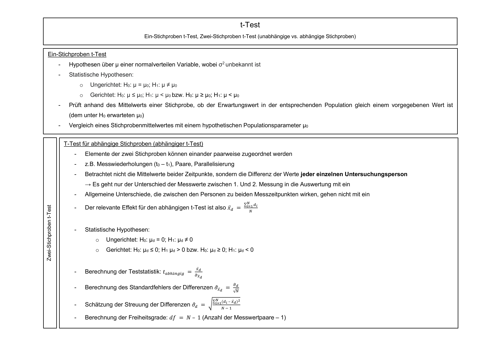
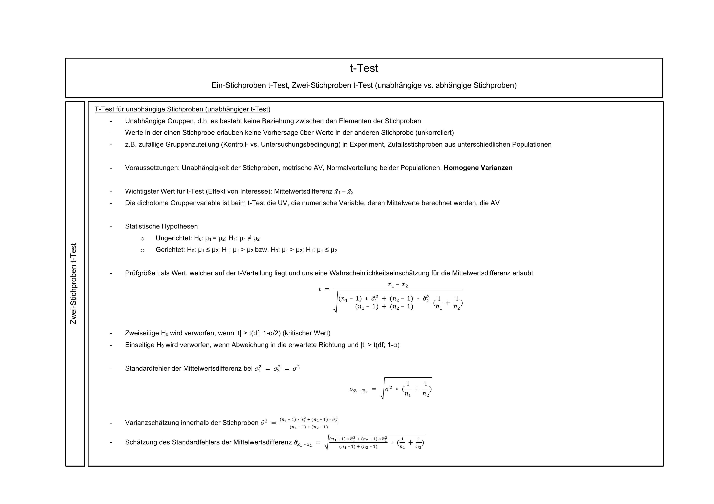
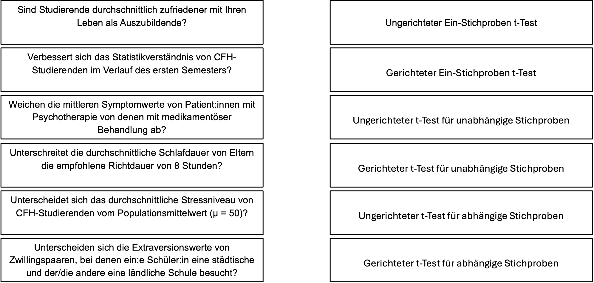
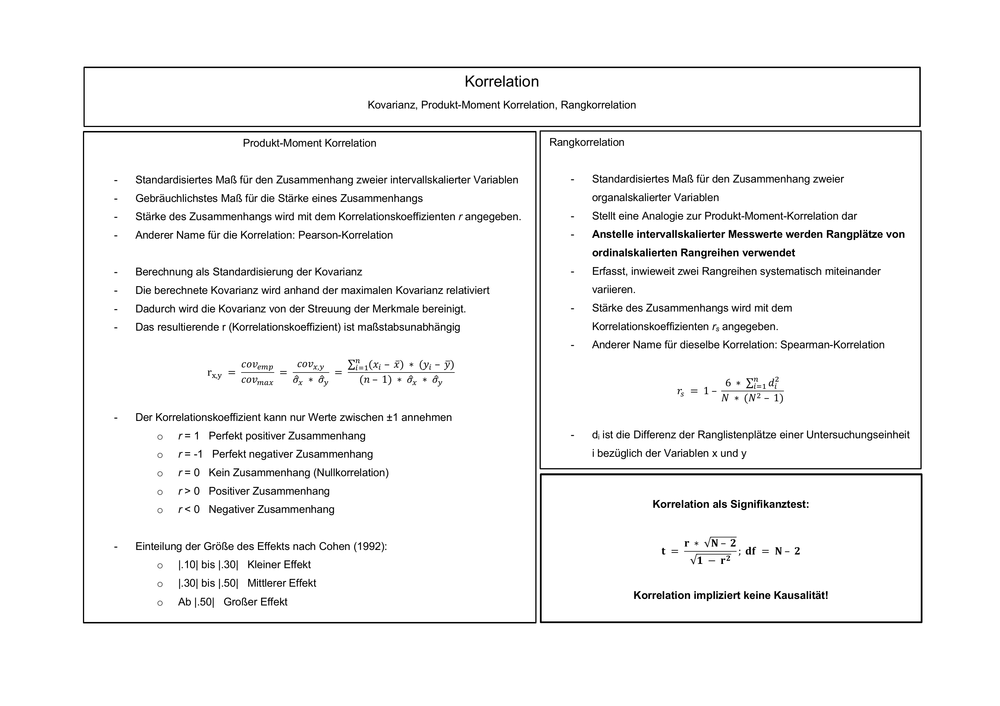

```{r setup, include=FALSE}
options(htmltools.dir.version = FALSE)

library(tidyverse)
library(kableExtra)
library(knitr)
library(ggplot2)
library(plotly)
library(htmlwidgets)
library(MASS)
library(ggpubr)
library(xaringanthemer)
library(xaringanExtra)
library(pdftools)
library(magick)
library(scales)
library(patchwork)
library(latex2exp)
library(RColorBrewer)
library(gridExtra)
library(grid)

style_duo_accent(
  primary_color = "#621C37",
  secondary_color = "#EE0071",
  background_image = "blank.png"
)

xaringanExtra::use_xaringan_extra(c("tile_view"))

use_scribble(
  pen_color = "#EE0071",
  pen_size = 4
  )

knitr::opts_chunk$set(
  fig.retina = TRUE,
  warning = FALSE,
  message = FALSE
)
```

name: 1
class: middle, left
<br><br><br><br><br><br><br>
# Statistik 1
## Seminar
***
### Einheit 5
##### `r format(as.Date(data.frame(readxl::read_excel("CFH_Statistik_1_Seminar_Termine.xlsx"))$Datum), "%d.%m.%Y")[8]` | Janika Saretzki, MSc. 

---
name: 2
class: top, left

### Termine
<br><br>
~~**Einheit 1  02.05.25  14:45-16:15 Uhr  A + B  HS Audimax / P3**~~<br>
~~**Einheit 2  15.05.25  13:05-15:30 Uhr  A + B  HS Audimax / P3**~~<br>
<br>
~~**Einheit 3**  12.06.25  13:05-15:30 Uhr  A    HS P5 005~~  
~~**Einheit 3**  13.06.25  13:50-16:15 Uhr  B    HS P1 105~~<br>
<br>
~~**Einheit 4**  26.06.25  13:20-15:45 Uhr  A    HS P5 005~~  
~~**Einheit 4**  27.06.25  13:50-16:15 Uhr  B    HS P1 105~~<br> 
<br>
**Einheit 5**  17.07.25  13:20-15:45 Uhr  A    HS P5 005  
**Einheit 5**  18.07.25  13:50-16:15 Uhr  B    HS P1 105<br>
<br>
**Tutorium  21.07.25  10:00-15:30 Uhr  A + B  HS Audimax / P3**<br>
**Tutorium  22.07.25  10:00-15:30 Uhr  B + B  HS Audimax / P3**<br> 

---
name: 3
class: top, left smaller

### Klausur
<br><br><br><br><br>
<div style="text-align: left; font-size: 95%;">
<strong>Bearbeitungszeit: 90 Minuten </strong><br>
<div style="margin-left: 20px; margin-top: 10px;">
  <div>- <strong>1/3</strong> Multiple-Choice-Fragen</div>
  <div>- <strong>2/3</strong> Rechenaufgaben</div>
</div>

<br>
<strong>Erlaubte Hilfsmittel:</strong> Nicht-programmierbarer Taschenrechner, Gestellte Formelsammlung (inkl. Verteilungstabellen), Selbst erstelltes Din-A4-Blatt (einseitig handgeschrieben), Geodreieck/Lineal, Schreibzeug (Kugelschreiber, Bleistift etc.)

---
name: 4
class: top, left smaller

<br><br><br>
<p style="text-align: center;">
  
</p>
---
name: 5
class: top, left smaller

<br><br><br><br>
<div style="display: flex; justify-content: center; align-items: flex-start; gap: 2%;">
  
  
</div>
<br>
<div style="text-align: center; margin-top: 1em; font-size: 90%;">
  <a href="https://daze02-stephan-goerigk.shinyapps.io/Statistik_trainer/" target="_blank">
    <strong>Statistiktrainer,</strong>
  </a> 
  <a href="https://daze02-stephan-goerigk.shinyapps.io/QM1_CFH/#section-willkommen" target="_blank">
   <strong>Übungsaufgaben</strong>
  </a>
</div>

---
name: 6
class: top, left, smaller
### Wiederholung
<div style="text-align: left; font-size: 90%;">
Zur Durchführung eines Hypothesentests sind folgende Schritte notwendig:

<br>
**1. Formulierung der Hypothesen:**
$$
\small
H_0: \text{Kein Effekt} \\
\small
H_1: \text{Es liegt ein Effekt vor}
$$

**2. Auswahl der zugrunde liegenden Verteilung**

**3. Festlegung von Annahme- und Ablehnungsbereich:** Bestimmung des kritischen Werts

**4. Einordnung des Beobachtungswerts in die Verteilung**

  - **Binomialverteilung**: Wahrscheinlichkeiten  
  - **z-Verteilung**: Mittelwerte bei bekanntem σ 
  - **t-Verteilung**: Mittelwerte bei unbekanntem σ
  - **F-Verteilung**: Varianzvergleiche  
  - **Chi-Quadrat-Verteilung**: Häufigkeiten / Proportionen

**5. Vergleich von Teststatistik und kritischem Wert**

**6. Entscheidung:** Test signifikant oder nicht signifikant
</div>
</span>

---
name: 7
class: top, left, smaller

### Wiederholung
<div style="text-align: left; font-size: 90%;">
<strong><u>Ein-Stichproben Test für Mittelwerte</u></strong>
<br><br><br>
<strong>Hypothesenpaar</strong>
<br>
Hypothese über µ einer normalverteilten Variable, wobei die Populationsvarianz bekannt ist
<br><br>

Statistische Hypothesenpaare:
</div>

<div style="text-align: center;">
  
</div>
<br>
<div style="text-align: left; font-size: 90%;">
<strong>Bestimmung einer zugrundeliegenden Verteilung</strong>
<br>
<li>Wenn wir an Mittelwerten interessiert sind UND die Populationsvarianz bekannt ist: <strong>z-Verteilung</strong><br></li>
<li>Wenn wir an Mittelwerten interessiert sind und die Populationsvarianz NICHT bekannt ist: <strong>t-Verteilung</strong></li></div>

---
name: 8
class: center, middle

```{r PDF to PNG, include=FALSE}

# pdf_files <- c("CHEAT-SHEET t-Test.pdf")
# img <- image_read_pdf(pdf_files[1], density = 300)
# 
# for (i in seq_along(img)) {
#   image_write(img[i], paste0("CHEAT-SHEET_t-Test_page", i, ".png"), format = "png")
# }

```



---
name: 9
class: center, middle


---
name: 10
class: top, left, smaller

### Übungsaufgabe 1 
<div style="text-align: left; font-size: 95%;">
Ein Medikamentenhersteller gibt an, dass jede Dose eines Psychopharmakums 200 Gramm (g) enthält. Es besteht der Verdacht, dass systematisch weniger abgefüllt wird. Wir kaufen daher 20 Dosen und wiegen den Inhalt. Die empirische Standardabweichung beträgt 7,28 g. Es wird angenommen, dass die Füllmengen normalverteilt sind.
<br><br>
```{r Dataframe 1, echo=FALSE, results='asis', warning=FALSE, message=FALSE}

pack_row1 <- 1:10
pack_row2 <- 11:20

gewicht_row1 <- c(200.3, 184.8, 192.2, 207.1, 187.5, 204.0, 200.1, 199.9, 188.5, 200.0)
gewicht_row2 <- c(191.1, 196.3, 206.1, 200.7, 199.0, 189.3, 183.4, 186.2, 200.2, 192.0)

gewicht_row1_chr <- gsub("\\.", ",", format(gewicht_row1, nsmall = 1))
gewicht_row2_chr <- gsub("\\.", ",", format(gewicht_row2, nsmall = 1))

tbl <- rbind(
  c("Packung", pack_row1),
  c("Gewicht (g)", gewicht_row1_chr),
  c("Packung", pack_row2),
  c("Gewicht (g)", gewicht_row2_chr)
)

kable(tbl, format = "html", align = "c", escape = FALSE) |>
  kable_styling(full_width = FALSE, font_size = 14, position = "center") |>
  row_spec(c(1,3), bold = TRUE, extra_css = "border-top: 1px solid black;") |>
  row_spec(c(2,4), extra_css = "border-bottom: 1px solid black;")

```
<br><br>
a) Formulieren Sie die statistischen Hypothesen, um die Herstellerangabe zu überprüfen.<br>
b) Entscheiden Sie, welcher Testtyp für diese Fragestellung angemessen ist.<br>
c) Berechnen Sie den empirischen Testwert auf Basis der Stichprobendaten.<br>
d) Bestimmen Sie den kritischen Wert für ein Signifikanzniveau von 5%.<br>
e) Treffen Sie auf Basis der Ergebnisse eine Schlussfolgerung.

</div>

---
name: 11
class: top, left, smaller

### Übungsaufgabe 1 - Lösung
<div style="text-align: left; font-size: 95%;">
Ein Medikamentenhersteller gibt an, dass jede Dose eines Psychopharmakums 200 Gramm (g) enthält. Es besteht der Verdacht, dass systematisch weniger abgefüllt wird. Wir kaufen daher 20 Dosen und wiegen den Inhalt. Die empirische Standardabweichung beträgt 7,28 g. Es wird angenommen, dass die Füllmengen normalverteilt sind.
<br><br>
```{r Dataframe 1b, echo=FALSE, results='asis', warning=FALSE, message=FALSE}

pack_row1 <- 1:10
pack_row2 <- 11:20

gewicht_row1 <- c(200.3, 184.8, 192.2, 207.1, 187.5, 204.0, 200.1, 199.9, 188.5, 200.0)
gewicht_row2 <- c(191.1, 196.3, 206.1, 200.7, 199.0, 189.3, 183.4, 186.2, 200.2, 192.0)

gewicht_row1_chr <- gsub("\\.", ",", format(gewicht_row1, nsmall = 1))
gewicht_row2_chr <- gsub("\\.", ",", format(gewicht_row2, nsmall = 1))

tbl <- rbind(
  c("Packung", pack_row1),
  c("Gewicht (g)", gewicht_row1_chr),
  c("Packung", pack_row2),
  c("Gewicht (g)", gewicht_row2_chr)
)

kable(tbl, format = "html", align = "c", escape = FALSE) |>
  kable_styling(full_width = FALSE, font_size = 14, position = "center") |>
  row_spec(c(1,3), bold = TRUE, extra_css = "border-top: 1px solid black;") |>
  row_spec(c(2,4), extra_css = "border-bottom: 1px solid black;")

```
<br><br>
a) Formulieren Sie die statistischen Hypothesen, um die Herstellerangabe zu überprüfen.<br>
</div>
<div style="flex: 1.4; font-size: 0.85em; line-height: 1.5; color: green; margin-top: 40px;">

$$
\small
H_0: \mu \geq \mu_0 \Rightarrow H_0: \mu \geq 200
$$


$$
\small
H_1: \mu < \mu_0 \Rightarrow H_1: \mu < 200
$$

... das bedeutet inhaltlich (nach Aufgabenstellung nicht gefordert, aber sinnvoll, sich zu überlegen): Die mittlere Füllmenge ist größer oder gleich der Herstellerangabe von 200g (Nullhypothese); Die mittlere Füllmenge ist kleiner als die Herstellerangabe von 200g (Alternativhypothese; das ist der Verdacht, den wir testen).

</div>

---
name: 12
class: top, left, smaller

### Übungsaufgabe 1 - Lösung
<div style="text-align: left; font-size: 95%;">
Ein Medikamentenhersteller gibt an, dass jede Dose eines Psychopharmakums 200 Gramm (g) enthält. Es besteht der Verdacht, dass systematisch weniger abgefüllt wird. Wir kaufen daher 20 Dosen und wiegen den Inhalt. Die empirische Standardabweichung beträgt 7,28 g. Es wird angenommen, dass die Füllmengen normalverteilt sind.
<br><br>
```{r Dataframe 1c, echo=FALSE, results='asis', warning=FALSE, message=FALSE}

pack_row1 <- 1:10
pack_row2 <- 11:20

gewicht_row1 <- c(200.3, 184.8, 192.2, 207.1, 187.5, 204.0, 200.1, 199.9, 188.5, 200.0)
gewicht_row2 <- c(191.1, 196.3, 206.1, 200.7, 199.0, 189.3, 183.4, 186.2, 200.2, 192.0)

gewicht_row1_chr <- gsub("\\.", ",", format(gewicht_row1, nsmall = 1))
gewicht_row2_chr <- gsub("\\.", ",", format(gewicht_row2, nsmall = 1))

tbl <- rbind(
  c("Packung", pack_row1),
  c("Gewicht (g)", gewicht_row1_chr),
  c("Packung", pack_row2),
  c("Gewicht (g)", gewicht_row2_chr)
)

kable(tbl, format = "html", align = "c", escape = FALSE) |>
  kable_styling(full_width = FALSE, font_size = 14, position = "center") |>
  row_spec(c(1,3), bold = TRUE, extra_css = "border-top: 1px solid black;") |>
  row_spec(c(2,4), extra_css = "border-bottom: 1px solid black;")

```
<br><br>
b) Entscheiden Sie, welcher Testtyp für diese Fragestellung angemessen ist.<br>
</div>

<div style="flex: 1.4; font-size: 0.85em; line-height: 1.5; color: green; margin-top: 40px;">
Ein (einseitiger) Ein-Stichproben t-Test ist angemessen, da nur eine Stichprobe betrachtet wird, lediglich die empirische Standardabweichung gegeben ist und ein gerichteter Test auf "weniger als 200 g" durchgeführt werden soll. Formel:

$$
\small
t = \frac{\bar{x} - \mu}{\frac{\hat{\sigma}}{\sqrt{n}}} \sim t_{n-1}
$$

$$
\small
\text{... wobei } t \text{ t‑verteilt ist mit } (n-1)\ \text{Freiheitsgraden, also } t_{n-1}.
$$

</div>

---
name: 13
class: top, left, smaller

### Übungsaufgabe 1 - Lösung
<div style="text-align: left; font-size: 95%;">
Ein Medikamentenhersteller gibt an, dass jede Dose eines Psychopharmakums 200 Gramm (g) enthält. Es besteht der Verdacht, dass systematisch weniger abgefüllt wird. Wir kaufen daher 20 Dosen und wiegen den Inhalt. Die empirische Standardabweichung beträgt 7,28 g. Es wird angenommen, dass die Füllmengen normalverteilt sind.
<br><br>
```{r Dataframe 1d, echo=FALSE, results='asis', warning=FALSE, message=FALSE}

pack_row1 <- 1:10
pack_row2 <- 11:20

gewicht_row1 <- c(200.3, 184.8, 192.2, 207.1, 187.5, 204.0, 200.1, 199.9, 188.5, 200.0)
gewicht_row2 <- c(191.1, 196.3, 206.1, 200.7, 199.0, 189.3, 183.4, 186.2, 200.2, 192.0)

gewicht_row1_chr <- gsub("\\.", ",", format(gewicht_row1, nsmall = 1))
gewicht_row2_chr <- gsub("\\.", ",", format(gewicht_row2, nsmall = 1))

tbl <- rbind(
  c("Packung", pack_row1),
  c("Gewicht (g)", gewicht_row1_chr),
  c("Packung", pack_row2),
  c("Gewicht (g)", gewicht_row2_chr)
)

kable(tbl, format = "html", align = "c", escape = FALSE) |>
  kable_styling(full_width = FALSE, font_size = 14, position = "center") |>
  row_spec(c(1,3), bold = TRUE, extra_css = "border-top: 1px solid black;") |>
  row_spec(c(2,4), extra_css = "border-bottom: 1px solid black;")

```
<br><br>
c) Berechnen Sie den empirischen Testwert auf Basis der Stichprobendaten.<br>
</div>

<div style="flex: 1.4; font-size: 0.80em; line-height: 1.5; color: green; margin-top: 20px;">

1. Schritt: Berechnung des Mittelwerts

$$
\small
\bar{x} = \frac{200{,}3 + 184{,}8 + 192{,}2 + \dots + 192{,}0}{20} = 195{,}44
$$

2. Schritt: Berechnung der Teststatistik

$$
\small
t = \frac{\bar{x} - \mu}{\frac{\hat{\sigma}}{\sqrt{n}}} \sim t_{n-1} \Rightarrow t = \frac{195{,}44\ - 200\,\text{}}{\frac{7{,}28\,\text{}}{\sqrt{20}}} = -2{,}801
$$
</div>

---
name: 14
class: top, left, smaller

### Übungsaufgabe 1 - Lösung
<div style="text-align: left; font-size: 95%;">
Ein Medikamentenhersteller gibt an, dass jede Dose eines Psychopharmakums 200 Gramm (g) enthält. Es besteht der Verdacht, dass systematisch weniger abgefüllt wird. Wir kaufen daher 20 Dosen und wiegen den Inhalt. Die empirische Standardabweichung beträgt 7,28 g. Es wird angenommen, dass die Füllmengen normalverteilt sind.
<br><br>
```{r Dataframe 1e, echo=FALSE, results='asis', warning=FALSE, message=FALSE}

pack_row1 <- 1:10
pack_row2 <- 11:20

gewicht_row1 <- c(200.3, 184.8, 192.2, 207.1, 187.5, 204.0, 200.1, 199.9, 188.5, 200.0)
gewicht_row2 <- c(191.1, 196.3, 206.1, 200.7, 199.0, 189.3, 183.4, 186.2, 200.2, 192.0)

gewicht_row1_chr <- gsub("\\.", ",", format(gewicht_row1, nsmall = 1))
gewicht_row2_chr <- gsub("\\.", ",", format(gewicht_row2, nsmall = 1))

tbl <- rbind(
  c("Packung", pack_row1),
  c("Gewicht (g)", gewicht_row1_chr),
  c("Packung", pack_row2),
  c("Gewicht (g)", gewicht_row2_chr)
)

kable(tbl, format = "html", align = "c", escape = FALSE) |>
  kable_styling(full_width = FALSE, font_size = 14, position = "center") |>
  row_spec(c(1,3), bold = TRUE, extra_css = "border-top: 1px solid black;") |>
  row_spec(c(2,4), extra_css = "border-bottom: 1px solid black;")

```
<br><br>
d) Bestimmen Sie den kritischen Wert für ein Signifikanzniveau von 5%.<br>
</div>

<div style="flex: 1.4; font-size: 0.80em; line-height: 1.5; color: green; margin-top: 20px;">

1. Schritt: Bestimme die Freiheitsgrade:
$$
\small
df = n - 1 = 20 - 1 = 19 \quad
$$

2. Schritt: Wiederholung der statistischen Hypothese, die wir testen:


$$
\small
H_1: \mu < 200
$$
Das bedeutet: Wir testen, ob der empirische Mittelwert <u>signifikant unter dem Referenzwert liegt.</u> Das Signifikanzniveau ist 0,05.
</div>

---
name: 15
class: top, left, smaller

### Übungsaufgabe 1 - Lösung
<div style="text-align: left; font-size: 95%;">
d) Bestimmen Sie den kritischen Wert für ein Signifikanzniveau von 5%.<br>
</div>

<div style="flex: 1.4; font-size: 0.80em; line-height: 1.5; color: green; margin-top: 20px;">
<br>
3. Schritt: Nutze die t-Tabelle zur Bestimmung des kritischen Werts<br>
Wir testen linksseitig (Verdacht, dass systematisch <u>weniger</u> abgefüllt wird)
<br><br><br>
Ein Alpha von 0,05 können wir nicht in der Tabelle ablesen und nutzen daher die Gegenwahrscheinlichkeit 1 - Alpha, d.h. 1 - 0,05 = 0,95 (kritischer Wert für das 95%-Quantil):

$$
\small
\Rightarrow \quad t_\text{kritisch} = t_{(0{,}95; 19)} = 1{,}729
$$
$$
\small
\Rightarrow \quad t_\text{kritisch} = t_{(0{,}05; \, df = 19)} = -1{,}729
$$
</div>
---
name: 16
class: top, left, smallest
<br>
<center>
<div style="display: flex; flex-direction: row; gap: 40px; align-items: flex-start;">
<div style="flex: 1;">
  
</div></center>

---
name: 17
class: top, left, smaller

### Übungsaufgabe 1 - Lösung
<div style="text-align: left; font-size: 95%;">
Ein Medikamentenhersteller gibt an, dass jede Dose eines Psychopharmakums 200 Gramm (g) enthält. Es besteht der Verdacht, dass systematisch weniger abgefüllt wird. Wir kaufen daher 20 Dosen und wiegen den Inhalt. Die empirische Standardabweichung beträgt 7,28 g. Es wird angenommen, dass die Füllmengen normalverteilt sind.
<br><br>
```{r Dataframe 1f, echo=FALSE, results='asis', warning=FALSE, message=FALSE}

pack_row1 <- 1:10
pack_row2 <- 11:20

gewicht_row1 <- c(200.3, 184.8, 192.2, 207.1, 187.5, 204.0, 200.1, 199.9, 188.5, 200.0)
gewicht_row2 <- c(191.1, 196.3, 206.1, 200.7, 199.0, 189.3, 183.4, 186.2, 200.2, 192.0)

gewicht_row1_chr <- gsub("\\.", ",", format(gewicht_row1, nsmall = 1))
gewicht_row2_chr <- gsub("\\.", ",", format(gewicht_row2, nsmall = 1))

tbl <- rbind(
  c("Packung", pack_row1),
  c("Gewicht (g)", gewicht_row1_chr),
  c("Packung", pack_row2),
  c("Gewicht (g)", gewicht_row2_chr)
)

kable(tbl, format = "html", align = "c", escape = FALSE) |>
  kable_styling(full_width = FALSE, font_size = 14, position = "center") |>
  row_spec(c(1,3), bold = TRUE, extra_css = "border-top: 1px solid black;") |>
  row_spec(c(2,4), extra_css = "border-bottom: 1px solid black;")

```
<br><br>
e) Treffen Sie auf Basis der Ergebnisse eine Schlussfolgerung.
</div>
<br>
<div style="flex: 1.4; font-size: 0.80em; line-height: 1.5; color: green; margin-top: 20px;">
$$
\small
t_{\text{empirisch}} = -2{,}801 \lt -1{,}729 = t_{\text{kritisch}} \quad \Rightarrow \quad H_0\ \text{verwerfen}
$$

Da der empirische t-Wert kleiner als der kritische t-Wert ist, liegt das Ergebnis im Ablehnungsbereich der Nullhypothese. Diese wird somit verworfen. Es gibt ein statistisch signifikantes Ergebnis; der beobachtete Effekt ist nicht durch Zufall erklärbar.
<br><br>
Die Auswertung zeigt, dass die Dosen im Durchschnitt tatsächlich weniger enthalten als die angegebenen 200g. Es spricht also einiges dafür, dass regelmäßig weniger abgefüllt wird, als der Hersteller angibt.
</div>

---
name: 18
<br><br>
```{r Lösung 1, echo=FALSE, fig.align='center', fig.width=6, fig.height=4.5, out.width='70%', dpi=300}

t_emp <- -2.80
t_crit <- -1.729
df <- 19

x <- seq(-4, 4, length.out = 1000)
y <- dt(x, df)
df_plot <- data.frame(x, y)

ggplot(df_plot, aes(x, y)) +
  geom_line(color = "black", size = 0.5) +

  geom_area(data = subset(df_plot, x <= t_crit), fill = "red", alpha = 0.4) +
  geom_vline(xintercept = t_crit, linetype = "dotted", color = "red") +
  annotate("text", x = t_crit - 0.1, y = dt(t_crit, df) + 0.01,
           label = "kritischer\nt-Wert = -1.729", hjust = 1.1,
           size = 3, color = "red") +

  geom_vline(xintercept = t_emp, linetype = "dashed", color = "blue") +
  annotate("text", x = t_emp - 0.1, y = dt(t_emp, df) + 0.015,
           label = "empirischer\nt-Wert = -2.80", hjust = 1,
           size = 3, color = "blue") +

  annotate("text", x = -3.4, y = 0.15, label = "Ablehnungs-\nbereich",
           color = "red", size = 3, hjust = 0.5) +

  labs(x = "t-Wert", y = "Dichte") +
  xlim(-4, 4) +
  ylim(0, 0.45) +
  theme_minimal(base_size = 12) +
  theme(
    panel.grid = element_blank(),
    axis.line = element_line(color = "black"),
    plot.margin = margin(10, 30, 10, 10),
    plot.title.position = "plot",
    clip = "off"
  ) +
  scale_x_continuous(expand = expansion(mult = c(0.01, 0.1)))

```


---
name: 19
class: top, left, smaller

### Übungsaufgabe 2
<div style="text-align: left; font-size: 95%;">
Ordnen Sie die Fragestellungen den richtigen Tests zu. Für alle Fragestellungen gilt, dass die Populationsvarianz der gesuchten Variable unbekannt ist.
</div>
<br>
<p style="text-align: center;">
  
</p>

---
name: 20
class: top, left, smaller

### Übungsaufgabe 2 - Lösung
<div style="text-align: left; font-size: 95%;">
Ordnen Sie die Fragestellungen den richtigen Tests zu. Für alle Fragestellungen gilt, dass die Populationsvarianz der gesuchten Variable unbekannt ist.
</div>
<br>
<p style="text-align: center;">
  
</p>

---
name: 21
class: top, left, smaller

### Übungsaufgabe 3
<div style="text-align: left; font-size: 95%;">
Ein Gesundheitspsychologe möchte untersuchen, ob ein edukativer Film Kinder zu besserer Zahnhygiene motivieren kann. Dafür werden 16 Kinder zufällig auf zwei Gruppen aufgeteilt: Acht Kinder sehen den Film, acht Kinder nicht.<br>
Im Folgemonat wird festgehalten, an wie vielen Tagen jedes Kind seine Zähne geputzt hat. Es wird eine Normalverteilung der Daten angenommen, und der Levene-Test ist nicht signifikant.
<br><br>
```{r Dataframe 2, echo=FALSE, results='asis', warning=FALSE, message=FALSE}

daten <- data.frame(
  Bedingung = c("Mit Film", "Ohne Film"),
  `Durchschnittliche Anzahl an Tagen<br>an denen Zähne geputzt wurde<br>(Stichprobenebene)` = c(23, 14),
  `Varianz der Anzahl an Tagen<br>an denen Zähne geputzt wurde<br>(Stichprobenebene)` = c(80, 120),
  check.names = FALSE
)

kable(daten, format = "html", escape = FALSE, align = "c") |>
  kable_styling(full_width = FALSE, font_size = 14, position = "center") |>
  row_spec(0, bold = TRUE) |>
  column_spec(1, bold = TRUE)

```
<br><br>
Analysieren Sie, ob der Film im Mittel zu einer höheren Anzahl an Tagen mit Zähneputzen führt.
<br><br>
a) Welcher statistische Test ist für die Fragestellung angemessen?<br>
b) Formulieren Sie die statistischen Hypothesen.<br>
c) Treffen Sie auf Basis der Stichprobendaten eine Testentscheidung bei einem Signifikanzniveau von Alpha = 0,20.
</div>

---
name: 22
class: top, left, smaller

### Übungsaufgabe 3 - Lösung
<div style="text-align: left; font-size: 95%;">
Ein Gesundheitspsychologe möchte untersuchen, ob ein edukativer Film Kinder zu besserer Zahnhygiene motivieren kann. Dafür werden 16 Kinder zufällig auf zwei Gruppen aufgeteilt: Acht Kinder sehen den Film, acht Kinder nicht.<br>
Im Folgemonat wird festgehalten, an wie vielen Tagen jedes Kind seine Zähne geputzt hat. Es wird eine Normalverteilung der Daten angenommen, und der Levene-Test ist nicht signifikant.
<br><br>
```{r Dataframe 2b, echo=FALSE, results='asis', warning=FALSE, message=FALSE}

daten <- data.frame(
  Bedingung = c("Mit Film", "Ohne Film"),
  `Durchschnittliche Anzahl an Tagen<br>an denen Zähne geputzt wurde<br>(Stichprobenebene)` = c(23, 14),
  `Varianz der Anzahl an Tagen<br>an denen Zähne geputzt wurde<br>(Stichprobenebene)` = c(80, 120),
  check.names = FALSE
)

kable(daten, format = "html", escape = FALSE, align = "c") |>
  kable_styling(full_width = FALSE, font_size = 14, position = "center") |>
  row_spec(0, bold = TRUE) |>
  column_spec(1, bold = TRUE)


```
<br><br>
Analysieren Sie, ob der Film im Mittel zu einer höheren Anzahl an Tagen mit Zähneputzen führt.
<br><br>
a) Welcher statistische Test ist für die Fragestellung angemessen?<br>
</div>
<div style="flex: 1.4; font-size: 0.75em; line-height: 1.5; color: green; margin-top: 20px;">
Da zwei unabhängige Gruppen (Kinder mit Film vs. ohne Film) hinsichtlich ihrer durchschnittlichen Anzahl an Tagen, an denen sie Zähne geputzt haben, verglichen werden sollen, und dabei angenommen wird, dass die Daten normalverteilt (parametrisches Verfahren möglich) und die Varianzen gleich sind (Levene-Test nicht signifikant, Varianzhomogenität ist gegeben, ø Welch-t-Test), ist der <u>Zwei-Stichproben t-Test für unabhängige Messungen</u> der geeignete Test.
</div>

---
name: 23
class: top, left, smaller

### Übungsaufgabe 3 - Lösung
<div style="text-align: left; font-size: 95%;">
Ein Gesundheitspsychologe möchte untersuchen, ob ein edukativer Film Kinder zu besserer Zahnhygiene motivieren kann. Dafür werden 16 Kinder zufällig auf zwei Gruppen aufgeteilt: Acht Kinder sehen den Film, acht Kinder nicht.<br>
Im Folgemonat wird festgehalten, an wie vielen Tagen jedes Kind seine Zähne geputzt hat. Es wird eine Normalverteilung der Daten angenommen, und der Levene-Test ist nicht signifikant.
<br><br>
```{r Dataframe 2c, echo=FALSE, results='asis', warning=FALSE, message=FALSE}

daten <- data.frame(
  Bedingung = c("Mit Film", "Ohne Film"),
  `Durchschnittliche Anzahl an Tagen<br>an denen Zähne geputzt wurde<br>(Stichprobenebene)` = c(23, 14),
  `Varianz der Anzahl an Tagen<br>an denen Zähne geputzt wurde<br>(Stichprobenebene)` = c(80, 120),
  check.names = FALSE
)

kable(daten, format = "html", escape = FALSE, align = "c") |>
  kable_styling(full_width = FALSE, font_size = 14, position = "center") |>
  row_spec(0, bold = TRUE) |>
  column_spec(1, bold = TRUE)


```
<br><br>
Analysieren Sie, ob der Film im Mittel zu einer höheren Anzahl an Tagen mit Zähneputzen führt.
<br><br>
b) Formulieren Sie die statistischen Hypothesen.<br>
</div>
<div style="flex: 1.4; font-size: 0.70em; line-height: 1.5; color: green; margin-top: 20px;">

$$
\small
H_0: \quad \mu_{\text{Mit Film}} ≤ \mu_{\text{Ohne Film}}
$$

$$
\small
H_1: \quad \mu_{\text{Mit Film}} > \mu_{\text{Ohne Film}}
$$

... das bedeutet inhaltlich (nach Aufgabenstellung nicht gefordert, aber sinnvoll, sich zu überlegen): Kinder, die den edukativen Film gesehen haben, putzen im Mittel nicht häufiger ihre Zähne als Kinder, die den Film nicht gesehen haben (Nullhypothese); Kinder, die den edukativen Film gesehen haben, putzen im Mittel häufiger ihre Zähne als Kinder, die den Film nicht gesehen haben (Alternativhypothese; das ist der Verdacht, den wir testen)
</div>
---
name: 24
class: top, left, smaller

### Übungsaufgabe 3 - Lösung
<div style="text-align: left; font-size: 95%;">
Ein Gesundheitspsychologe möchte untersuchen, ob ein edukativer Film Kinder zu besserer Zahnhygiene motivieren kann. Dafür werden 16 Kinder zufällig auf zwei Gruppen aufgeteilt: Acht Kinder sehen den Film, acht Kinder nicht.<br>
Im Folgemonat wird festgehalten, an wie vielen Tagen jedes Kind seine Zähne geputzt hat. Es wird eine Normalverteilung der Daten angenommen, und der Levene-Test ist nicht signifikant.
<br><br>
```{r Dataframe 2d, echo=FALSE, results='asis', warning=FALSE, message=FALSE}

daten <- data.frame(
  Bedingung = c("Mit Film", "Ohne Film"),
  `Durchschnittliche Anzahl an Tagen<br>an denen Zähne geputzt wurde<br>(Stichprobenebene)` = c(23, 14),
  `Varianz der Anzahl an Tagen<br>an denen Zähne geputzt wurde<br>(Stichprobenebene)` = c(80, 120),
  check.names = FALSE
)

kable(daten, format = "html", escape = FALSE, align = "c") |>
  kable_styling(full_width = FALSE, font_size = 14, position = "center") |>
  row_spec(0, bold = TRUE) |>
  column_spec(1, bold = TRUE)

```
<br><br>
Analysieren Sie, ob der Film im Mittel zu einer höheren Anzahl an Tagen mit Zähneputzen führt.
<br><br>
c) Treffen Sie auf Basis der Stichprobendaten eine Testentscheidung bei einem Signifikanzniveau von Alpha = 0,20.<br>
</div>

<div style="flex: 1.4; font-size: 0.80em; line-height: 1.5; color: green; margin-top: 20px;">

Gegeben sind folgende Werte:

$$
\small
n_1 = n_2 = 8
$$
$$
\small
\bar{x}_1 = 23,\quad \bar{x}_2 = 14,\quad s_1^2 = 80,\quad s_2^2 = 120,\quad \alpha = 0{,}20 \quad \text{(einseitig)}
$$


</div>

---
name: 25
class: top, left, smaller

### Übungsaufgabe 3 - Lösung
<div style="text-align: left; font-size: 95%;">
c) Treffen Sie auf Basis der Stichprobendaten eine Testentscheidung bei einem Signifikanzniveau von Alpha = 0,20.
</div>

<div style="flex: 1.4; font-size: 0.80em; line-height: 1.5; color: green; margin-top: 20px;">
Formel für den t-Test für unabhängige Stichproben:

$$
\small
t = \frac{\bar{x}_1 - \bar{x}_2}{\hat{\sigma}_{\bar{x}_1 - \bar{x}_2}}
$$

... mit dem geschätzten Standardfehler der Differenz der Mittelwerte im Nenner:

$$
\small
\hat{\sigma}_{\bar{x}_1 - \bar{x}_2} = \sqrt{ \frac{(n_1 - 1) \cdot s_1^2 + (n_2 - 1) \cdot s_2^2}{(n_1 - 1) + (n_2 - 1)} \cdot \left( \frac{1}{n_1} + \frac{1}{n_2} \right) }
$$

<br>
Diesen berechnen Sie zuerst durch Einsetzen der Werte:

$$
\small
\hat{\sigma}_{\bar{x}_1 - \bar{x}_2} = \sqrt{ \frac{(7 \cdot 80) + (7 \cdot 120)}{14} \cdot \left( \frac{1}{8} + \frac{1}{8} \right) } = \sqrt{ \frac{560 + 840}{14} \cdot \frac{1}{4} } = \sqrt{100 \cdot \frac{1}{4}} = \sqrt{25} = 5
$$

.. und berechnen damit den empirischen t-Wert:

$$
\small
t_{\text{empirisch}} = \frac{23 - 14}{5} = \frac{9}{5} = 1{,}8
$$

</div>

---
name: 26
class: top, left, smaller

### Übungsaufgabe 3 - Lösung
<div style="text-align: left; font-size: 95%;">
c) Treffen Sie auf Basis der Stichprobendaten eine Testentscheidung bei einem Signifikanzniveau von Alpha = 0,20.
</div>
<br><br><br>
<div style="flex: 1.4; font-size: 0.80em; line-height: 1.5; color: green; margin-top: 20px;">
Bestimmung des kritischen Werts:

Die Freiheitsgrade berechnen sich zu:

$$
\small
df = n_1 + n_2 - 2 = 8 + 8 - 2 = 14
$$

Den kritischen t-Wert lesen wir aus der t-Tabelle als das 1 - Alpha-Quantil der t-Verteilung mit 14 Freiheitsgraden ab:

$$
\small
t_{\text{kritisch}} = t_{1 - \alpha;\, 14} = t_{0{,}80;\,14} = 0{,}868
$$

$$
\small
t_{\text{empirisch}} = 1{,}8 > 0{,}868 = t_{\text{kritisch}}
$$

<br><br><br>
Das Ergenis zeigt, dass Kinder, die einen edukativen Film sehen, signifikant häufiger die Zähne putzen als Kinder, die den Film nicht sehen. <u>Was bedeutet das inhaltlich?</u><br>Es kann angenommen werden, dass das Sehen des edukativen Films mit häufigerem Zähneputzen einhergeht.
</div>

---
name: 16
class: top, left, smallest
<br>
<center>
<div style="display: flex; flex-direction: row; gap: 40px; align-items: flex-start;">
<div style="flex: 1;">
  
</div></center>

---

name: 27
<br><br>
```{r Lösung 3, echo=FALSE, fig.align='center', fig.width=6, fig.height=4.5, out.width='70%', dpi=300}

t_emp <- 1.80
t_crit <- 0.865
df <- 14

x <- seq(-4, 4, length.out = 1000)
y <- dt(x, df)
df_plot <- data.frame(x, y)

ggplot(df_plot, aes(x, y)) +
  geom_line(color = "black", size = 0.6) +

  geom_area(data = subset(df_plot, x >= t_crit), fill = "red", alpha = 0.4) +
  geom_vline(xintercept = t_crit, linetype = "dotted", color = "red") +
  annotate("text", x = t_crit + 0.1, y = dt(t_crit, df) + 0.01,
           label = "kritischer\nt-Wert = 0.865", hjust = 0,
           size = 3.5, color = "red") +

  geom_vline(xintercept = t_emp, linetype = "dashed", color = "blue") +
  annotate("text", x = t_emp + 0.1, y = dt(t_emp, df) + 0.015,
           label = "empirischer\nt-Wert = 1.80", hjust = 0,
           size = 3.5, color = "blue") +

  annotate("text", x = 3.0, y = 0.15, label = "Ablehnungs-\nbereich",
           color = "red", size = 3.5, hjust = 0.5) +

  labs(x = "t-Wert", y = "Dichte") +
  xlim(-4, 4) +
  ylim(0, 0.45) +
  theme_minimal(base_size = 12) +
  theme(
    panel.grid = element_blank(),
    axis.line = element_line(color = "black"),
    plot.margin = margin(10, 30, 10, 10),
    plot.title.position = "plot",
    clip = "off"
  ) +
  scale_x_continuous(expand = expansion(mult = c(0.01, 0.1)))

```

---
name: 28
class: top, left, smaller

### Übungsaufgabe 4
<div style="text-align: left; font-size: 95%;">
Sie interessieren sich dafür, ob sich Eltern in ihrer Kreativität systematisch von ihren Kindern unterscheiden. Eine Kinderärztin ermöglicht Ihnen den Zugang zu Vorsorgeuntersuchungen, bei denen jeweils ein Elternteil und ein Kind gemeinsam erscheinen. Zur Erhebung der Kreativität werden Elternteil und Kind getrennt gebeten, innerhalb von 5 Minuten möglichst viele Verwendungsmöglichkeiten für einen Ziegelstein zu notieren.
<br><br>
```{r Dataframe 3, echo=FALSE, results='asis', warning=FALSE, message=FALSE}

tbl <- rbind(
  c("Paar", 1, 2, 3, 4, 5, 6),
  c("Elternteil", 8, 9, 4, 10, 5, 6),
  c("Kind", 10, 10, 8, 4, 5, 8),
  c("Differenz", 2, 1, 4, -6, 0, 2)
)

kable(tbl, format = "html", align = "c", escape = FALSE) |>
  kable_styling(full_width = FALSE, position = "center", font_size = 14) |>
  row_spec(1, bold = TRUE) |>
  row_spec(4, extra_css = "border-top: 2px solid black;") |>
  column_spec(1:7, extra_css = "min-width: 60px;")

```

$$
\small
\hat{\sigma}_d = 3{,}45
$$
<br>
a) Welcher Test ist angemessen?<br>
b) Wie lauten die statistischen Hypothesen?<br>
c) Wie lautet der empirische t-Wert?<br>
d) Welche Testentscheidung treffen Sie bei einem Signifikanzniveau von Alpha = 0,01?
</div>

---
name: 29
class: top, left, smaller

### Übungsaufgabe 4 - Lösung
<div style="text-align: left; font-size: 95%;">
Sie interessieren sich dafür, ob sich Eltern in ihrer Kreativität systematisch von ihren Kindern unterscheiden. Eine Kinderärztin ermöglicht Ihnen den Zugang zu Vorsorgeuntersuchungen, bei denen jeweils ein Elternteil und ein Kind gemeinsam erscheinen. Zur Erhebung der Kreativität werden Elternteil und Kind getrennt gebeten, innerhalb von 5 Minuten möglichst viele Verwendungsmöglichkeiten für einen Ziegelstein zu notieren.
<br><br>
```{r Dataframe 3b, echo=FALSE, results='asis', warning=FALSE, message=FALSE}

tbl <- rbind(
  c("Paar", 1, 2, 3, 4, 5, 6),
  c("Elternteil", 8, 9, 4, 10, 5, 6),
  c("Kind", 10, 10, 8, 4, 5, 8),
  c("Differenz", 2, 1, 4, -6, 0, 2)
)

kable(tbl, format = "html", align = "c", escape = FALSE) |>
  kable_styling(full_width = FALSE, position = "center", font_size = 14) |>
  row_spec(1, bold = TRUE) |>
  row_spec(4, extra_css = "border-top: 2px solid black;") |>
  column_spec(1:7, extra_css = "min-width: 60px;")

```

$$
\small
\hat{\sigma}_d = 3{,}45
$$
<br>
a) Welcher Test ist angemessen?<br>
</div>

<div style="flex: 1.4; font-size: 0.80em; line-height: 1.5; color: green; margin-top: 20px;">
Für den Vergleich der Kreativität von Eltern und ihren Kindern ist ein t-Test für abhängige Stichproben (gepaarter t-Test) angemessen, da jeweils ein Elternteil und ein Kind ein Messpaar bilden. Die Kreativitätswerte stammen somit aus <u>verbundenen Beobachtungen innerhalb derselben Familie.</u> Der Test prüft, ob der Mittelwert der Differenzen signifikant von null abweicht, also ob sich die Kreativität systematisch zwischen den Gruppen unterscheidet.
</div>

---
name: 30
class: top, left, smaller

### Übungsaufgabe 4 - Lösung
<div style="text-align: left; font-size: 95%;">
Sie interessieren sich dafür, ob sich Eltern in ihrer Kreativität systematisch von ihren Kindern unterscheiden. Eine Kinderärztin ermöglicht Ihnen den Zugang zu Vorsorgeuntersuchungen, bei denen jeweils ein Elternteil und ein Kind gemeinsam erscheinen. Zur Erhebung der Kreativität werden Elternteil und Kind getrennt gebeten, innerhalb von 5 Minuten möglichst viele Verwendungsmöglichkeiten für einen Ziegelstein zu notieren.
<br><br>
```{r Dataframe 3c, echo=FALSE, results='asis', warning=FALSE, message=FALSE}

tbl <- rbind(
  c("Paar", 1, 2, 3, 4, 5, 6),
  c("Elternteil", 8, 9, 4, 10, 5, 6),
  c("Kind", 10, 10, 8, 4, 5, 8),
  c("Differenz", 2, 1, 4, -6, 0, 2)
)

kable(tbl, format = "html", align = "c", escape = FALSE) |>
  kable_styling(full_width = FALSE, position = "center", font_size = 14) |>
  row_spec(1, bold = TRUE) |>
  row_spec(4, extra_css = "border-top: 2px solid black;") |>
  column_spec(1:7, extra_css = "min-width: 60px;")

```

$$
\small
\hat{\sigma}_d = 3{,}45
$$
<br>
b) Wie lauten die statistischen Hypothesen?<br>
</div>
<br>
<div style="flex: 1.4; font-size: 0.80em; line-height: 1.5; color: green; margin-top: 20px;">

$$
\small
H_0: \mu_d = 0 \quad \text{(kein Unterschied in der Kreativität zwischen Eltern und Kindern)}
$$

$$
\small
H_1: \mu_d \ne 0 \quad \text{(Unterschied in der Kreativität zwischen Eltern und Kindern)}
$$


</div>

---
name: 31
class: top, left, smaller

### Übungsaufgabe 4 - Lösung
<div style="text-align: left; font-size: 95%;">
Sie interessieren sich dafür, ob sich Eltern in ihrer Kreativität systematisch von ihren Kindern unterscheiden. Eine Kinderärztin ermöglicht Ihnen den Zugang zu Vorsorgeuntersuchungen, bei denen jeweils ein Elternteil und ein Kind gemeinsam erscheinen. Zur Erhebung der Kreativität werden Elternteil und Kind getrennt gebeten, innerhalb von 5 Minuten möglichst viele Verwendungsmöglichkeiten für einen Ziegelstein zu notieren.
<br><br>
```{r Dataframe 3d, echo=FALSE, results='asis', warning=FALSE, message=FALSE}

tbl <- rbind(
  c("Paar", 1, 2, 3, 4, 5, 6),
  c("Elternteil", 8, 9, 4, 10, 5, 6),
  c("Kind", 10, 10, 8, 4, 5, 8),
  c("Differenz", 2, 1, 4, -6, 0, 2)
)

kable(tbl, format = "html", align = "c", escape = FALSE) |>
  kable_styling(full_width = FALSE, position = "center", font_size = 14) |>
  row_spec(1, bold = TRUE) |>
  row_spec(4, extra_css = "border-top: 2px solid black;") |>
  column_spec(1:7, extra_css = "min-width: 60px;")

```

$$
\small
\hat{\sigma}_d = 3{,}45
$$
<br>
c) Wie lautet der empirische t-Wert?<br>
</div>

<div style="flex: 1.4; font-size: 0.80em; line-height: 1.5; color: green; margin-top: 20px;">

1. Schritt: Differenzen notieren
$$
\small
\text{Differenzen:} \quad d_i = \{2,\ 1,\ 4,\ -6,\ 0,\ 2\}
$$

2. Schritt: Stichprobengröße (Achtung: Beim t-Test für abhängige Stichproben ist N die Anzahl der Differenzpaare, nicht der Einzelwerte!)
$$
\small
\text{Stichprobengröße:} \quad N = 6 \\
$$

</div>
---
name: 32
class: top, left, smaller

### Übungsaufgabe 4 - Lösung
<div style="text-align: left; font-size: 95%;">
c) Wie lautet der empirische t-Wert?<br>
</div><br>
<div style="flex: 1.4; font-size: 0.80em; line-height: 1.5; color: green; margin-top: 20px;">
3. Schritt: Standardabweichung der Differenzen (bereits gegeben!)
$$
\small
\text{Gegeben:} \quad \hat{\sigma}_d = 3{,}45
$$

4. Schritt: Mittelwert der Differenzen berechnen
$$
\small
\bar{x}_d = \frac{2 + 1 + 4 + (-6) + 0 + 2}{6} = \frac{3}{6} = 0{,}5
$$

5. Schritt: Standardfehler berechnen
$$
\small
\hat{\sigma}_{\bar{x}_d} = \frac{\hat{\sigma}_d}{\sqrt{N}} = \frac{3{,}45}{\sqrt{6}} \approx \frac{3{,}45}{2{,}45} \approx 1{,}41
$$

6. Schritt: t-Wert (Teststatistik)berechnen
$$
\small
t_{\text{emp}} = \frac{\bar{x}_d}{\hat{\sigma}_{\bar{x}_d}} = \frac{0{,}5}{1{,}41} \approx 0{,}35
$$

</div>

---
name: 33
class: top, left, smaller

### Übungsaufgabe 4 - Lösung
<div style="text-align: left; font-size: 95%;">
Sie interessieren sich dafür, ob sich Eltern in ihrer Kreativität systematisch von ihren Kindern unterscheiden. Eine Kinderärztin ermöglicht Ihnen den Zugang zu Vorsorgeuntersuchungen, bei denen jeweils ein Elternteil und ein Kind gemeinsam erscheinen. Zur Erhebung der Kreativität werden Elternteil und Kind getrennt gebeten, innerhalb von 5 Minuten möglichst viele Verwendungsmöglichkeiten für einen Ziegelstein zu notieren.
<br><br>
```{r Dataframe 3e, echo=FALSE, results='asis', warning=FALSE, message=FALSE}

tbl <- rbind(
  c("Paar", 1, 2, 3, 4, 5, 6),
  c("Elternteil", 8, 9, 4, 10, 5, 6),
  c("Kind", 10, 10, 8, 4, 5, 8),
  c("Differenz", 2, 1, 4, -6, 0, 2)
)

kable(tbl, format = "html", align = "c", escape = FALSE) |>
  kable_styling(full_width = FALSE, position = "center", font_size = 14) |>
  row_spec(1, bold = TRUE) |>
  row_spec(4, extra_css = "border-top: 2px solid black;") |>
  column_spec(1:7, extra_css = "min-width: 60px;")

```

$$
\small
\hat{\sigma}_d = 3{,}45
$$
<br>
d) Welche Testentscheidung treffen Sie bei einem Signifikanzniveau von Alpha = 0,01?<br>
</div>

<div style="flex: 1.4; font-size: 0.80em; line-height: 1.5; color: green; margin-top: 20px;">

Schritt 1: Gegebene Werte
$$
\small
\text{Gegeben:} \quad t_{\text{empirisch}} \approx 0{,}36 \quad \text{und} \quad \alpha = 0{,}01
$$

Schritt 2: Bestimmung des kritischen Werts bei zweiseitigem Test (df = 5, da N = 6 und df = N - 1)
$$
\quad t_{\text{kritisch}} =  t_{\text{kritisch}} = t_{1 - \alpha/2;\, 5} = t_{\text{kritisch}} = t_{1 - 0,01/2;\, 5} = t_{\text{kritisch}} = t_{1 - 0,005;\, 5} = t_{0{,}995;\,5} = 4{,}032
$$

</div>
---

name: 48
class: top, left, smallest
<br>
<center>
<div style="display: flex; flex-direction: row; gap: 40px; align-items: flex-start;">
<div style="flex: 1;">
  
</div></center>

---
name: 35
class: top, left, smaller

### Übungsaufgabe 4 - Lösung
<div style="text-align: left; font-size: 95%;">
d) Welche Testentscheidung treffen Sie bei einem Signifikanzniveau von Alpha = 0,01?
</div>

<div style="flex: 1.4; font-size: 0.80em; line-height: 1.5; color: green; margin-top: 20px;">
Schritt 3: Vergleich von empirischem und kritischem t-Wert
$$
\small
|t_{\text{empirsch}}| = 0{,}36 \;<\; 4,032 = t_{\text{kritisch}} 
$$

Schritt 4: Testentscheidung formulieren<br>
Die Nullhypothese wird nicht verworfen!

<br><br>

5. Schritt: Interpretation für inhaltlichen Bezug<br>
Es gibt bei einem Singifikanzniveau von 0,01 keinen signifikanten Unterschied zwischen Eltern und Kindern in Ihrer Kreativität.
</div>
---
name: 36
class: center, middle

```{r PDF to PNG2, include=FALSE}

# pdf_files <- c("CHEAT-SHEET Korrelation.pdf")
# img <- image_read_pdf(pdf_files[1], density = 300)
# 
# for (i in seq_along(img)) {
#   image_write(img[i], paste0("CHEAT-SHEET_Korrelation_page", i, ".png"), format = "png")
# }

```


---
name: 37
class: center, middle



---

name: 38
class: top, left, smaller

### Übungsaufgabe 5
<div style="text-align: left; font-size: 95%;">
Die Variablen x und y sind intervallskaliert. Prüfen Sie, ob ein Zusammenhang zwischen den beiden Variablen besteht. Es wird angenommen, dass keine Ausreißer in den Daten enthalten sind.
<br><br>

```{r Dataframe 4, echo=FALSE, results='asis', warning=FALSE, message=FALSE}

tabelle <- rbind(
  c("x", "y"),
  c("2", "1"),
  c("1", "2"),
  c("9", "6"),
  c("5", "4"),
  c("3", "2")
)

kable(tabelle, format = "html", align = "c", col.names = NULL, escape = FALSE) |>
  kable_styling(full_width = FALSE, font_size = 14, position = "center") |>
  row_spec(1, extra_css = "border-bottom: 1px solid black;") |>
  column_spec(1:2, width = "4em")

```


$$
\small \bar{x} = 4 \quad s_x = 3{,}16
$$

$$
\small \bar{y} = 3 \quad s_y = 2
$$


a) Stellen Sie die statistischen Hypothesen auf. <br>
b) Besteht ein Zusammenhang zwischen den beiden Variablen? <br><strong>Falls ja: Wie würden Sie die gefundene Korrelation bzw. den Effekt bewerten?</strong><br>
c) Falls eine Korrelation besteht: Würden Sie diese als signifikant bezeichnen (Alpha = 0,05)?
</div>

---
name: 39
class: top, left, smaller

### Übungsaufgabe 5 - Lösung
<div style="text-align: left; font-size: 95%;">
Die Variablen x und y sind intervallskaliert. Prüfen Sie, ob ein Zusammenhang zwischen den beiden Variablen besteht. Es wird angenommen, dass keine Ausreißer in den Daten enthalten sind.
<br><br>

```{r Dataframe 4b, echo=FALSE, results='asis', warning=FALSE, message=FALSE}

tabelle <- rbind(
  c("x", "y"),
  c("2", "1"),
  c("1", "2"),
  c("9", "6"),
  c("5", "4"),
  c("3", "2")
)

kable(tabelle, format = "html", align = "c", col.names = NULL, escape = FALSE) |>
  kable_styling(full_width = FALSE, font_size = 14, position = "center") |>
  row_spec(1, extra_css = "border-bottom: 1px solid black;") |>
  column_spec(1:2, width = "4em")

```


$$
\small \bar{x} = 4 \quad s_x = 3{,}16
$$

$$
\small \bar{y} = 3 \quad s_y = 2
$$

a) Stellen Sie die statistischen Hypothesen auf. <br>
<div style="flex: 1.4; font-size: 0.80em; line-height: 1.5; color: green; margin-top: 20px;">
$$
\small
H_0: \rho = 0 \quad \text{(Es besteht kein linearer Zusammenhang zwischen } x \text{ und } y \text{)}
$$

$$
\small
H_1: \rho \ne 0 \quad \text{(Es besteht ein linearer Zusammenhang zwischen } x \text{ und } y \text{)}
$$


</div>
</div>

---
name: 40
class: top, left, smaller

### Übungsaufgabe 5 - Lösung
<div style="text-align: left; font-size: 95%;">
Die Variablen x und y sind intervallskaliert. Prüfen Sie, ob ein Zusammenhang zwischen den beiden Variablen besteht. Es wird angenommen, dass keine Ausreißer in den Daten enthalten sind.
<br><br>

```{r Dataframe 4c, echo=FALSE, results='asis', warning=FALSE, message=FALSE}

tabelle <- rbind(
  c("x", "y"),
  c("2", "1"),
  c("1", "2"),
  c("9", "6"),
  c("5", "4"),
  c("3", "2")
)

kable(tabelle, format = "html", align = "c", col.names = NULL, escape = FALSE) |>
  kable_styling(full_width = FALSE, font_size = 14, position = "center") |>
  row_spec(1, extra_css = "border-bottom: 1px solid black;") |>
  column_spec(1:2, width = "4em")

```


$$
\small \bar{x} = 4 \quad s_x = 3{,}16
$$

$$
\small \bar{y} = 3 \quad s_y = 2
$$


b) Besteht ein Zusammenhang zwischen den beiden Variablen? <br><strong>Falls ja: Wie würden Sie die gefundene Korrelation bzw. den Effekt bewerten?</strong><br>
</div>
<div style="flex: 1.4; font-size: 0.80em; line-height: 1.5; color: green; margin-top: 20px;">
1. Schritt: Gegeben sind folgende Werte:

$$
\small
\bar{x} = 4, \quad \bar{y} = 3, \quad s_x = 3{,}16, \quad s_y = 2
$$

</div>

---
name: 41
class: top, left, smaller

### Übungsaufgabe 5 - Lösung

b) Besteht ein Zusammenhang zwischen den beiden Variablen? <br><strong>Falls ja: Wie würden Sie die gefundene Korrelation bzw. den Effekt bewerten?</strong><br>
</div>

<div style="flex: 1.4; font-size: 0.80em; line-height: 1.5; color: green; margin-top: 20px;">
2. Schritt:  Einsetzen in die Formel für Pearson-r
$$
\small
r = \frac{1}{n - 1} \sum_{i=1}^{n} \left( \frac{x_i - \bar{x}}{s_x} \cdot \frac{y_i - \bar{y}}{s_y} \right) 
$$

$$
\small
r = \frac{
\left(\frac{x_1-\bar{x}}{s_x}\cdot\frac{y_1-\bar{y}}{s_y}\right) +
\left(\frac{x_2-\bar{x}}{s_x}\cdot\frac{y_2-\bar{y}}{s_y}\right) +
\left(\frac{x_3-\bar{x}}{s_x}\cdot\frac{y_3-\bar{y}}{s_y}\right) +
\left(\frac{x_4-\bar{x}}{s_x}\cdot\frac{y_4-\bar{y}}{s_y}\right) +
\left(\frac{x_5-\bar{x}}{s_x}\cdot\frac{y_5-\bar{y}}{s_y}\right)
}{n-1}
$$


$$
\tiny
r = \frac{(-0{,}63 \cdot -1{,}00) + (-0{,}95 \cdot -0{,}50) + (1{,}58 \cdot 1{,}50) + (0{,}32 \cdot 0{,}50) + (-0{,}32 \cdot -0{,}50)}{5 - 1}
= \frac{0{,}63 + 0{,}48 + 2{,}37 + 0{,}16 + 0{,}16}{4} = \frac{3{,}80}{4} = 0{,}95
$$


Es besteht ein positiver Zusammenhang zwischen den Variablen x und y. Mit r = 0,95 liegt ein großer Effekt vor (nach Cohen, 1992)

</div>
---
name: 42
class: top, left, smaller

### Übungsaufgabe 5 - Lösung
<div style="text-align: left; font-size: 95%;">
Die Variablen x und y sind intervallskaliert. Prüfen Sie, ob ein Zusammenhang zwischen den beiden Variablen besteht. Es wird angenommen, dass keine Ausreißer in den Daten enthalten sind.
<br><br>

```{r Dataframe 4d, echo=FALSE, results='asis', warning=FALSE, message=FALSE}

tabelle <- rbind(
  c("x", "y"),
  c("2", "1"),
  c("1", "2"),
  c("9", "6"),
  c("5", "4"),
  c("3", "2")
)

kable(tabelle, format = "html", align = "c", col.names = NULL, escape = FALSE) |>
  kable_styling(full_width = FALSE, font_size = 14, position = "center") |>
  row_spec(1, extra_css = "border-bottom: 1px solid black;") |>
  column_spec(1:2, width = "4em")

```


$$
\small \bar{x} = 4 \quad s_x = 3{,}16
$$

$$
\small \bar{y} = 3 \quad s_y = 2
$$

c) Falls eine Korrelation besteht: Würden Sie diese als signifikant bezeichnen (Alpha = 0,05)?
</div>

<div style="flex: 1.4; font-size: 0.80em; line-height: 1.5; color: green; margin-top: 20px;">
1. Schritt: Gegebene Werte
$$
\small
r = 0{,}95, \quad N = 5, \quad \alpha = 0{,}05
$$

</div>
---
name: 43
class: top, left, smaller

### Übungsaufgabe 5 - Lösung
<div style="text-align: left; font-size: 95%;">
c) Falls eine Korrelation besteht: Würden Sie diese als signifikant bezeichnen (Alpha = 0,05)?
</div>

<div style="flex: 1.4; font-size: 0.80em; line-height: 1.5; color: green; margin-top: 20px;">

2. Schritt: Freiheitsgrade berechnen
$$
\small
df = N - 2 = 5 - 2 = 3
$$

3. Schritt: Einsetzen in die Formel aus der Folie (t-Verteilung)

$$
\small
t = \frac{r \cdot \sqrt{N - 2}}{\sqrt{1 - r^2}} 
= \frac{0{,}95 \cdot \sqrt{5 - 2}}{\sqrt{1 - 0{,}95^2}} 
= \frac{0{,}95 \cdot \sqrt{3}}{\sqrt{1 - 0{,}9025}} 
= \frac{0{,}95 \cdot 1{,}732}{\sqrt{0{,}0975}} 
= \frac{1{,}645}{0{,}312} 
\approx 5{,}27
$$

4. Schritt: Kritischer t-Wert
$$
\small
t_{\text{kritisch}} = t_{1 - \alpha/2;\, df} = t_{0{,}975;\,3} = 3{,}182
$$

5. Schritt: Testentscheidung
$$
\small
|t_{\text{empirisch}}| = 5{,}27 > 3,182 = t_{\text{kritisch}} \quad (\text{zweiseitig, } \alpha = 0{,}05, df = 3)
$$

$$
\small
\Rightarrow \text{Die Korrelation ist signifikant auf dem Niveau von } \alpha = 0{,}05.
$$

</div>

---
name: 48
class: top, left, smallest
<br>
<center>
<div style="display: flex; flex-direction: row; gap: 40px; align-items: flex-start;">
<div style="flex: 1;">
  
</div></center>

---
name: 44
class: top, left, smaller

### Übungsaufgabe 6
<div style="text-align: left; font-size: 95%;">
Zwei Kunstkritiker bringen zwölf Gemälde nach ihrem Wert in eine Rangreihe. 
<br><br>
```{r Dataframe 5, echo=FALSE, results='asis', warning=FALSE, message=FALSE}

daten <- rbind(
  c("Gemälde", 1:12),
  c("Kritiker 1", 8, 7, 3, 11, 4, 1, 5, 6, 10, 2, 12, 9),
  c("Kritiker 2", 6, 9, 1, 12, 5, 4, 8, 3, 11, 2, 10, 7)
)

kable(daten, format = "html", align = "c", escape = FALSE, col.names = NULL) |>
  kable_styling(full_width = FALSE, font_size = 14, position = "center") |>
  row_spec(1, bold = TRUE) |>  
  column_spec(1:13, width = "3em")


```
<br><br>
<strong>Korreliert die Rangfolge der beiden Kritiker?</strong><br><br>
a) Welcher Korrelationskoeffizient sollte bestimmt werden? Begründen Sie Ihre Entscheidung.<br>
b) Beantworten Sie die Forschungsfrage.<br>
c) Ist die Korrelation auf einem Signifikanzniveau von 1% signifikant?
</div>

---
name: 45
class: top, left, smaller

### Übungsaufgabe 6 - Lösung
<div style="text-align: left; font-size: 95%;">
Zwei Kunstkritiker bringen zwölf Gemälde nach ihrem Wert in eine Rangreihe. 
<br><br>
```{r Dataframe 5b, echo=FALSE, results='asis', warning=FALSE, message=FALSE}

daten <- rbind(
  c("Gemälde", 1:12),
  c("Kritiker 1", 8, 7, 3, 11, 4, 1, 5, 6, 10, 2, 12, 9),
  c("Kritiker 2", 6, 9, 1, 12, 5, 4, 8, 3, 11, 2, 10, 7)
)

kable(daten, format = "html", align = "c", escape = FALSE, col.names = NULL) |>
  kable_styling(full_width = FALSE, font_size = 14, position = "center") |>
  row_spec(1, bold = TRUE) |>  
  column_spec(1:13, width = "3em")


```
<br><br>
<strong>Korreliert die Rangfolge der beiden Kritiker?</strong><br><br>
a) Welcher Korrelationskoeffizient sollte bestimmt werden? Begründen Sie Ihre Entscheidung.<br>
</div>

<div style="flex: 1.4; font-size: 0.80em; line-height: 1.5; color: green; margin-top: 20px;">
Da es sich bei den Bewertungen beider Kritiker um Rangdaten handelt, ist der passende Zusammenhangsmaß der Rangkorrelationskoeffizient nach Spearman. Der Spearman-Koeffizient prüft, ob eine monotone Beziehung zwischen zwei Rangreihen besteht. Er ist daher geeignet, wenn beide Variablen ordinalskaliert (Ränge) sind – wie hier.
</div>

---
name: 46
class: top, left, smaller

### Übungsaufgabe 6 - Lösung
<div style="text-align: left; font-size: 95%;">
Zwei Kunstkritiker bringen zwölf Gemälde nach ihrem Wert in eine Rangreihe. 
<br><br>
```{r Dataframe 5c, echo=FALSE, results='asis', warning=FALSE, message=FALSE}

daten <- rbind(
  c("Gemälde", 1:12),
  c("Kritiker 1", 8, 7, 3, 11, 4, 1, 5, 6, 10, 2, 12, 9),
  c("Kritiker 2", 6, 9, 1, 12, 5, 4, 8, 3, 11, 2, 10, 7)
)

kable(daten, format = "html", align = "c", escape = FALSE, col.names = NULL) |>
  kable_styling(full_width = FALSE, font_size = 14, position = "center") |>
  row_spec(1, bold = TRUE) |>  
  column_spec(1:13, width = "3em")


```
<br><br>
<strong>Korreliert die Rangfolge der beiden Kritiker?</strong><br><br>
b) Beantworten Sie die Forschungsfrage.<br>
</div>

<div style="flex: 1.4; font-size: 0.80em; line-height: 1.5; color: green; margin-top: 20px;">
$$
\small
r_s = 1 - \frac{6 \cdot \sum d_i^2}{N \cdot (N^2 - 1)} 
= 1 - \frac{6 \cdot 50}{12 \cdot (12^2 - 1)} 
= 1 - \frac{300}{12 \cdot 143} 
= 1 - \frac{300}{1716} 
\approx 1 - 0{,}175 
= 0{,}825 \approx 0{,}83
$$


Die Rangfolge der beiden Kritiker korreliert positiv mit 0,65. Nach Cohen (1992) entspricht dies einem großen Effekt.

</div>

---
name: 47
class: top, left, smaller

### Übungsaufgabe 6 - Lösung
<div style="text-align: left; font-size: 95%;">
Zwei Kunstkritiker bringen zwölf Gemälde nach ihrem Wert in eine Rangreihe. 
<br><br>
```{r Dataframe 5d, echo=FALSE, results='asis', warning=FALSE, message=FALSE}

daten <- rbind(
  c("Gemälde", 1:12),
  c("Kritiker 1", 8, 7, 3, 11, 4, 1, 5, 6, 10, 2, 12, 9),
  c("Kritiker 2", 6, 9, 1, 12, 5, 4, 8, 3, 11, 2, 10, 7)
)

kable(daten, format = "html", align = "c", escape = FALSE, col.names = NULL) |>
  kable_styling(full_width = FALSE, font_size = 14, position = "center") |>
  row_spec(1, bold = TRUE) |>  
  column_spec(1:13, width = "3em")


```
<br><br>
<strong>Korreliert die Rangfolge der beiden Kritiker?</strong><br><br>
c) Ist die Korrelation auf einem Signifikanzniveau von 1% signifikant?
</div>

<div style="flex: 1.4; font-size: 0.80em; line-height: 1.5; color: green; margin-top: 20px;">

$$
\small
t = \frac{r_s \cdot \sqrt{N - 2}}{\sqrt{1 - r_s^2}} 
= \frac{0{,}83 \cdot \sqrt{12 - 2}}{\sqrt{1 - 0{,}83^2}} 
= \frac{0{,}83 \cdot \sqrt{10}}{\sqrt{1 - 0{,}6889}} 
= \frac{0{,}83 \cdot 3{,}16}{\sqrt{0{,}3111}} 
= \frac{2{,}623}{0{,}558} \approx 4{,}71
$$

$$
\small
df = N - 2 = 12 - 2 = 10
$$

$$
\small
\Rightarrow \quad t_\text{kritisch} = t_{(1-Alpha/2; 10)} = t_{(1-0,01/2; 10) = t_{1-0,005; 10}} = t_{0,995} = 3{,}169
$$

$$
\small
\Rightarrow \quad t_\text{empirisch} = 4,71 > 3,169 = t_\text{kritisch}
$$

Die Rangkorrelation ist mit 0,83 hoch und auf dem Signifikanzniveau Alpha = 0,01 signifikant } (t = 4,71; df = 10). Es besteht ein signifikanter Zusammenhang zwischen den Rangreihen der beiden Kritiker.
</div>

---
name: 48
class: top, left, smallest
<br>
<center>
<div style="display: flex; flex-direction: row; gap: 40px; align-items: flex-start;">
<div style="flex: 1;">
  
</div></center>

---
name: 36
class: center, middle

```{r PDF to PNG3, include=FALSE}

# library(magick)
# 
# pdf_file <- "CHEAT-SHEET_Chi_Quadrat_Test.pdf"
# 
# img <- image_read_pdf(pdf_file, density = 300)
# 
# image_write(img, path = "CHEAT-SHEET_Chi_Quadrat_Test.png", format = "png")

```


---
name: 46
class: top, left, smaller

### Übungsaufgabe 7
<div style="text-align: left; font-size: 95%;">
Eine Bildungsforscherin interessiert sich dafür, wie Schülerinnen zur Schule kommen. Sie vermutet, dass das Verkehrsmittel "Fahrrad" und "Öffentliche Verkehrsmittel" gleich häufig genutzt werden. Aus einer Stichprobe von N = 150 Schülerinnen ergibt sich folgendes Ergebnis:
<br><br>
Anzahl Schülerinnen (Fahrrad): 94<br>
Anzahl Schülerinnen (Öffentliche Verkehrsmittel): 56
<br><br><br>
a) Berechnen Sie die unter der Hypothese der Forscherin erwarteten Häufigkeiten für die gewählten Verkehrsmittel der Schülerinnen.<br>
b) Prüfen Sie, ob sich die angenommene Verteilung in den Daten zeigt oder ob es signifikante Unterschiede gibt. Berechnen Sie dazu die empirische und kritische Teststatistik bei einem Signifikanzniveau von Alpha = 0,05.<br>
c) Geben Sie das Ergebnis mit einer statistischen Begründung an und ordnen Sie das Ergebnis kurz inhaltlich ein.
</div>
---

name: 46
class: top, left, smaller

### Übungsaufgabe 7 - Lösung
<div style="text-align: left; font-size: 95%;">
Eine Bildungsforscherin interessiert sich dafür, wie Schülerinnen zur Schule kommen. Sie vermutet, dass das Verkehrsmittel "Fahrrad" und "Öffentliche Verkehrsmittel" gleich häufig genutzt werden. Aus einer Stichprobe von N = 150 Schülerinnen ergibt sich folgendes Ergebnis:
<br><br>
Anzahl Schülerinnen (Fahrrad): 94<br>
Anzahl Schülerinnen (Öffentliche Verkehrsmittel): 56
<br><br><br>
a) Berechnen Sie die unter der Hypothese der Forscherin erwarteten Häufigkeiten für die gewählten Verkehrsmittel der Schülerinnen.<br>
</div>
<div style="flex: 1.4; font-size: 0.80em; line-height: 1.5; color: green; margin-top: 20px;">
Wir lesen aus Aufgabenstellung: Gleichverteilungsannahme!<br>
Wenn keine Präferenz besteht, dann soll jede Kategorie den gleichen Anteil haben. Das heißt:

$$
\small
e_i = \frac{\text{Gesamtzahl}}{\text{Anzahl der Kategorien}}
$$

Es gibt zwei Kategorien: Fahrrad vs. Öffentliche Verkehrsmittel und N = 150

$$
\small
e_i = \frac{150}{2} = 75 \Rightarrow \text{erwartet ist also } e_{\text{Fahrrad}} = 75; e_{\text{Öffentlich}} = 75
$$

</div>

---
name: 46
class: top, left, smaller

### Übungsaufgabe 7 - Lösung
<div style="text-align: left; font-size: 95%;">
Eine Bildungsforscherin interessiert sich dafür, wie Schülerinnen zur Schule kommen. Sie vermutet, dass das Verkehrsmittel "Fahrrad" und "Öffentliche Verkehrsmittel" gleich häufig genutzt werden. Aus einer Stichprobe von N = 150 Schülerinnen ergibt sich folgendes Ergebnis:
<br><br>
Anzahl Schülerinnen (Fahrrad): 94<br>
Anzahl Schülerinnen (Öffentliche Verkehrsmittel): 56
<br><br><br>
b) Prüfen Sie, ob sich die angenommene Verteilung in den Daten zeigt oder ob es signifikante Unterschiede gibt. Berechnen Sie dazu die empirische und kritische Teststatistik bei einem Signifikanzniveau von Alpha = 0,05.<br>
</div>
<div style="flex: 1.4; font-size: 0.70em; line-height: 1.5; color: green; margin-top: 20px;">
Empirischer Wert:
$$
\small
\chi^2 = \sum_{i=1}^{k} \frac{(f_{bi} - f_{ei})^2}{f_{ei}} = \frac{(94-75)^2}{75} + \frac{(56-75)^2}{75} = 9,63
$$
Kritischer Wert:
$$
\small
df = k - 1 = 1, \quad \chi^2_{\text{kritisch}} = \chi^2_{Alpha-1;1} = \chi^2_{0,95;1} = 3,841
$$

Testentscheidung:
$$
\small
\chi^2_{\text{empirisch}} = 9,63 > 3,841 = \chi^2_{\text{kritisch}} \implies \text{signifikant}
$$
</div>

---
name: 48
class: top, left, smallest
<br><br><br>
<center>
<div style="display: flex; flex-direction: row; gap: 40px; align-items: flex-start;">
<div style="flex: 1;">
  
</div></center>

---
<br><br>
```{r Lösung 7, echo=FALSE, fig.align='center', fig.width=6, fig.height=4.5, out.width='70%', dpi=300}

df <- 1
alpha <- 0.05
chi_crit <- qchisq(1 - alpha, df = df)  # = 3.841
chi_emp  <- 9.63

x <- seq(0, 15, length.out = 1000)
y <- dchisq(x, df = df)
df_plot <- data.frame(x, y)

ggplot(df_plot, aes(x, y)) +
  geom_line(color = "black", size = 0.8) +

  geom_area(data = subset(df_plot, x >= chi_crit),
            aes(x = x, y = y),
            fill = "red", alpha = 0.4) +

  geom_hline(yintercept = 0, color = "black", size = 0.6) +

  geom_vline(xintercept = chi_crit, linetype = "dotted", color = "red") +
  annotate("text",
           x = chi_crit + 0.3,
           y = 0.35,
           label = expression(paste("kritischer ", chi^2, "-Wert = 3.841")),
           hjust = 0, size = 4, color = "red") +

  geom_vline(xintercept = chi_emp, linetype = "dashed", color = "blue") +
  annotate("text",
           x = chi_emp - 0.3,
           y = 0.40,
           label = expression(paste("empirischer ", chi^2, "-Wert = 9.63")),
           hjust = 1, size = 4, color = "blue") +

  annotate("text",
           x = 11, y = 0.30,
           label = "Ablehnungs-\nbereich",
           color = "red", size = 4, hjust = 0.5) +

  labs(
    x = expression(Chi^2~Wert),
    y = "Dichte"
  ) +
  xlim(0, 15) +
  ylim(0, 0.45) +
  theme_minimal(base_size = 14) +
  theme(
    panel.grid = element_blank(),
    axis.line.y = element_line(color = "black"),  
    plot.margin = margin(10, 30, 10, 10),
    plot.title.position = "plot",
    clip = "off"
  ) +
  scale_x_continuous(expand = expansion(mult = c(0.01, 0.05)))


```

---

name: 46
class: top, left, smaller

### Übungsaufgabe 7 - Lösung
<div style="text-align: left; font-size: 95%;">
Eine Bildungsforscherin interessiert sich dafür, wie Schülerinnen zur Schule kommen. Sie vermutet, dass das Verkehrsmittel "Fahrrad" und "Öffentliche Verkehrsmittel" gleich häufig genutzt werden. Aus einer Stichprobe von N = 150 Schülerinnen ergibt sich folgendes Ergebnis:
<br><br>
Anzahl Schülerinnen (Fahrrad): 94<br>
Anzahl Schülerinnen (Öffentliche Verkehrsmittel): 56
<br><br><br>
c) Geben Sie das Ergebnis mit einer statistischen Begründung an und ordnen Sie das Ergebnis kurz inhaltlich ein.
</div>

<div style="flex: 1.4; font-size: 0.80em; line-height: 1.5; color: green; margin-top: 20px;">
Der empirische Chi-Quadrat-Wert ist größer als der kritische Chi-Quadrat-Wert. Der Chi-Quadrat Test ist damit signifikant. 

<br><br>Es gibt statistisch signifikante Hinweise, dass mehr Schülerinnen mit dem Fahrrad als mit öffentlichen Verkehrsmitteln zur Schule kommen.
</div>
---
name: 46
class: top, left, smaller

### Beispiel Multiple-Choice-Frage
<div style="text-align: left; font-size: 95%;">
<br><br>
<strong>Aufgabe ## (5 Punkte)</strong><br><br>
<strong>Welche Aussagen zum Konfidenzintervall sind richtig?</strong><br><br>

☐ Die Breite des Konfidenzintervalls bestimmt sich unter anderem durch den Standardfehler der Schätzfunktion. <br><br>

☐ Ein schmales Konfidenzintervall weist auf eine genaue Schätzung hin. <br><br>

☐ Ein breites Konfidenzintervall weist auf eine hohe Konfidenz in den geschätzten Wert hin. <br><br> 

☐ Die Breite des Konfidenzintervalls hängt unter anderem von der Irrtumswahrscheinlichkeit ab. <br><br>  

☐ Je größer die Stichprobengröße n, desto breiter das Konfidenzintervall. <br><br>

</div>
---
name: 46
class: top, left, smaller

### Beispiel Multiple-Choice-Frage
<div style="text-align: left; font-size: 95%;">
<br><br>
<strong>Aufgabe ## (5 Punkte)</strong><br><br>
<strong>Welche Aussagen zum Konfidenzintervall sind richtig?</strong><br><br>

✅ Die Breite des Konfidenzintervalls bestimmt sich unter anderem durch den Standardfehler der Schätzfunktion. <br>
<strong><span style="font-size:100%;">Die Breite des Konfidenzintervalls hängt  von der Standardabweichung der Schätzung ab - konkret vom Standardfehler. Je größer der Standardfehler, desto breiter das Intervall. Der Standardfehler hängt wiederum z.B. von der Streuung in den Daten und der Stichprobengröße ab.</span><br><br></strong>

✅ Ein schmales Konfidenzintervall weist auf eine genaue Schätzung hin. <br>
<strong><span style="font-size:100%;">Wenn das Intervall schmal ist, bedeutet das, dass der Schätzer wenig Streuung hat, also eine hohe Präzision. Man spricht dann auch von hoher Genauigkeit der Punktschätzung.</span><br><br></strong>

---
<br><br><br>
<div style="text-align: left; font-size: 95%;">
❌ Ein breites Konfidenzintervall weist auf eine hohe Konfidenz in den geschätzten Wert hin. <br>
<strong><span style="font-size:100%;">Klingt verlockend, ist aber falsch. Das Konfidenz (z.B. 95%) ist vorgegeben und unabhängig von der Breite. Ein breites Intervall bedeutet nicht "mehr Sicherheit", sondern eher das Gegenteil: Die Schätzung ist unsicherer, weil das Intervall groß ist.</span><br><br></strong>

✅ Die Breite des Konfidenzintervalls hängt unter anderem von der Irrtumswahrscheinlichkeit ab. <br>
<strong><span style="font-size:100%;">Wenn man z.B. ein 95%-Intervall statt eines 90%-Intervalls wählst, muss das intervall breiter werden, um mehr Werte mit einzuschließen. Höhere gewünschte Sicherheit (niedrigere Irrtumswahrscheinlichkeit Alpha) >> breiteres Intervall</span><br><br></strong>

❌ Je größer die Stichprobengröße n, desto breiter das Konfidenzintervall. <br>
<strong><span style="font-size:100%;">Je größer die Stichprobe, desto kleiner der Standardfehler und desto schmaler das Intervall. Große Stichproben liefern präzisere Schätzungen.</span><br><br></strong>
<br>
$$
\small
\text{Konfidenzintervall bei bekannter Populationsvarianz, zweiseitige Testung} = \bar{x} \pm z_{1-\tfrac{\alpha}{2}} \cdot \frac{s}{\sqrt{n}}
$$

$$
\small
\text{Standardfehler = } \frac{s}{\sqrt{n}}
$$
</div>

---

